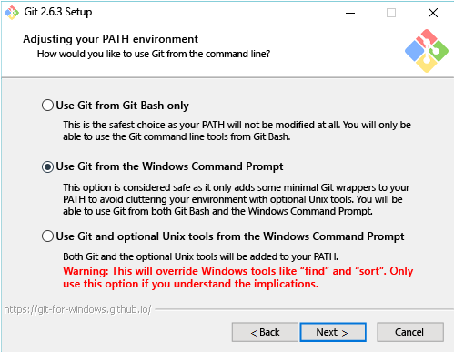

# <a name="contribute-to-the-docs"></a>Beiträge zu den Dokumenten leisten

> **Hinweis:** Um Beiträge erstellen zu können, benötigen Sie ein Konto auf [GitHub](https://www.github.com).

## <a name="edit-an-existing-doc"></a>Bearbeiten eines vorhandenen Dokuments

1. Suchen Sie das Dokument, das Sie bearbeiten möchten.  

2. Klicken Sie auf die entsprechende Schaltfläche (**Contribute to this Topic**), um einen Beitrag zu leisten.  
  
  
  Sie werden daraufhin automatisch zu der in GitHub mit dieser Datei verknüpften Markdowndatei weitergeleitet.
  
  Stellen Sie sicher, dass Sie bei GitHub angemeldet sind.  Melden Sie sich andernfalls an, oder erstellen Sie ein GitHub-Konto.
  
  
  
3. Klicken Sie auf das Symbol „Bearbeiten“, um den im Browser enthaltenen Editor aufzurufen.
  
  

4. Achten Sie bei Änderungen auf den Kontext.
  
  Mögliche Aktionen:
  1. Datei bearbeiten
  2. Änderungen als Vorschau anzeigen
  3. Datei umbenennen (was Sie vermutlich nicht tun möchten)
  
  
  
5. Änderungen als Pull-Anforderung vorschlagen
  
  

6. Überprüfen Ihrer Änderungen
  
  **Bei einer Pull-Anforderung achten wir auf Folgendes**  
  * Die Änderung ist richtig – sie spiegelt die Technologie genau wider.
  * Rechtschreibung und Grammatik sind richtig.
  * Sie befindet sich an einer logischen Position in der Dokumentation.
    
  

7. Erstellen einer [Pull-Anforderung](contribute-to-docs.md#pull-requests)  

## <a name="pull-requests"></a>Pull-Anforderungen

Die meisten Änderungen werden per Pull-Anforderung ausgeführt.  Eine Pull-Anforderung ist eine Möglichkeit, ein Changeset gemeinsam mit mehrere Reviewern zu überprüfen, die den aktuellen Inhalt ändern und kommentieren können.


## <a name="fork-the-repo-and-edit-locally"></a>Verzweigen des Repositorys und lokales Bearbeiten

Wenn Sie länger mit Dokumenten arbeiten müssen, klonen Sie das Repository lokal, und arbeiten Sie auf Ihrem Computer.

Die folgende Anleitung zeigt, wie Sie mein (Sarah Cooleys) Setup emulieren.  Es gibt viele alternative Setups, die ebenso gut funktionieren.

> **Hinweis:** All diese Dokumenttools funktionieren ebenso gut unter Linux/OSX.  Wenn Sie weitere Anleitungen möchten, fragen Sie uns bitte.

Die vorliegende Anleitung ist in drei Abschnitte unterteilt:
* [Einrichten von Git](contribute-to-docs.md#set-up-git)
  * Installieren von Git
  * Anfängliches Setup
  * Verzweigen des Dokumentationsrepositorys
  * Klonen Ihrer Kopie auf Ihrem lokalen Computer
* [Verwalten der anfänglichen Anmeldeinformationen](contribute-to-docs.md#validate-and-stash-credentials)
  * Informationen über das Ausführen eines Stashs für Anmeldeinformationen und über Hilfsprogramme für Anmeldeinformationen
* [Einrichten der Dokumentumgebung](contribute-to-docs.md#set-up-markdown-editing-environment)
  * Installieren von VSCode
  * Exemplarische Vorgehensweise für VSCode für Git – einige nützliche Funktionen
  * Ausführen des ersten Commits

### <a name="set-up-git"></a>Einrichten von Git

1. Installieren Sie Git (unter Windows) von [hier](https://git-for-windows.github.io/).

  In dieser Installation müssen Sie nur einen Wert ändern:

  **Anpassen Ihrer PATH-Umgebung** Verwenden Sie Git über die Windows-Eingabeaufforderung.

  

  So können Sie Git-Befehle in der PowerShell-Konsole und in jeder anderen Windows-Konsole verwenden.

2. Konfigurieren Sie Ihre Git-Identität.

  Öffnen Sie ein PowerShell-Fenster, und führen Sie Folgendes aus:

  ``` PowerShell
  git config --global user.name "User Name"
  git config --global user.email username@microsoft.com
  ```

  Git verwendet diese Werte, um Ihre Commits zu bezeichnen.

  > Wenn folgender Fehler angezeigt wird, ist Git möglicherweise nicht ordnungsgemäß installiert, oder Sie müssen PowerShell neu starten.
    ``` PowerShell
    git : The term 'git' is not recognized as the name of a cmdlet, function, script file, or operable program. Check the spelling of the name, or if a path was included, verify that the path is correct and try again.
    ```

3. Konfigurieren Sie Ihre Git-Umgebung.

   Richten Sie ein Hilfsprogramm für Anmeldeinformationen ein, damit Sie Benutzername und Kennwort (zumindest auf diesem Computer) nur einmal eingeben müssen.
   Ich habe dieses einfache [Windows-Hilfsprogramm für Anmeldeinformationen](https://github.com/Microsoft/Git-Credential-Manager-for-Windows#download-and-install) verwendet.

   Nach der Installation führen Sie folgende Befehle aus, um das Programm zu aktivieren und das Pushverhalten einzurichten:
   ```
   git config --global credential.helper manager
   git config --global push.default simple
   ```

   Beim ersten Mal müssen Sie sich bei GitHub authentifizieren – Sie werden aufgefordert, Ihren Benutzernamen, Ihr Kennwort und Ihren Code für die zweistufige Authentifizierung einzugeben, sofern Sie diese aktiviert haben.
   Beispiel:
   ```
   C:\Users\plang\Source\Repos\Virtualization-Documentation [master]> git pull
   Please enter your GitHub credentials for https://github.com/
   username: plang@microsoft.com
   password:
   authcode (app): 562689
   ```
   Damit wird automatisch ein [persönliches Zugriffstoken](https://github.com/settings/tokens) mit den richtigen Berechtigungen für GitHub erstellt. Speichern Sie dieses Token an einem sicheren Ort auf dem lokalen Computer. Bei späteren Anmeldungen werden Sie nicht mehr zur Eingabe von Anmeldeinformationen aufgefordert.

4. Verzweigen Sie das Repository

5. Klonen Sie das Repository

  „git clone“ erstellt eine lokale Kopie des Git-Repositorys mit den richtigen Hooks zur Synchronisierung mit anderen Klonen des gleichen Repositorys.

  Standardmäßig erstellt der Befehl einen Ordner mit dem gleichen Namen wie das Repository im aktuellen Verzeichnis.  Ich speichere all meine Git-Repositorys in meinem Benutzerverzeichnis.  Weitere Informationen über „git clone“ finden Sie [hier](http://git-scm.com/docs/git-clone).

  ``` PowerShell
  cd ~
  git clone https://github.com/Microsoft/Virtualization-Documentation.git
  ```

  Wenn der Befehl erfolgreich ausgeführt wurde, verfügen Sie jetzt über einen Ordner `Virtualization-Documentation`.

  ``` PowerShell
  cd Virtualization-Documentation
  ```

5. (Optional) Richten Sie Posh-Git ein.

  Posh-Git ist ein von der Community erstelltes PowerShell-Modul, das die Verwendung von Git in PowerShell etwas benutzerfreundlicher gestaltet.  Das Modul fügt die Vervollständigung per Tabulatortaste zu PowerShell hinzu und ermöglicht die Anzeige von Informationen zu Verzweigung und Dateistatus an der Eingabeaufforderung.  Weitere Informationen dazu finden Sie [hier](https://github.com/dahlbyk/posh-git).  Sie können Posh-Git installieren, indem Sie folgenden Befehl in einer PowerShell-Administratorkonsole ausführen.

  ``` PowerShell
  Install-Module -Name posh-git
  ```

  Um Posh-Git so einzurichten, dass es bei jedem Start von PowerShell aktiviert wird, fügen Sie Ihrem PowerShell-Profil (z.B. `%UserProfile%\My Documents\WindowsPowerShell\profile.ps1 `) folgenden Befehl hinzu:

  ``` PowerShell
  Import-Module posh-git

  function global:prompt {
    $realLASTEXITCODE = $LASTEXITCODE

    Write-Host($pwd.ProviderPath) -nonewline

    Write-VcsStatus

    $global:LASTEXITCODE = $realLASTEXITCODE
    return "> "
  }
  ```

### <a name="validate-and-stash-credentials"></a>Validieren und Ausführen eines Stashs für Anmeldeinformationen

  Um zu überprüfen, ob das Repository ordnungsgemäß eingerichtet ist, rufen Sie per Pull neue Inhalte ab.

  ``` PowerShell
  git pull
  ```


### <a name="set-up-markdown-editing-environment"></a>Einrichten der Umgebung für die Markdownbearbeitung

1. Laden Sie VSCode herunter.

6. Führen Sie einen Testcommit aus.  Wenn ein ordnungsgemäßer Stash für Ihre Anmeldeinformationen ausgeführt wurde, sollte alles reibungslos funktionieren.


