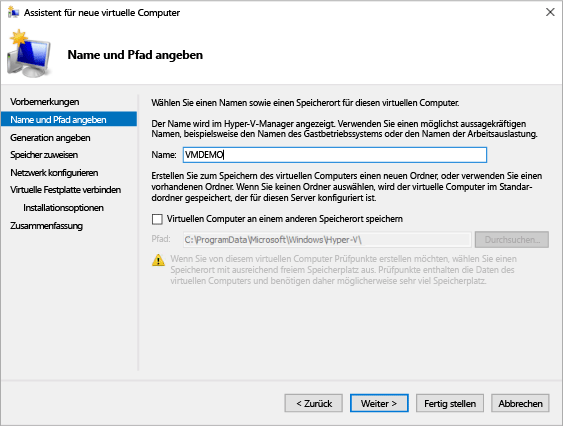
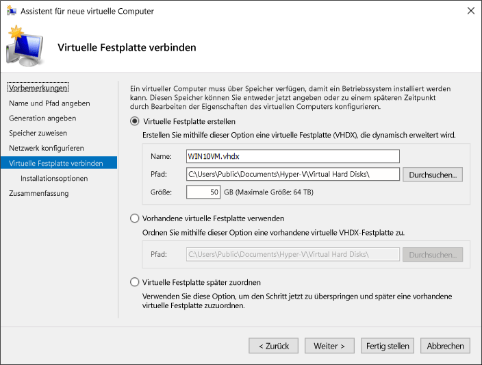

# <a name="create-virtual-machine-with-hyper-v-on-windows-10"></a>Erstellen eines virtuellen Computers auf Windows 10 mit Hyper-V

Hier erfahren Sie, wie Sie einen virtuellen Computer erstellen und ein Betriebssystem auf dem neuen virtuellen Computer installieren können.  Sie benötigen eine ISO-Datei für das von Ihnen ausgewählte Betriebssystem. Beziehen Sie bei Bedarf eine Evaluierungsversion von Windows 10 aus dem [TechNet-Evaluierungscenter](http://www.microsoft.com/evalcenter/).

## <a name="create-a-virtual-machine-with-hyper-v-manager"></a>Erstellen eines virtuellen Computers mit dem Hyper-V-Manager

1. Öffnen Sie Hyper-V-Manager, indem Sie entweder die Windows-Taste drücken und "Hyper-V-Manager" eingeben oder suchen Sie **Hyper-V-Manager** in Ihren Apps.

1. Klicken Sie im Hyper-V-Manager auf **Aktion** > **Neu** > **Virtueller Computer**, um den Assistenten für neue virtuelle Computer anzuzeigen.

1. Lesen Sie den Abschnitt „Vorbemerkungen“, und klicken Sie auf **Weiter**.

1. Geben Sie dem virtuellen Computer einen Namen.
  > **Hinweis:** Dies ist der Name, den Hyper-V für den virtuellen Computer verwendet, nicht der Computername für das Gastbetriebssystem, das innerhalb des virtuellen Computers bereitgestellt wird.

1. Wählen Sie einen Pfad, in dem die Dateien des virtuellen Computers gespeichert werden, z.B. **c:\VM**. Sie können auch den Standardspeicherort übernehmen. Klicken Sie, sobald Sie fertig sind, auf **Weiter**.

  

1. Wählen Sie eine Generation für den virtuellen Computer aus, und klicken Sie auf **Weiter**.  

  Virtuelle Computer der Generation 2 wurden mit Windows Server 2012 R2 eingeführt und bieten ein vereinfachtes virtuelles Hardwaremodell und verschiedene Zusatzfunktionen. Auf virtuellen Computern der Generation 2 kann nur ein 64-Bit-Betriebssystem installiert werden. Weitere Informationen zu virtuellen Computern der 2.Generation finden Sie unter [Virtuelle Computer der Generation 2 (Übersicht)](<https://docs.microsoft.com/previous-versions/windows/it-pro/windows-server-2012-R2-and-2012/dn282285(v=ws.11)>).
  
  > Wenn der neue virtuelle Computer als 2. Generation konfiguriert ist und eine Linux-Distribution ausführt, muss der sichere Start deaktiviert werden. Weitere Informationen zum sicheren Start finden Sie unter [Secure Boot](<https://docs.microsoft.com/previous-versions/windows/it-pro/windows-8.1-and-8/dn486875(v=ws.11)>).

2. Wählen Sie **2048**MB als Wert für **Arbeitsspeicher beim Start**, und lassen Sie **Dynamischen Arbeitsspeicher aktivieren** ausgewählt. Klicken Sie auf die Schaltfläche **Weiter**.

  Arbeitsspeicher wird von einem Hyper-V-Host und dem auf diesem ausgeführten virtuellen Computer gemeinsam genutzt. Die Anzahl der virtuellen Computer, die auf einem Host ausgeführt werden können, hängt zum Teil vom verfügbaren Arbeitsspeicher ab. Ein virtueller Computer kann auch für die Verwendung von dynamischem Arbeitsspeicher konfiguriert werden. Falls aktiviert, gibt die dynamische Arbeitsspeicherfunktion vom ausgeführten virtuellen Computer nicht genutzten Arbeitsspeicher frei. Dadurch können mehr virtuelle Computer auf dem Host ausgeführt werden. Weitere Informationen zu dynamischem Arbeitsspeicher finden Sie unter [Dynamischer Hyper-V-Arbeitsspeicher – Übersicht](https://docs.microsoft.com/previous-versions/windows/it-pro/windows-server-2012-R2-and-2012/hh831766(v=ws.11)).

3. Wählen Sie im Assistenten „Netzwerk konfigurieren“ einen virtuellen Switch für den virtuellen Computer, und klicken Sie auf **Weiter**. Weitere Informationen finden Sie unter [Erstellen eines virtuellen Switches](connect-to-network.md).

4. Benennen Sie die virtuellen Festplatte, wählen Sie einen Speicherort, oder übernehmen Sie die Standardeinstellung, und geben Sie eine Größe an. Klicken Sie im Anschluss auf **Weiter**.

  Eine virtuelle Festplatte bietet dem virtuellen Computer Speicher, der mit einer physischen Festplatte vergleichbar ist. Eine virtuelle Festplatte ist erforderlich, damit Sie ein Betriebssystem auf dem virtuellen Computer installieren können.
  
  

1. Wählen Sie im Installationsoptionen-Assistenten **Betriebssystem von startfähiger Imagedatei installieren** aus, und wählen Sie dann die ISO-Datei eines Betriebssystems aus. Klicken Sie danach auf **Weiter**.

  Beim Erstellen eines virtuellen Computers können Sie verschiedene Installationsoptionen für das Betriebssystem konfigurieren. Drei Optionen sind verfügbar:

  * **Betriebssystem zu einem späteren Zeitpunkt installieren**: Bei Wahl dieser Option erfolgen keine weiteren Änderungen am virtuellen Computer.

  * **Betriebssystem von startfähiger Imagedatei installieren**: Dies ist vergleichbar mit dem Einlegen einer CD in das physische CD-ROM-Laufwerk eines physischen Computers. Um diese Option zu konfigurieren, wählen Sie ein ISO-Image aus. Dieses Image wird auf dem virtuellen CD-ROM-Laufwerk des virtuellen Computers bereitgestellt. Die Startreihenfolge des virtuellen Computers wird so geändert, dass der Start zuerst vom CD-ROM-Laufwerk erfolgt.

  * **Betriebssystem von einem netzwerkbasierten Installationsserver installieren**: Diese Option ist erst verfügbar, nachdem Sie den virtuellen Computer mit einem Netzwerkswitch verbunden haben. Bei dieser Konfiguration wird versucht, den virtuellen Computer über das Netzwerk zu starten.

1. Überprüfen Sie die Details des virtuellen Computers, und klicken Sie zum Abschließen der Erstellung auf **Fertig stellen**.

## <a name="create-a-virtual-machine-with-powershell"></a>Erstellen eines virtuellen Computers mit PowerShell

1. Öffnen Sie die PowerShell ISE als Administrator.

2. Führen Sie das folgende Skript aus:

  ``` powershell
  # Set VM Name, Switch Name, and Installation Media Path.
  $VMName = 'TESTVM'
  $Switch = 'External VM Switch'
  $InstallMedia = 'C:\Users\Administrator\Desktop\en_windows_10_enterprise_x64_dvd_6851151.iso'

  # Create New Virtual Machine
  New-VM -Name $VMName -MemoryStartupBytes 2147483648 -Generation 2 -NewVHDPath "D:\Virtual Machines\$VMName\$VMName.vhdx" -NewVHDSizeBytes 53687091200 -Path "D:\Virtual Machines\$VMName" -SwitchName $Switch

  # Add DVD Drive to Virtual Machine
  Add-VMScsiController -VMName $VMName
  Add-VMDvdDrive -VMName $VMName -ControllerNumber 1 -ControllerLocation 0 -Path $InstallMedia

  # Mount Installation Media
  $DVDDrive = Get-VMDvdDrive -VMName $VMName

  # Configure Virtual Machine to Boot from DVD
  Set-VMFirmware -VMName $VMName -FirstBootDevice $DVDDrive
  ```

## <a name="complete-the-operating-system-deployment"></a>Abschließen der Betriebssystembereitstellung

Um die Erstellung des virtuellen Computers abzuschließen, müssen Sie den virtuellen Computer starten und die Installation des Betriebssystems durchlaufen.

1. Doppelklicken Sie im Hyper-V-Manager auf den virtuellen Computer. Dadurch wird das Tool VMConnect gestartet.

2. Klicken Sie in VMConnect auf die grüne Startschaltfläche. Dies entspricht dem Drücken der Einschalttaste eines physischen Computers. Sie werden möglicherweise aufgefordert, eine beliebige Taste zu drücken, um von CD oder DVD zu starten. Befolgen Sie diese Aufforderung.

  > **Hinweis:** Sie müssen möglicherweise in das VMConnect-Fenster klicken, um sicherzustellen, dass Ihre Tastatureingaben an den virtuellen Computer gesendet werden.

3. Der virtuelle Computer wird mit der Setup-Phase gestartet. Durchlaufen Sie die Installation wie auf einem physischen Computer.

   

  > **Hinweis:** Um Windows auf einem virtuellen Computer ausführen zu können, benötigen Sie eine separate Lizenz, es sei denn, Sie führen eine Volumenlizenzversion von Windows aus. Das Betriebssystem des virtuellen Computers ist unabhängig vom Betriebssystem des Hosts.
