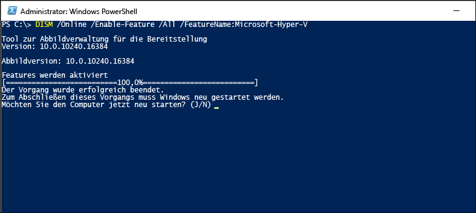

# <a name="install-hyper-v-on-windows-10"></a>Installieren von Hyper-V unter Windows10

Aktivieren von Hyper-V, um virtuelle Computer unter Windows10 zu erstellen  
Hyper-V kann auf unterschiedliche Weise aktiviert werden, einschließlich der Verwendung der Windows 10-Systemsteuerung, PowerShell oder der Verwendung des Bereitstellungs-Imaging-Service-und-Verwaltungstools (DISM). In diesem Dokument wird jede Option vorgestellt.

> **Hinweis:** Hyper-V ist in Windows als optionales Feature integriert und kann nicht zusätzlich heruntergeladen werden.

## <a name="check-requirements"></a>Voraussetzungen:

* Windows 10 Enterprise, pro oder Education
* 64-Bit-Prozessor mit Second Level Address Translation (SLAT).
* CPU-Unterstützung für die VM-Monitor Modus-Erweiterung (VT-c auf Intel-CPUs).
* Mindestens 4 GB Speicher.

Die Hyper-V-Rolle kann unter Windows 10 Home **nicht** installiert werden.

Führen Sie ein Upgrade von Windows 10 Home Edition auf Windows 10 pro durch, indem Sie die **Einstellungen** > **aktualisieren und die Sicherheits** > **Aktivierung**öffnen.

Weitere Informationen und Hinweise zur Problembehandlung finden Sie unter [Systemanforderungen für Hyper-V unter Windows10](../reference/hyper-v-requirements.md).

## <a name="enable-hyper-v-using-powershell"></a>Aktivieren von Hyper-V mit PowerShell

1. Öffnen Sie eine PowerShell-Konsole als Administrator.

2. Führen Sie den folgenden Befehl aus:

  ```powershell
  Enable-WindowsOptionalFeature -Online -FeatureName Microsoft-Hyper-V -All
  ```

  Wenn der Befehl nicht gefunden wurde, stellen Sie sicher, dass Sie PowerShell als Administrator ausführen.

Starten Sie neu, wenn die Installation abgeschlossen ist.

## <a name="enable-hyper-v-with-cmd-and-dism"></a>Aktivieren von Hyper-V mit Befehlszeile und DISM

Das Tool DISM (Deployment Image Servicing and Management, Abbildverwaltung für die Bereitstellung) dient zum Konfigurieren von Windows und Windows-Images.  Mit DISM ist es u.a. möglich, Windows-Features zu aktivieren, während das Betriebssystem ausgeführt wird.

So aktivieren Sie die Hyper-V-Rolle mithilfe von DISM:

1. Starten Sie eine PowerShell- oder Befehlszeilensitzung als Administrator.

1. Geben Sie den folgenden Befehl ein:

  ```powershell
  DISM /Online /Enable-Feature /All /FeatureName:Microsoft-Hyper-V
  ```

  

Weitere Informationen zu DISM finden Sie in der [technischen Referenz zu DISM](<https://docs.microsoft.com/previous-versions/windows/it-pro/windows-8.1-and-8/hh824821(v=win.10)>)(in englischer Sprache).

## <a name="enable-the-hyper-v-role-through-settings"></a>Aktivieren der Hyper-V-Rolle über die Einstellungen

1. Klicken Sie mit der rechten Maustaste auf die Windows-Taste, und wählen Sie "Apps und Features" aus.

2. Klicken Sie unter Verwandte Einstellungen auf der rechten Seite auf **Programme und Funktionen** . 

3. Wählen Sie **Windows-Features aktivieren oder deaktivieren** aus.

4. Wählen Sie **Hyper-V** aus, und klicken Sie auf **OK**.


Nach Abschluss der Installation werden Sie aufgefordert, den Computer neu zu starten.

## <a name="make-virtual-machines"></a>Virtuelle Computer erstellen

[Erstellen Sie Ihren ersten virtuellen Computer](quick-create-virtual-machine.md)
