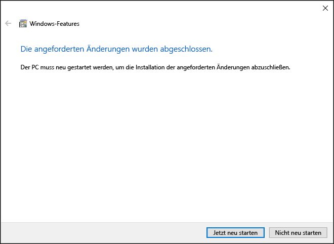

# <a name="install-hyper-v-on-windows-10"></a>Installieren von Hyper-V unter Windows10

Aktivieren von Hyper-V, um virtuelle Computer unter Windows10 zu erstellen  
Hyper-V kann auf unterschiedliche Weise aktiviert werden – in der Windows 10-Systemsteuerung, mit der PowerShell (meine bevorzugte Methode) oder mit dem DISM-Tool (Deployment Image Servicing and Management, Abbildverwaltung für die Bereitstellung). In diesem Dokument wird jede Option vorgestellt.

> **Hinweis:** Hyper-V ist in Windows als optionales Feature integriert und kann nicht zusätzlich oder als installierbare Komponente heruntergeladen werden. 

## <a name="check-requirements"></a>Voraussetzungen:

* Windows10 Enterprise, Professional oder Education
* 64-Bit-Prozessor mit Second Level Address Translation (SLAT).
* CPU-Unterstützung für VM Monitor Mode Extension (VT-c bei Intel-CPUs).
* Mindestens 4 GB Speicher.

Die Hyper-V-Rolle kann unter Windows 10 Home **nicht** installiert werden.  
Ein Upgrade von Windows10 Home auf Windows10 Professional ist unter **Einstellungen** > **Update und Sicherheit** > **Aktivierung** möglich.

Weitere Informationen und Hinweise zur Problembehandlung finden Sie unter [Systemanforderungen für Hyper-V unter Windows10](../reference/hyper-v-requirements.md).


## <a name="install-hyper-v"></a>Installieren von Hyper-V 
Hyper-V ist in Windows als optionales Feature integriert und kann nicht zusätzlich oder als installierbare Komponente heruntergeladen werden.  Es gibt verschiedene Möglichkeiten, um die integrierte Hyper-V-Rolle zu aktivieren.

### <a name="enable-hyper-v-using-powershell"></a>Aktivieren von Hyper-V mit PowerShell

1. Öffnen Sie eine PowerShell-Konsole als Administrator.

2. Führen Sie den folgenden Befehl aus:
  ```powershell
  Enable-WindowsOptionalFeature -Online -FeatureName:Microsoft-Hyper-V -All
  ```  

  Wenn der Befehl nicht gefunden wurde, stellen Sie sicher, dass Sie PowerShell als Administrator ausführen.  

Nach Abschluss der Installation müssen Sie den Computer neu starten.  

### <a name="enable-hyper-v-with-cmd-and-dism"></a>Aktivieren von Hyper-V mit Befehlszeile und DISM

Das Tool DISM (Deployment Image Servicing and Management, Abbildverwaltung für die Bereitstellung) dient zum Konfigurieren von Windows und Windows-Images.  Mit DISM ist es u.a. möglich, Windows-Features zu aktivieren, während das Betriebssystem ausgeführt wird.  

So aktivieren Sie die Hyper-V-Rolle mithilfe von DISM:
1. Starten Sie eine PowerShell- oder Befehlszeilensitzung als Administrator.

2. Geben Sie den folgenden Befehl ein:  
  ```powershell
  DISM /Online /Enable-Feature /All /FeatureName:Microsoft-Hyper-V
  ```  
  

Weitere Informationen zu DISM finden Sie in der [technischen Referenz zu DISM](https://technet.microsoft.com/en-us/library/hh824821.aspx)(in englischer Sprache).

### <a name="manually-enable-the-hyper-v-role"></a>Manuelles Aktivieren der Hyper-V-Rolle

1. Klicken Sie mit der rechten Maustaste auf die Windows-Taste, und wählen Sie "Apps und Features" aus.

2. Wählen Sie **Windows-Features aktivieren oder deaktivieren** aus.

3. Wählen Sie **Hyper-V** aus, und klicken Sie auf **OK**.  


Nach Abschluss der Installation werden Sie aufgefordert, den Computer neu zu starten.




## <a name="make-virtual-machines"></a>Virtuelle Computer erstellen
[Erstellen Sie Ihren ersten virtuellen Computer](quick-create-virtual-machine.md)
