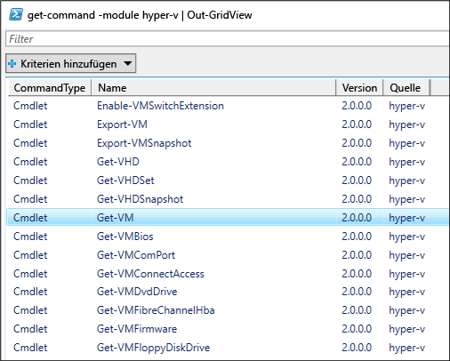

# <a name="working-with-hyper-v-and-windows-powershell"></a>Arbeiten mit Hyper-V und Windows PowerShell

Nachdem Sie sich mit den Grundlagen der Bereitstellung von Hyper-V sowie dem Erstellen und Verwalten virtueller Computer vertraut gemacht haben, wollen wir uns nun ansehen, wie viele dieser Aktivitäten mithilfe von PowerShell automatisiert werden können.

### <a name="return-a-list-of-hyper-v-commands"></a>Zurückgeben einer Liste von Hyper-V-Befehle

1. Klicken Sie auf der Windows-Schaltfläche „Start“, und geben Sie **powershell** ein.
2. Führen Sie den folgenden Befehl aus, um eine durchsuchbare Liste mit PowerShell-Befehlen anzuzeigen, die für das PowerShell-Modul für Hyper-V verfügbar sind.

 ```powershell
Get-Command -Module hyper-v | Out-GridView
```
  Sie erhalten eine Rückgabe wie diese:

  

3. Um weitere Informationen zu einem bestimmten PowerShell-Befehl zu erhalten, verwenden Sie `Get-Help`. Bei Ausführen des folgenden Befehls werden z. B. Informationen zum Hyper-V-Befehl `Get-VM` zurückgegeben.

  ```powershell
  Get-Help Get-VM
  ```
 Die Ausgabe veranschaulicht die Struktur des Befehls, die erforderlichen und optionalen Parameter sowie die Aliase, die Sie verwenden können.

 


### <a name="return-a-list-of-virtual-machines"></a>Abrufen einer Liste virtueller Computer

Mit `Get-VM` können Sie eine Liste virtueller Computer zurückgeben.

1. Führen Sie in PowerShell folgenden Befehl aus:
 
 ```powershell
 Get-VM
 ```
 Die Ausgabe ist wie folgt:

 

2. Um nur eingeschaltete virtuelle Computer zurückzugeben, fügen Sie dem Befehl `Get-VM` einen Filter hinzu. Ein Filter kann mit dem `Where-Object`-Befehl hinzugefügt werden. Weitere Informationen zum Filtern finden Sie in der Dokumentation zum [Verwenden von „Where-Object“](<https://docs.microsoft.com/previous-versions/windows/it-pro/windows-powershell-1.0/ee177028(v=technet.10)>).

 ```powershell
 Get-VM | where {$_.State -eq 'Running'}
 ```
3.  Listen Sie alle virtuellen Computer in einen funktionsfähigen Status, off, führen Sie den folgenden Befehl. Mit diesem Befehl wird eine Kopie des Befehls aus Schritt 2 mit dem Filter aus „Running“ in „Off“ geändert.

 ```powershell
 Get-VM | where {$_.State -eq 'Off'}
 ```

### <a name="start-and-shut-down-virtual-machines"></a>Starten und Herunterfahren virtueller Computer

1. Um einen bestimmten virtuellen Computer zu starten, führen Sie den folgenden Befehl mit dem Namen des virtuellen Computers aus:

 ```powershell
 Start-VM -Name <virtual machine name>
 ```

2. Um alle momentan ausgeschalteten virtuellen Computer zu starten, rufen Sie eine Liste dieser Computer ab, und übergeben Sie die Liste an den Befehl `Start-VM`:

  ```powershell
  Get-VM | where {$_.State -eq 'Off'} | Start-VM
  ```
3. Zum Herunterfahren aller ausgeführten virtuellen Computer führen Sie diesen Befehl aus:
 
  ```powershell
  Get-VM | where {$_.State -eq 'Running'} | Stop-VM
  ```

### <a name="create-a-vm-checkpoint"></a>Erstellen eines VM-Prüfpunkts

Wählen Sie zum Erstellen eines Prüfpunkts mithilfe von PowerShell den virtuellen Computer mit dem Befehl `Get-VM` aus, und übergeben Sie diesen an den Befehl `Checkpoint-VM`. Benennen Sie abschließend den Prüfpunkt mit dem Befehl `-SnapshotName`. Der vollständige Befehl sieht folgendermaßen aus:

 ```powershell
 Get-VM -Name <VM Name> | Checkpoint-VM -SnapshotName <name for snapshot>
 ```
### <a name="create-a-new-virtual-machine"></a>Erstellen eines neuen virtuellen Computers

Im folgenden Beispiel wird das Erstellen ein neues virtuellen Computers in der PowerShell ISE (Integrated Scripting Environment) gezeigt. Dies ist ein einfaches Beispiel, das mit zusätzlichen PowerShell-Features und komplexeren VM-Bereitstellungen erweitert werden kann.

1. Geben Sie zum Öffnen der PowerShell ISE im Startmenü **PowerShell ISE** ein.
2. Führen Sie den folgenden Code zum Erstellen eines virtuellen Computers aus. In der Dokumentation zu [New-VM](https://docs.microsoft.com/powershell/module/hyper-v/new-vm?view=win10-ps) finden Sie ausführliche Informationen zum Befehl `New-VM`.

 ```powershell
  $VMName = "VMNAME"

  $VM = @{
      Name = $VMName
      MemoryStartupBytes = 2147483648
      Generation = 2
      NewVHDPath = "C:\Virtual Machines\$VMName\$VMName.vhdx"
      NewVHDSizeBytes = 53687091200
      BootDevice = "VHD"
      Path = "C:\Virtual Machines\$VMName"
      SwitchName = (Get-VMSwitch).Name
  }

  New-VM @VM
 ```

## <a name="wrap-up-and-references"></a>Zusammenfassung und Referenzen

In diesem Dokument wurden einige einfache Schritte mit dem PowerShell-Modul für Hyper-V sowie verschiedene Beispielszenarien vorgestellt. Weitere Informationen zum PowerShell-Modul für Hyper-V finden Sie in der [Referenz zu Hyper-V-Cmdlets in Windows PowerShell](https://docs.microsoft.com/powershell/module/hyper-v/index?view=win10-ps).  
 
