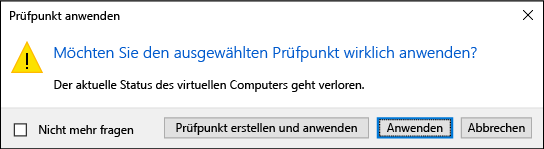
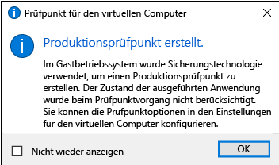

# <a name="using-checkpoints-to-revert-virtual-machines-to-a-previous-state"></a>Zurücksetzen virtueller Computer in einen vorherigen Zustand mithilfe von Prüfpunkten

Einer der großen Vorteile der Virtualisierung ist die Möglichkeit, den Zustand eines virtuellen Computers problemlos zu speichern. In Hyper-V erfolgt dies mithilfe von Prüfpunkten für virtuelle Computer. Sie können einen Prüfpunkt für einen virtuellen Computer z. B. erstellen, ehe Sie Änderungen an der Softwarekonfiguration vornehmen, ein Softwareupdate anwenden oder neue Software installieren. Sollte eine Änderung ein Problem verursachen, kann der virtuelle Computer in den Zustand zurückgesetzt werden, in dem er sich bei Erstellen des Prüfpunkts befand.

Hyper-V unter Windows 10 kennt zwei Typen von Prüfpunkten:

* **Standard Prüfpunkte**: erstellt eine Momentaufnahme des virtuellen Computers und des Speicher Zustands der virtuellen Maschine zum Zeitpunkt der Prüf Punkt Initiierung. Eine Momentaufnahme ist keine vollständige Sicherung und kann Probleme mit der Datenkonsistenz bei Systemen verursachen, die Daten zwischen verschiedenen Knoten replizieren, wie z.B. Active Directory.  Vor Windows 10 waren mit Hyper-V nur Standardprüfpunkte (früher als Snapshots bezeichnet) verfügbar.

* **Produktions Prüfpunkte**: verwendet Volumeschattenkopie-Dienst oder das Einfrieren des Dateisystems auf einem virtuellen Linux-Computer, um eine Daten konsistente Sicherung des virtuellen Computers zu erstellen. Es wird keine Momentaufnahme des Arbeitsspeicherzustands des virtuellen Computers erstellt.

Produktionsprüfpunkte sind standardmäßig aktiviert, was aber im Hyper-V-Manager oder über PowerShell geändert werden kann.

> **Hinweis:** Das PowerShell-Modul „Hyper-V“ hat mehrere Aliase, sodass die Begriffe „Prüfpunkt“ und „Snapshot“ austauschbar verwendet werden können.  
  In diesem Dokument wird „Prüfpunkt“ verwendet, es ist aber möglich, dass ähnliche Befehle mit dem Begriff „Momentaufnahme“ verwendet werden.

## <a name="changing-the-checkpoint-type"></a>Ändern des Prüfpunkttyps

**Verwenden des Hyper-V-Managers**

1. Öffnen Sie den Hyper-V-Manager.
2. Klicken Sie mit der rechten Maustaste auf den virtuellen Computer, und wählen Sie **Einstellungen** aus.
3. Wählen Sie unter „Verwaltung“ die Option **Prüfpunkte** aus.
4. Wählen Sie den gewünschten Prüfpunkttyp aus.

<br />


**Verwenden von PowerShell**

Die folgenden Befehle können ausgeführt werden, um den Prüfpunkt mit PowerShell zu ändern. 

Auf Standardprüfpunkt festlegen:
```powershell
Set-VM -Name <vmname> -CheckpointType Standard
```

Auf Produktionsprüfpunkt festlegen. Wenn der Produktionsprüfpunkt fehlerhaft ist, wird ein Standardprüfpunkt erstellt:
```powershell
Set-VM -Name <vmname> -CheckpointType Production
```

Auf Produktionsprüfpunkt festlegen. Wenn der Produktionsprüfpunkt fehlerhaft ist, wird kein Standardprüfpunkt erstellt: 
```powershell
Set-VM -Name <vmname> -CheckpointType ProductionOnly
```

## <a name="creating-checkpoints"></a>Erstellen von Prüfpunkten

Erstellt einen Prüfpunkt des für den virtuellen Computer konfigurierten Typs. Im Abschnitt zum [Konfigurieren des Prüfpunkttyps](checkpoints.md#changing-the-checkpoint-type) weiter oben in diesem Dokument finden Sie Anweisungen zum Ändern dieses Typs.

**Verwenden des Hyper-V-Managers**

So erstellen Sie einen Prüfpunkt:  
1. Wählen Sie im Hyper-V-Manager den virtuellen Computer aus.
2. Klicken Sie mit der rechten Maustaste auf den Namen des virtuellen Computers, und klicken Sie auf **Prüfpunkt**.
3. Wenn der Prozess abgeschlossen ist, wird der Prüfpunkt im **Hyper-V-Manager** unter **Prüfpunkte** angezeigt.

**Verwenden von PowerShell**

Erstellen Sie einen Prüfpunkt mit dem Befehl **CheckPoint-VM**.  

```powershell
Checkpoint-VM -Name <VMName>
```

Rufen Sie nach Abschluss des Prüfpunktprozesses mithilfe des Befehls **Get-VMCheckpoint** eine Liste mit Prüfpunkten für einen virtuellen Computer auf.

```powershell
Get-VMCheckpoint -VMName <VMName>
```

## <a name="applying-checkpoints"></a>Anwenden von Prüfpunkten

Wenn Sie einen virtuellen Computer auf einen früheren Zeitpunkt zurücksetzen möchten, können Sie einen vorhandenen Prüfpunkt anwenden.

**Verwenden des Hyper-V-Managers**

1. Wählen Sie im **Hyper-V-Manager** unter **Virtuelle Computer** den virtuellen Computer aus.
2. Klicken Sie im Abschnitt „Prüfpunkte“ mit der rechten Maustaste auf den Prüfpunkt, die Sie verwenden möchten, und klicken Sie auf **Anwenden**.
3. Ein Dialogfeld mit den folgenden Optionen wird angezeigt:  
  * **Prüfpunkt erstellen und anwenden**: Erstellt einen neuen Prüfpunkt des virtuellen Computers, bevor der frühere Prüfpunkt angewendet wird. 
  * **Übernehmen**: Wendet nur den ausgewählten Prüfpunkt an. Diese Aktion kann nicht rückgängig gemacht werden.
  * **Abbrechen**: Schließt das Dialogfeld, ohne eine Änderung zu übernehmen.
  
  Wählen Sie eine der Optionen zum Übernehmen, um den Prüfpunkt anzuwenden.

**Verwenden von PowerShell**

5. Zum Anzeigen einer Liste der Prüfpunkte für einen virtuellen Computer wählen Sie den Befehl **Get-VMCheckpoint**.

    ```powershell
    Get-VMCheckpoint -VMName <VMName>
    ```
6. Zum Anwenden des Prüfpunkts verwenden Sie den Befehl **Restore-VMCheckpoint**.

    ```powershell
    Restore-VMCheckpoint -Name <checkpoint name> -VMName <VMName> -Confirm:$false
    ```

## <a name="renaming-checkpoints"></a>Umbenennen von Prüfpunkten

Viele Prüfpunkte werden zu einem bestimmten Zeitpunkt erstellt.  Wenn Sie Ihnen einen identifizierbaren Namen geben, ist es einfacher, Details zum Systemstatus zu merken, als der Prüfpunkt erstellt wurde.

Standardmäßig ist der Name eines Prüfpunkts der Name des virtuellen Computers in Kombination mit Datum und Uhrzeit der Prüfpunkterstellung. Dies ist das Standardformat: 

```
virtual_machine_name (MM/DD/YYY -hh:mm:ss AM\PM)
```

Namen dürfen maximal 100 Zeichen umfassen, und der Name darf nicht leer bleiben. 

**Verwenden des Hyper-V-Managers**

1. Wählen Sie im **Hyper-V Manager** den virtuellen Computer aus.
2. Klicken Sie mit der rechten Maustaste auf den Prüfpunkt, und wählen Sie **Umbenennen** aus.
3. Geben Sie den neuen Namen für den Prüfpunkt. Der Name muss weniger als 100 Zeichen haben, und das Feld darf nicht leer bleiben.
4. Drücken Sie die EINGABETASTE,sobald Sie fertig sind.

**Verwenden von PowerShell**

``` powershell
Rename-VMCheckpoint -VMName <virtual machine name> -Name <checkpoint name> -NewName <new checkpoint name>
```

## <a name="deleting-checkpoints"></a>Löschen von Prüfpunkten

Durch das Löschen von Prüfpunkten können Sie Speicherplatz auf dem Hyper-V-Host freigeben.

Prüfpunkte werden im Hintergrund als AVHDX-Dateien am gleichen Speicherort wie die VHDX-Dateien für den virtuellen Computer gespeichert. Wenn Sie einen Prüfpunkt löschen, führt Hyper-V die AVHDY- und VHDY-Dateien automatisch zusammen.  Anschließend wird die AVHDX-Datei im Dateisystem gelöscht. 

Sie sollten die AVHDX-Dateien nicht direkt löschen.
 
**Verwenden des Hyper-V-Managers**

So löschen Sie einen Prüfpunkt ordnungsgemäß 

1. Wählen Sie im **Hyper-V Manager** den virtuellen Computer aus.
2. Klicken Sie im Abschnitt Prüfpunkte mit der rechten Maustaste auf den **Prüfpunkt** , den Sie löschen möchten, und klicken Sie dann auf Löschen. Sie können auch einen Prüfpunkt und alle nachfolgenden Prüfpunkte löschen. Klicken Sie hierzu mit der rechten Maustaste auf den frühesten Prüfpunkt, den Sie löschen möchten, und klicken Sie dann auf ****Prüfpunktunterstruktur**löschen**.
3. Sie werden gefragt, ob Sie den Prüfpunkt wirklich löschen möchten. Vergewissern Sie sich, dass der richtige Prüfpunkt ausgewählt ist, und klicken Sie dann auf **Löschen**. 
 
**Verwenden von PowerShell**
```powershell
Remove-VMCheckpoint -VMName <virtual machine name> -Name <checkpoint name>
```

## <a name="exporting-checkpoints"></a>Exportieren von Prüfpunkten

Beim Exportieren wird der Prüfpunkt als virtueller Computer gebündelt, sodass er an einen neuen Speicherort verschoben werden kann. Nach dem Importieren wird der Prüfpunkt als virtueller Computer wiederhergestellt. Exportierte Prüfpunkte können für die Sicherung verwendet werden.

**Verwenden von PowerShell**
``` powershell
Export-VMCheckpoint -VMName <virtual machine name> -Name <checkpoint name> -Path <path for export>
```

## <a name="enable-or-disable-checkpoints"></a>Aktivieren oder Deaktivieren von Prüfpunkten

1. Klicken Sie im **Hyper-V-Manager** mit der rechten Maustaste auf den Namen des virtuellen Computers, und klicken Sie auf **Einstellungen**.
2. Wählen Sie im Abschnitt **Verwaltung** den Eintrag **Prüfpunkte** aus.
3. Damit können Prüfpunkte, die aus diesem virtuellen Computer ausgeführt werden, stellen Sie sicher, dass Sie Prüfpunkte aktivieren auswählen--ist dies das Standardverhalten.  
Zum Deaktivieren von Prüfpunkten deaktivieren Sie das Kontrollkästchen **Prüfpunkte aktivieren**.
4. Klicken Sie auf **Übernehmen**, um die Änderungen zu speichern. Wenn Sie fertig sind, klicken Sie auf **OK**, um das Dialogfeld zu schließen.

## <a name="configure-checkpoint-location"></a>Konfigurieren der Prüfpunktspeicherorts

Wenn der virtuelle Computer keine Prüfpunkte hat, können Sie den Speicherort von Prüfpunktkonfigurationsdateien und Dateien mit gespeichertem Zustand ändern.

1. Klicken Sie im **Hyper-V-Manager** mit der rechten Maustaste auf den Namen des virtuellen Computers, und klicken Sie auf **Einstellungen**.
2. Wählen Sie im Abschnitt **Verwaltung** den Eintrag **Prüfpunkte** oder **Speicherort für Prüfpunktdateien** aus.
4. Geben Sie in **Speicherort für Prüfpunktdateien** den Pfad zum Ordner ein, in dem Sie die Dateien speichern möchten.
5. Klicken Sie auf **Übernehmen**, um die Änderungen zu speichern. Wenn Sie fertig sind, klicken Sie auf **OK**, um das Dialogfeld zu schließen.

Der Standardspeicherort für die Speicherung von Prüfpunktkonfigurationsdateien lautet: `%systemroot%\ProgramData\Microsoft\Windows\Hyper-V\Snapshots`.


<!-- This belongs in dev docs

This folder will contain the .VMRS file with the runtime and saved state data and a .VMCX configuration file, which uses the checkpoint GUID as the file name.
-->

## <a name="checkpoint-demo"></a>Demo zu Prüfpunkten

Diese Übung führt Sie durch das Erstellen und Anwenden eines Standardprüfpunkts im Gegensatz zu einem Produktionsprüfpunkt.  In diesem Beispiel nehmen Sie eine einfache Änderung am virtuellen Computer vor und beobachten die unterschiedlichen Verhalten. 

### <a name="standard-checkpoint"></a>Standardprüfpunkt

1. Melden Sie sich bei Ihrem virtuellen Computer an, und erstellen Sie eine Textdatei auf dem Desktop.
2. Öffnen Sie die Datei mit Editor, und geben Sie den Text „Dies ist ein Standardprüfpunkt“ ein. **Sie dürfen weder die Datei speichern noch Editor schließen**.  
3. Legen Sie den Prüfpunkt als Standardprüfpunkt fest. Anweisungen finden Sie [hier](checkpoints.md#changing-the-checkpoint-type).
4. Erstellen Sie einen neuen Prüfpunkt.

<br />

 

**Anwenden des Standardprüfpunkts mit dem Hyper-V-Manager**

Nun da ein Prüfpunkt vorhanden ist, nehmen Sie eine Änderung am virtuellen Computer vor, und wenden Sie anschließend den Prüfpunkt an, um den virtuellen Computer in den gespeicherter Zustand zurückzusetzen. 

1. Schließen Sie die Textdatei, wenn Sie noch geöffnet ist, und löschen Sie Sie vom Desktop der virtuellen Maschine.
2. Öffnen Sie den Hyper-V-Manager, klicken Sie mit der rechten Maustaste auf den Standardprüfpunkt, und wählen Sie „Anwenden“ aus.
3. Wählen Sie im Benachrichtigungsfenster „Prüfpunkt anwenden“ den Befehl „Anwenden“ aus.

<br />

 

Nachdem der Prüfpunkt angewendet wurde, werden Sie feststellen, dass nicht nur die Textdatei vorhanden ist, sondern dass das System exakt den Zustand wie zum Zeitpunkt der Erstellung des Prüfpunkts aufweist. In diesem Fall ist Editor geöffnet und die Textdatei geladen.

### <a name="production-checkpoint"></a>Produktionsprüfpunkt

Nun wollen wir uns mit Produktionsprüfpunkten beschäftigen. Dieser Prozess entspricht nahezu dem bei einem Standardprüfpunkt, liefert allerdings etwas andere Ergebnisse. Stellen Sie, bevor Sie beginnen, sicher, dass Sie über einen virtuellen Computer verfügen und den Prüfpunkttyp in „Produktionsprüfpunkte“ geändert haben.

**Ändern des virtuellen Computers und Erstellen eines Produktionsprüfpunkts**

1. Melden Sie sich beim virtuellen Computer an, und erstellen Sie eine neue Textdatei. Wenn Sie die vorherige Übung befolgt haben, können Sie die vorhandene Textdatei verwenden.
2. Geben Sie „Dies ist ein Produktionsprüfpunkt.“ in die Textdatei ein. Speichern Sie die Datei, doch **schließen Sie Editor nicht**.
3. Öffnen Sie Hyper-V-Manager, klicken Sie mit der rechten Maustaste auf den virtuellen Computer, **und wählen Sie**Prüfpunkt
4. Klicken Sie im Fenster „Produktionsprüfpunkt erstellt“ auf **OK**.

<br />

 

**Anwenden des Produktionsprüfpunkts mit dem Hyper-V-Manager**

Nun da ein Prüfpunkt vorhanden ist, nehmen Sie eine Änderung am System vor, und wenden Sie anschließend den Prüfpunkt an, um den virtuellen Computer in den gespeicherter Zustand zurückzusetzen. 

1. Schließen Sie die Textdatei, wenn Sie noch geöffnet ist, und löschen Sie Sie vom Desktop der virtuellen Maschine.
2. Öffnen Sie Hyper-V-Manager, klicken Sie mit der rechten Maustaste auf den Produktions Prüf Punkt, und wählen Sie **anwenden**
3. Wählen Sie im Benachrichtigungsfenster „Prüfpunkt anwenden“ den Befehl **Anwenden** aus.

Nachdem der Produktionsprüfpunkt angewendet wurde, werden Sie feststellen, dass sich der virtuelle Computer im ausgeschalteten Zustand befindet.

1. Starten Sie den virtuellen Computer, und melden Sie sich an.
2. Wie Sie sehen, wurde die Textdatei wiederhergestellt. Doch im Gegensatz zum Standardprüfpunkt ist Editor nicht geöffnet.   
