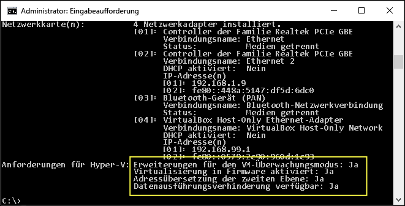

# Systemanforderungen von Hyper-V unter Windows 10

Hyper-V unter Windows 10 funktioniert nur mit einer bestimmten Gruppe von Hardware- und Betriebssystemkonfigurationen. In diesem Dokument werden die Software- und Hardwareanforderungen von Hyper-V kurz vorgestellt. Außerdem wird erläutert, wie Sie Ihr System auf Kompatibilität mit Hyper-V überprüfen. Wenngleich in diesem Dokument nicht alle mit Hyper-V kompatiblen Systemkonfigurationen im Detail behandelt werden, können Sie anhand dieser Informationen schnell herausfinden, ob Ihr aktuelles System virtuelle Hyper-V-Computer hosten kann.

## Betriebssystemanforderungen

Die Rolle „Hyper-V“ kann bei diesen Versionen von Windows 10 aktiviert werden:

- Windows 10 Enterprise
- Windows 10 Professional
- Windows 10 Education

Die Rolle „Hyper-V“ kann bei diesen Versionen nicht installiert werden:

- Windows 10 Home
- Windows 10 Mobile
- Windows 10 Mobile Enterprise

>Für Windows 10 Home Edition kann ein Upgrade auf Windows 10 Professional erfolgen. Öffnen Sie dazu **Einstellungen** > **Update und Sicherheit** > **Aktivierung**. Hier können Sie den Store besuchen und ein Upgrade erwerben.

## Hardwareanforderungen

Dieses Dokument bietet zwar keine vollständige Liste von mit Hyper-V kompatibler Hardware, doch die folgenden Elemente sind erforderlich:

- 64-Bit-Prozessor mit Second Level Address Translation (SLAT).
- CPU-Unterstützung für VM Monitor Mode Extension (VT-c bei Intel-CPUs).
- Mindestens 4 GB Arbeitsspeicher. Doch da virtuelle Computer Arbeitsspeicher mit dem Hyper-V-Host gemeinsam nutzen, müssen Sie ausreichend Arbeitsspeicher bereitstellen, damit der erwartete virtuelle Workload bewältigt werden kann.

Die folgenden Elemente müssen im BIOS des Systems aktiviert sein:
- Virtualisierungstechnologie (wird je nach Hersteller der Hauptplatine anders bezeichnet)
- Von der Hardware erzwungene Datenausführungsverhinderung (Data Execution Prevention, DEP)

## Überprüfen der Hardwarekompatibilität

Öffnen Sie zum Überprüfen der Kompatibilität PowerShell oder eine Eingabeaufforderung (cmd.exe), und geben Sie **systeminfo.exe** ein. Hiermit werden Informationen zur Hyper-V-Kompatibilität zurückgegeben.
Wenn alle aufgelisteten Hyper-V-Anforderungen den Wert **Ja** haben, kann die Rolle „Hyper-V“ auf Ihrem System ausgeführt werden. Wenn für ein Element **Nein** zurückgegeben wird, überprüfen Sie die in diesem Dokument aufgeführten Anforderungen und nehmen, sofern möglich, Anpassungen vor.



Wenn Sie **systeminfo.exe** auf einem vorhandenen Hyper-V-Host ausführen, enthält der Abschnitt „Hyper-V-Anforderungen“ Folgendes:

```
Hyper-V Requirements: A hypervisor has been detected. Features required for Hyper-V are not be displayed.
```

## Nächster Schritt – Installieren von Hyper-V

[Installieren von Hyper-V](walkthrough_install.md)


<!--HONumber=Feb16_HO2-->
