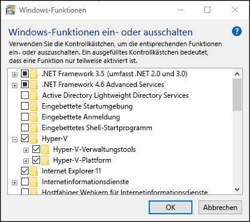
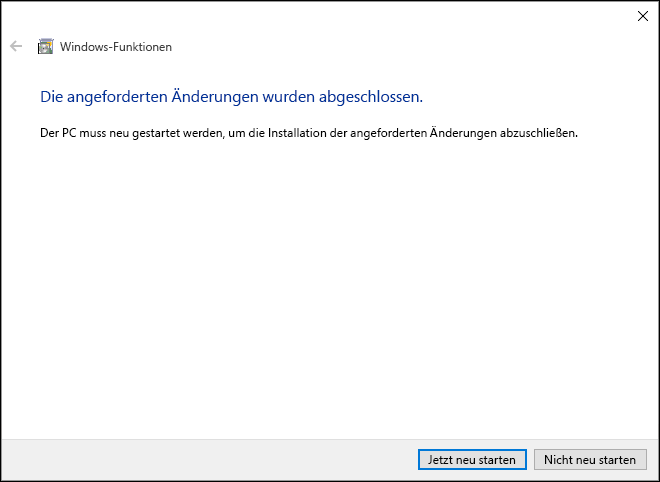
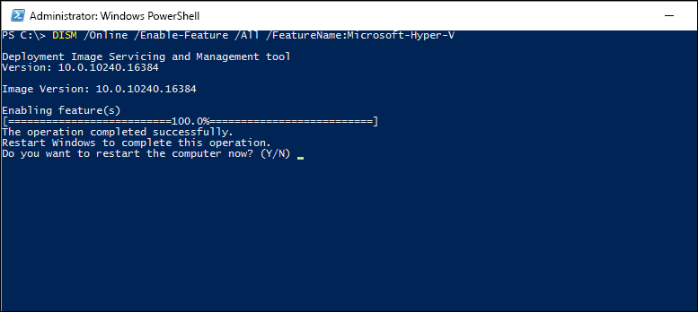

# Installieren von Hyper-V unter Windows 10

Die Rolle „Hyper-V“ muss aktiviert werden, bevor Sie virtuelle Computer unter Windows 10 erstellen können. Dies kann über die Systemsteuerung in Windows 10, PowerShell oder das DISM-Tool (Deployment Imaging Servicing and Management) erfolgen. In diesem Dokument werden diese Varianten vorgestellt.

> Stellen Sie vor der Aktivierung von Hyper-V sicher, dass Ihr System kompatibel ist. Weitere Informationen finden Sie unter [Systemanforderungen von Hyper-V unter Windows 10](https://msdn.microsoft.com/virtualization/hyperv_on_windows/quick_start/walkthrough_compatibility).

## Manuelles Installieren der Rolle „Hyper-V“

1. Klicken Sie mit der rechten Maustaste auf die Windows-Schaltläche, und wählen Sie „Programme und Funktionen“ aus.

2. Wählen Sie **Windows-Features aktivieren oder deaktivieren** aus.

3. Wählen Sie **Hyper-V** aus, und klicken Sie auf **OK**.  



Nach Abschluss der Installation werden Sie aufgefordert, den Computer neu zu starten.



## Installieren von Hyper-V mit PowerShell

1. Öffnen Sie eine PowerShell-Konsole als Administrator.

2. Führen Sie den folgenden Befehl aus:

```powershell
Enable-WindowsOptionalFeature -Online -FeatureName Microsoft-Hyper-V -All
```
Nach Abschluss der Installation müssen Sie den Computer neu starten.

## Installieren von Hyper-V mit DISM

Das DISM-Tool (Deployment Image Servicing and Management) dient zum Warten von Windows-Images und Vorbereiten von Windows-Prä-Installationsumgebungen. DISM kann auch verwendet werden, um Windows-Features zu aktivieren, während das Betriebssystem ausgeführt wird. Weitere Informationen finden Sie in der [technischen Referenz zu DISM](https://technet.microsoft.com/en-us/library/hh824821.aspx).

So aktivieren Sie die Hyper-V-Rolle mithilfe von DISM

1. Öffnen Sie ein PowerShell oder CMD-Sitzung als Administrator.

2. Geben Sie den folgenden Befehl ein:

```powershell
DISM /Online /Enable-Feature /All /FeatureName:Microsoft-Hyper-V
```



## Nächster Schritt: Erstellen eines virtuellen Switches
[Erstellen eines virtuellen Switches](walkthrough_virtual_switch.md)


<!--HONumber=Jun16_HO4-->


