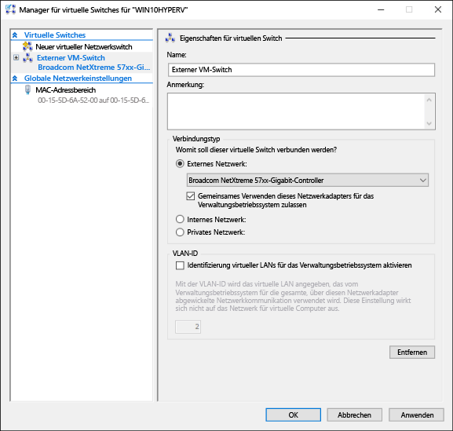

# Erstellen eines virtuellen Switches 

Vor dem Erstellen eines virtuellen Computers in Hyper-V können Sie für diesen virtuellen Computer eine Möglichkeit bereitstellen, sich mit einem physischen Netzwerk zu verbinden. Hyper-V bietet softwarebasierte Netzwerktechnologie, mit deren Hilfe eine Netzwerkkarte eines virtuellen Computers sich mit einem virtuellen Switch und somit mit einem Netzwerk verbinden kann. Jeder in Hyper-V erstellte virtuelle Switch kann mit einem von drei Verbindungstypen konfiguriert werden:

- **Externes Netzwerk**: Der virtuelle Switch wird mit einem physischen Netzwerkadapter verbunden, der eine Verbindung zwischen dem physischen Netzwerk, dem Hyper-V-Host und dem virtuellen Computer herstellt. In dieser Konfiguration können Sie auch die Fähigkeit des Hosts aktivieren oder deaktivieren, über die physisch angeschlossene Netzwerkkarte zu kommunizieren. Dies kann nützlich sein, um ausschließlich VM-Datenverkehr für eine bestimmte physische Netzwerkkarte zu isolieren.

- **Internes Netzwerk**: Der virtuelle Switch ist nicht mit einer physischen Netzwerkkarte verbunden. Es besteht jedoch Netzwerkkonnektivität zwischen dem Hyper-V-Host und allen virtuellen Computern, die mit diesem Switch verbunden sind.

- **Privates Netzwerk**: Der virtuelle Switch ist nicht mit einem physischen Netzwerkadapter verbunden, und es besteht keine Verbindung zwischen dem Hyper-V-Host und mit diesem Switch verbundenen virtuellen Computern.

## Manuelles Erstellen eines virtuellen Switches

In dieser Übung wird das Erstellen eines externen virtuellen Switches mithilfe des Hyper-V-Managers erläutert. Nach Abschluss enthält Ihr Hyper-V-Host einen virtuellen Switch, über den virtuelle Computer mit einem physischen Netzwerk verbunden werden können. 

1. Öffnen Sie den Hyper-V-Manager.

2. Klicken Sie mit der rechten Maustaste auf den Namen des Hyper-V-Hosts, und wählen Sie **Manager für virtuelle Switches** aus.

3. Wählen Sie unter „Virtuelle Switches“ die Option **Neuer virtueller Netzwerkswitch** aus.

4. Klicken Sie unter „Welche Art von virtuellem Switch möchten Sie erstellen?“ auf **Extern**.

5. Klicken Sie auf die Schaltfläche **Virtuellen Switch erstellen**.

6. Geben Sie unter „Eigenschaften für virtuelle Switches“ dem neuen Switch einen Namen, z. B. **Externer VM-Switch**.

7. Stellen Sie unter „Verbindungstyp“ sicher, dass **Externes Netzwerk** ausgewählt wurde.

8. Wählen Sie die physische Netzwerkkarte, die mit dem neuen virtuellen Switch verbunden werden soll. Dies ist die Netzwerkkarte, die physisch mit dem Netzwerk verbunden ist.  

    

9. Wählen Sie **Übernehmen** aus, um den virtuellen Switch zu erstellen. An dieser Stelle wird wahrscheinlich die folgende Meldung angezeigt. Klicken Sie auf **Ja**, um den Vorgang fortzusetzen.

      

10. Klicken Sie auf **OK**, um das Fenster „Manager für virtuelle Switches“ zu schließen.

## Erstellen eines virtuellen Switches mit PowerShell

Über die folgenden Schritte mit PowerShell können Sie einen virtuellen Switch mit einer externen Verbindung erstellen. 

1. Verwenden Sie **Get-NetAdapter**, um eine Liste der Netzwerkadapter zurückzugeben, die mit dem Windows 10-System verbunden sind.

    ```powershell
    PS C:\> Get-NetAdapter

    Name                      InterfaceDescription                    ifIndex Status       MacAddress             LinkSpeed
    ----                      --------------------                    ------- ------       ----------             ---------
    Ethernet 2                Broadcom NetXtreme 57xx Gigabit Cont...       5 Up           BC-30-5B-A8-C1-7F         1 Gbps
    Ethernet                  Intel(R) PRO/100 M Desktop Adapter            3 Up           00-0E-0C-A8-DC-31        10 Mbps  
    ```

2. Wählen Sie den Netzwerkadapter aus, der mit dem Hyper-V-Switch verwendet werden soll, und legen Sie eine Instanz in einer Variablen namens **$net** ab.

    ```
    $net = Get-NetAdapter -Name 'Ethernet'
    ```

3. Führen Sie den folgenden Befehl zum Erstellen des neuen virtuellen Hyper-V-Switches aus.

    ```
    New-VMSwitch -Name "External VM Switch" -AllowManagementOS $True -NetAdapterName $net.Name
    ```

## Virtuelle Switches und Laptops

Wenn Windows 10 Hyper-V auf einem Laptop ausgeführt wird, empfiehlt es sich, einen virtuellen Switch sowohl für Ethernet- als auch drahtlose Netzwerkkarten zu erstellen. Bei dieser Konfiguration können Sie Ihre virtuellen Computer zwischen diesen Switches abhängig davon umschalten, wie der Laptop mit dem Netzwerk verbunden ist. Virtuelle Computer wechseln nicht automatisch zwischen drahtgebundenen und drahtlosen Netzwerken.

## Nächster Schritt: Erstellen eines virtuellen Computers
[Erstellen eines virtuellen Windows-Computers](walkthrough_create_vm.md)


<!--HONumber=Oct16_HO4-->


