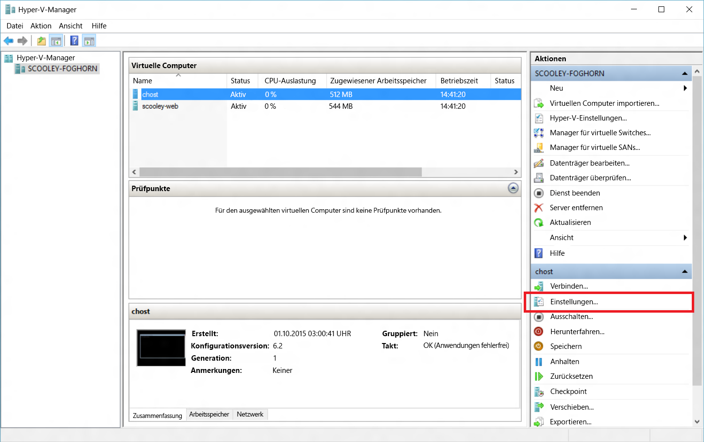
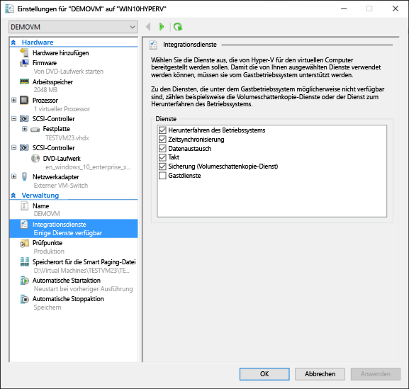
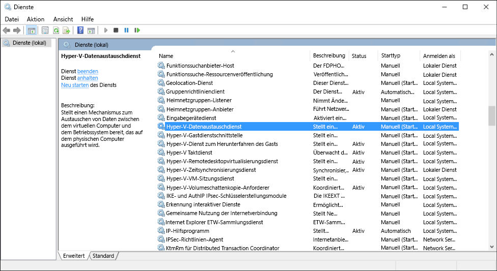

# Verwalten von Hyper-V-Integrationsdiensten

Integrationsdienste (oft als „Integrationskomponenten“ bezeichnet) ermöglichen dem virtuellen Computer das Kommunizieren mit dem Hyper-V-Host. Viele dieser Dienste sind bloß zweckmäßig (z. B. Kopieren von Gastdateien), während andere für das ordnungsgemäße Funktionieren des Gastbetriebssystems wichtig sein können (z. B. Zeitsynchronisierung).

Dieser Artikel enthält ausführliche Informationen zum Verwalten von Integrationsdiensten mithilfe von Hyper-V-Manager und PowerShell in Windows 10. Weitere Informationen zu den einzelnen Integrationsdiensten finden Sie unter [Integrationsdienste](https://technet.microsoft.com/en-us/library/dn798297.aspx).

## Aktivieren und Deaktivieren von Integrationsdiensten mit Hyper-V-Manager

1. Wählen Sie einen virtuellen Computer aus, und öffnen Sie „Einstellungen“.
    

2. Wechseln Sie im Fenster „Einstellungen“ des virtuellen Computers unter „Verwaltung“ zur Registerkarte „Integrationsdienste“.

    

    Hier sehen Sie alle Integrationsdienste, die auf diesem Hyper-V-Host verfügbar sind. Wichtig ist der Hinweis, dass das Gastbetriebssystem ggf. nicht alle aufgeführten Integrationsdienste unterstützt.

## Aktivieren und Deaktivieren von Integrationsdiensten mit PowerShell

Integrationsdienste können mit PowerShell aktiviert und deaktiviert werden, indem [`Enable-VMIntegrationService`](https://technet.microsoft.com/en-us/library/hh848500.aspx) und [`Disable-VMIntegrationService`](https://technet.microsoft.com/en-us/library/hh848488.aspx) ausgeführt werden.

In diesem Beispiel aktivieren und deaktivieren wir den Integrationsdienst für das Kopieren von Gastdateien auf dem zuvor erwähnten virtuellen Computer „demovm“.

1. Prüfen, welche Integrationsdienste ausgeführt werden

  ``` PowerShell
  Get-VMIntegrationService -VMName "demovm"
  ```

  Die Ausgabe sieht folgendermaßen aus:
  ``` PowerShell
  VMName      Name                    Enabled PrimaryStatusDescription SecondaryStatusDescription
  ------      ----                    ------- ------------------------ --------------------------
  demovm      Guest Service Interface False   OK
  demovm      Heartbeat               True    OK                       OK
  demovm      Key-Value Pair Exchange True    OK
  demovm      Shutdown                True    OK
  demovm      Time Synchronization    True    OK
  demovm      VSS                     True    OK
  ```

2. Aktivieren Sie den Integrationsdienst `Guest Service Interface`.

   ``` PowerShell
   Enable-VMIntegrationService -VMName "demovm" -Name "Guest Service Interface"
   ```

   Wenn Sie `Get-VMIntegrationService -VMName "demovm"` ausführen, sehen Sie, dass der Integrationsdienst „Guest Service Interface“ aktiviert ist.

3. Deaktivieren Sie den Integrationsdienst `Guest Service Interface`.

   ``` PowerShell
   Disable-VMIntegrationService -VMName "demovm" -Name "Guest Service Interface"
   ```

Integrationsdienste sind so konzipiert, dass sie für ein ordnungsgemäßes Funktionieren sowohl im Host- als auch im Gastsystem aktiviert sein müssen. In Windows-Gastbetriebssystemen sind Integrationsdienste standardmäßig aktiviert, können aber deaktiviert werden. Dies wird im nächsten Abschnitt erläutert.


## Verwalten von Integrationsdiensten im Gastbetriebssystem (Windows)

> **Hinweis:** Durch das Deaktivieren von Integrationsdiensten kann die Fähigkeit des Hosts zum Verwalten Ihres virtuellen Computers schwerwiegend eingeschränkt werden. Integrationsdienste müssen für einen ordnungsgemäßen Betrieb auf Host und Gast aktiviert sein.

Integrationsdienste werden unter Windows als Dienste angezeigt. Zum Aktivieren oder Deaktivieren eines Integrationsdiensts innerhalb des virtuellen Computers öffnen Sie den Windows-Dienste-Manager.



Suchen Sie die Dienste, die „Hyper-V“ im Namen enthalten. Klicken Sie mit der rechten Maustaste auf den Dienst, den Sie aktivieren oder deaktivieren bzw. starten oder beenden möchten.

Um alle Integrationsdienste mithilfe von PowerShell anzuzeigen, führen Sie Folgendes aus:

```PowerShell
Get-Service -Name vm*
```

Als Rückgabe erhalten Sie eine Liste, die ungefähr so aussieht:

```PowerShell
Status   Name               DisplayName
------   ----               -----------
Running  vmicguestinterface Hyper-V Guest Service Interface
Running  vmicheartbeat      Hyper-V Heartbeat Service
Running  vmickvpexchange    Hyper-V Data Exchange Service
Running  vmicrdv            Hyper-V Remote Desktop Virtualizati...
Running  vmicshutdown       Hyper-V Guest Shutdown Service
Running  vmictimesync       Hyper-V Time Synchronization Service
Stopped  vmicvmsession      Hyper-V VM Session Service
Running  vmicvss            Hyper-V Volume Shadow Copy Requestor
```

Starten oder beenden Sie Dienste mit [`Start-Service`](https://technet.microsoft.com/en-us/library/hh849825.aspx) bzw. [`Stop-Service`](https://technet.microsoft.com/en-us/library/hh849790.aspx).

Standardmäßig sind alle Integrationsdienste im Gastbetriebssystem aktiviert.

## Verwalten von Integrationsdiensten im Gastbetriebssystem (Linux)

Linux-Integrationsdienste werden in der Regel über den Linux-Kernel bereitgestellt.

Prüfen Sie, ob die Integrationsdiensttreiber und -daemons ausgeführt werden, indem Sie in Ihrem Linux-Gastbetriebssystem die folgenden Befehle ausführen.

1. Der Treiber für Linux-Integrationsdienste heißt „hv_utils“. Führen Sie Folgendes aus, um festzustellen, ob er geladen ist.

  ``` BASH
  lsmod | grep hv_utils
  ```

  Die Ausgabe sollte wie folgt aussehen:

  ``` BASH
  Module                  Size   Used by
  hv_utils               20480   0
  hv_vmbus               61440   8 hv_balloon,hyperv_keyboard,hv_netvsc,hid_hyperv,hv_utils,hyperv_fb,hv_storvsc
  ```

2. Führen Sie den folgenden Befehl im Linux-Gastbetriebssystem aus, um zu prüfen, ob die erforderlichen Daemons ausgeführt werden.

  ``` BASH
  ps -ef | grep hv
  ```

  Die Ausgabe sollte wie folgt aussehen:

  ``` BASH
  root       236     2  0 Jul11 ?        00:00:00 [hv_vmbus_con]
  root       237     2  0 Jul11 ?        00:00:00 [hv_vmbus_ctl]
  ...
  root       252     2  0 Jul11 ?        00:00:00 [hv_vmbus_ctl]
  root      1286     1  0 Jul11 ?        00:01:11 /usr/lib/linux-tools/3.13.0-32-generic/hv_kvp_daemon
  root      9333     1  0 Oct12 ?        00:00:00 /usr/lib/linux-tools/3.13.0-32-generic/hv_kvp_daemon
  root      9365     1  0 Oct12 ?        00:00:00 /usr/lib/linux-tools/3.13.0-32-generic/hv_vss_daemon
  scooley  43774 43755  0 21:20 pts/0    00:00:00 grep --color=auto hv          
  ```

  Führen Sie Folgendes aus, um festzustellen, welche Daemons verfügbar sind:
  ``` BASH
  compgen -c hv_
  ```

  Die Ausgabe sollte wie folgt aussehen:

  ``` BASH
  hv_vss_daemon
  hv_get_dhcp_info
  hv_get_dns_info
  hv_set_ifconfig
  hv_kvp_daemon
  hv_fcopy_daemon     
  ```

  Daemons für Integrationsdienste, die ggf. angezeigt werden:
* `hv_vss_daemon`: Dieser Daemon ist zum Erstellen von Sicherungen aktiver virtueller Linux-Computer erforderlich.
* `hv_kvp_daemon`: Dieser Daemon ermöglicht das Festlegen und Abfragen interner und externer Schlüsselwertpaare.
* `hv_fcopy_daemon`: Dieser Daemon implementiert einen Dateikopierdienst zwischen Host und Gast.

> **Hinweis:** Wenn die genannten Daemons für Integrationsdienste nicht verfügbar sind, werden sie möglicherweise auf Ihrem System nicht unterstützt oder sind nicht installiert. Weitere distributionsbezogene Informationen finden Sie [hier](https://technet.microsoft.com/en-us/library/dn531030.aspx).

In diesem Beispiel beenden und starten wir den KVP-Daemon `hv_kvp_daemon`.

Beenden Sie den Prozess des Daemons mithilfe der PID (Prozess-ID), die sich in der zweiten Spalte der obigen Ausgabe befindet. Alternativ können Sie den richtigen Prozess mithilfe von `pidof` finden. Da Hyper-V-Daemons als Root ausgeführt werden, benötigen Sie Rootberechtigungen.

``` BASH
sudo kill -15 `pidof hv_kvp_daemon`
```

Wenn Sie `ps -ef | hv` nochmals ausführen, sehen Sie, dass der Prozess `hv_kvp_daemon` nicht mehr vorhanden ist.

Um den Daemon erneut zu starten, führen Sie den Daemon als Root aus.

``` BASH
sudo hv_kvp_daemon
```

Wenn Sie `ps -ef | hv` nochmals ausführen, sehen Sie, dass der Prozess `hv_kvp_daemon` eine neue Prozess-ID hat.


## Wartung von Integrationsdiensten

Halten Sie Integrationsdienste auf dem neuesten Stand, um sich die bestmögliche Leistung und neuesten Features für virtuelle Computer zu sichern.

**Für auf Windows 10-Hosts ausgeführte virtuelle Computer:**

| Gastbetriebssystem| Updatemechanismus| Anmerkungen|
|:---------|:---------|:---------|
| Windows 10| Windows Update| |
| Windows 8.1| Windows Update| |
| Windows 8| Windows Update| Benötigt den Integrationsdienst „Datenaustausch“.*****|
| Windows 7| Windows Update| Benötigt den Integrationsdienst „Datenaustausch“.*****|
| Windows Vista (SP 2)| Windows Update| Benötigt den Integrationsdienst „Datenaustausch“.*****|
| –| | |
| Windows Server 2012 R2| Windows Update| |
| Windows Server 2012| Windows Update| Benötigt den Integrationsdienst „Datenaustausch“.*****|
| Windows Server 2008 R2| Windows Update| Benötigt den Integrationsdienst „Datenaustausch“.*****|
| Windows Server 2008 (SP 2)| Windows Update| Benötigt den Integrationsdienst „Datenaustausch“.*****|
| Windows Home Server 2011| Windows Update| Benötigt den Integrationsdienst „Datenaustausch“.*****|
| Windows Small Business Server 2011| Windows Update| Benötigt den Integrationsdienst „Datenaustausch“.*****|


**\*** Wenn der Integrationsdienst „Datenaustausch“ nicht aktiviert werden kann, stehen die Integrationskomponenten für diese Gastbetriebssysteme als CAB-Dateien im Downloadcenter [hier](https://support.microsoft.com/en-us/kb/3071740) zur Verfügung. Anweisungen zum Ausführen einer CAB-Datei finden Sie [hier](http://blogs.technet.com/b/virtualization/archive/2015/07/24/integration-components-available-for-virtual-machines-not-connected-to-windows-update.aspx).


**Für auf Windows 8.1-Hosts ausgeführte virtuelle Computer:**

| Gastbetriebssystem| Updatemechanismus| Anmerkungen|
|:---------|:---------|:---------|
| Windows 10| Windows Update| |
| Windows 8.1| Windows Update| |
| Windows 8| Integrationsdienste-Datenträger| |
| Windows 7| Integrationsdienste-Datenträger| |
| Windows Vista (SP 2)| Integrationsdienste-Datenträger| |
| Windows XP (SP 2, SP 3)| Integrationsdienste-Datenträger| |
| –| | |
| Windows Server 2012 R2| Windows Update| |
| Windows Server 2012| Integrationsdienste-Datenträger| |
| Windows Server 2008 R2| Integrationsdienste-Datenträger| |
| Windows Server 2008 (SP 2)| Integrationsdienste-Datenträger| |
| Windows Home Server 2011| Integrationsdienste-Datenträger| |
| Windows Small Business Server 2011| Integrationsdienste-Datenträger| |
| Windows Server 2003 R2 (SP 2)| Integrationsdienste-Datenträger| |
| Windows Server 2003 (SP 2)| Integrationsdienste-Datenträger| |

**Für auf Windows 8-Hosts ausgeführte virtuelle Computer:**

| Gastbetriebssystem| Updatemechanismus| Anmerkungen|
|:---------|:---------|:---------|
| Windows 8.1| Windows Update| |
| Windows 8| Integrationsdienste-Datenträger| |
| Windows 7| Integrationsdienste-Datenträger| |
| Windows Vista (SP 2)| Integrationsdienste-Datenträger| |
| Windows XP (SP 2, SP 3)| Integrationsdienste-Datenträger| |
| –| | |
| Windows Server 2012 R2| Windows Update| |
| Windows Server 2012| Integrationsdienste-Datenträger| |
| Windows Server 2008 R2| Integrationsdienste-Datenträger| |
| Windows Server 2008 (SP 2)| Integrationsdienste-Datenträger| |
| Windows Home Server 2011| Integrationsdienste-Datenträger| |
| Windows Small Business Server 2011| Integrationsdienste-Datenträger| |
| Windows Server 2003 R2 (SP 2)| Integrationsdienste-Datenträger| |
| Windows Server 2003 (SP 2)| Integrationsdienste-Datenträger| |

Eine Anleitung zur Aktualisierung mithilfe des Integrationsdienste-Datenträgers für Windows 8 und Windows 8.1 finden Sie [hier](https://technet.microsoft.com/en-us/library/hh846766.aspx#BKMK_step4).

**\*\*** Weitere Informationen zu Linux-Gastbetriebssystemen finden Sie [hier](https://technet.microsoft.com/en-us/library/dn531030.aspx).


