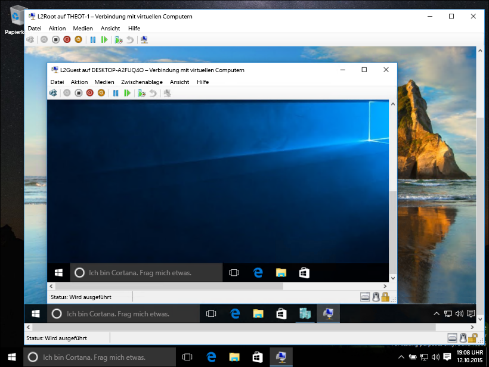
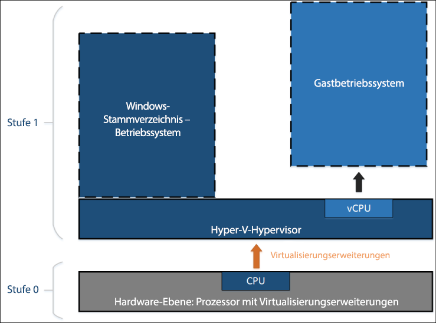
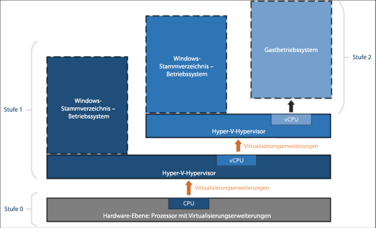

# Geschachtelte Virtualisierung

> **Hinweis:** Dieses frühe Vorschaufeature ist nur für Windows Insider verfügbar, die Build 10565 oder höher ausführen, und gibt keine Garantien hinsichtlich Leistung oder Stabilität.

Als geschachtelte Virtualisierung wird das Ausführen virtualisierter Funktionen in einer virtualisierten Umgebung bezeichnet. Anders ausgedrückt erlaubt Ihnen die Schachtelung das Ausführen der Serverrolle „Hyper-V“ in einem virtuellen Computer.



Hyper-V erfordert die Unterstützung der Hardwarevirtualisierung (z. B. Intel VT-X und AMD-V), um virtuelle Maschinen ausführen zu können. In der Regel verbirgt der Hypervisor nach der Installation von Hyper-V diese Fähigkeit vor den virtuellen Gastcomputern. Dadurch wird verhindert, dass Gastcomputer die Serverrolle „Hyper-V“ unter anderen Hypervisoren ausführen.

Bei der geschachtelten Virtualisierung werden diese Komponenten zur Unterstützung der Hardwarevirtualisierung dem virtuellen Gastcomputer verfügbar gemacht.

Das folgende Diagramm zeigt Hyper-V ohne Schachtelung. Der Hyper-V-Hypervisor hat die vollständige Kontrolle über die Hardwarevirtualisierungserweiterungen (orangefarbener Pfeil) und macht diese nicht für das Gastbetriebssystem verfügbar.



Im Gegensatz dazu zeigt das folgende Diagramm Hyper-V mit Schachtelung. In diesem Fall stellt Hyper-V die Hardwarevirtualisierungserweiterungen seinen virtuellen Computern zur Verfügung. Bei aktivierter Schachtelung können Gast-VMs ihren eigenen Hypervisor installieren und eigene Gast-VMs ausführen.



## Anforderungen an die geschachtelte Virtualisierung

Bedenken Sie vor der Aktivierung der geschachtelten Virtualisierung, dass dies eine Vorschau ist. Verwenden Sie die Schachtelung nicht in Produktionsumgebungen.

Anforderungen:
* Mindestens 4 GB verfügbarer Arbeitsspeicher (RAM). Die geschachtelte Virtualisierung erfordert großzügig bemessenen Arbeitsspeicher.
* Beide Hypervisoren müssen den neuesten Windows Insider-Build (10565 oder höher) aufweisen. Andere Hypervisoren funktionieren nicht.
* Dieses Feature ist derzeit auf Intel beschränkt. Intel VT-x ist erforderlich.

## Aktivieren der geschachtelten Virtualisierung

1. Erstellen Sie einen virtuellen Computer, auf dem derselbe Build wie auf dem Host ausgeführt wird (siehe die [Anweisungen hier](../quick_start/walkthrough_create_vm.md)).

2. Führen Sie [dieses Skript](https://github.com/Microsoft/Virtualization-Documentation/blob/master/hyperv-tools/Nested/Enable-NestedVm.ps1) als Administrator auf dem Hyper-V-Host aus.

    In dieser frühen Vorschau gelten für die Schachtelung verschiedene Konfigurationsanforderungen. Zur Vereinfachung der Abläufe dient [dieses PowerShell-Skript](https://github.com/Microsoft/Virtualization-Documentation/blob/master/hyperv-tools/Nested/Enable-NestedVm.ps1) zum Überprüfen der Konfiguration, Ändern aller Elemente, die nicht ordnungsgemäß sind, und Aktivieren der geschachtelten Virtualisierung für den angegebenen virtuellen Computer.

  ``` PowerShell
  Invoke-WebRequest https://raw.githubusercontent.com/Microsoft/Virtualization-Documentation/master/hyperv-tools/Nested/Enable-NestedVm.ps1 -OutFile ~/Enable-NestedVm.ps1 
  ~/Enable-NestedVm.ps1 -VmName "DemoVM"
  ```

3. Installieren Sie Hyper-V auf dem virtuellen Computer.

  ``` PowerShell
  Invoke-Command -VMName "DemoVM" -ScriptBlock { Enable-WindowsOptionalFeature -FeatureName Microsoft-Hyper-V -Online; Restart-Computer }
  ```

4. Erstellen Sie geschachtelte virtuelle Computer!

## Bekannte Probleme

Es folgt eine Liste bekannter Probleme:
* Hosts mit aktiviertem Device Guard können keine Virtualisierungserweiterungen für Gäste verfügbar machen.

* Hosts mit aktivierter virtualisierungsbasierter Sicherheit (VBS) können keine Virtualisierungserweiterungen für Gäste verfügbar machen. Sie müssen VBS zuerst deaktivieren, um eine Vorschau auf die geschachtelte Virtualisierung anzuzeigen.

* Wenn die geschachtelte Virtualisierung auf einem virtuellen Computer aktiviert ist, sind die folgenden Features nicht mehr mit diesem virtuellen Computer kompatibel.  
    Diese Aktionen haben entweder keinen Erfolg oder bewirken, dass der virtuelle Computer nicht gestartet wird, wenn er andere virtuelle Computer hostet:
    * Dynamischer Arbeitsspeicher muss deaktiviert sein. Dies verhindert den Start der VM.
    * Das Ändern der Größe des Laufzeitspeichers ist nicht möglich.
    * Das Anwenden von Prüfpunkten auf einen ausgeführten virtuellen Computer ist nicht möglich.
    * Eine Livemigration ist nicht möglich, was heißt, dass eine VM, die andere VMs hostet, nicht per Livemigration migriert werden kann.
    * Speichern/Wiederherstellen ist nicht möglich.

    > **Hinweis:** Diese Features funktionieren weiterhin in der „innersten“ Gast-VM. Die Einschränkungen gelten nur für die VM auf erster Ebene.

* Wenn die geschachtelte Virtualisierung aktiviert ist, muss das Spoofing von MAC-Adressen auf dem virtuellen Computer aktiviert sein, damit der Netzwerkbetrieb für die „innersten“ Gäste funktioniert.

## Häufig gestellte Fragen und Problembehandlung

### Mein virtueller Computer startet nicht. Was muss ich tun?

1. Stellen Sie sicher, dass der dynamische Arbeitsspeicher deaktiviert ist.
2. Führen Sie dieses PowerShell-Skript auf dem Hostcomputer an einer Eingabeaufforderung mit erhöhten Rechten aus.

    Dieses Skript meldet, ob Host und VMs ordnungsgemäß für die Schachtelung konfiguriert sind.

  ``` PowerShell
  Invoke-WebRequest https://raw.githubusercontent.com/Microsoft/Virtualization-Documentation/master/hyperv-tools/Nested/Get-NestedVirtStatus.ps1 -OutFile ~/Get-NestedVirtStatus.ps1 
  ~/Get-NestedVirtStatus.ps1
  ```

### Die Verbindung mit virtuellen Computern geht ständig verloren.

Wenn Sie ein leeres Kennwort verwenden, ist dies ein bekanntes Problem. Ändern Sie Ihr Kennwort, wodurch das Problem gelöst werden sollte.

### Mein Problem ist hier nicht aufgeführt.

Wird Ihr Problem nicht angezeigt? Haben Sie Feedback? Kontaktieren Sie uns.

Nutzen Sie für Rückmeldungen die Windows-Feedback-App, die [Virtualisierungsforen](https://social.technet.microsoft.com/Forums/windowsserver/En-us/home?forum=winserverhyperv) oder [GitHub](https://github.com/Microsoft/Virtualization-Documentation).


