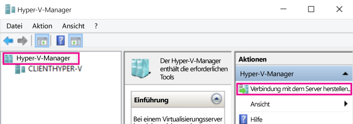
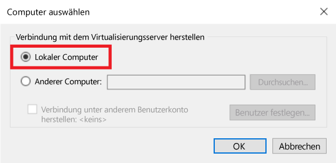
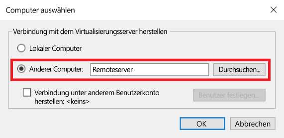
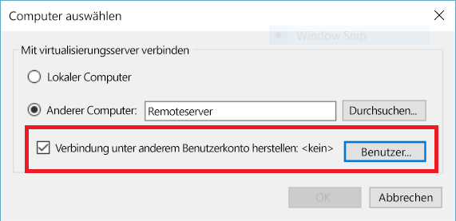

# Verwalten von Hyper-V-Remotehosts mit Hyper-V-Manager

Hyper-V-Manager ist ein integriertes Tool für die Diagnose und Verwaltung Ihres lokalen Hyper-V-Hosts und einer kleinen Anzahl von Remotehosts. Dieser Artikel beschreibt die Konfigurationsschritte für das Verbinden mit Hyper-V-Hosts mithilfe von Hyper-V-Manager in allen unterstützten Konfigurationen.

> Der Hyper-V-Manager steht über **Programme und Funktionen** als **Hyper-V-Verwaltungstools** in allen [Windows-Betriebssystemen mit enthaltenem Hyper-V](../quick_start/walkthrough_compatibility.md#OperatingSystemRequirements) zur Verfügung. Die Hyper-V-Plattform muss nicht aktiviert werden, um Remotehosts zu verwalten.

Zum Verbinden mit einem Hyper-V-Host im Hyper-V-Manager stellen Sie sicher, dass im linken Bereich **Hyper-V-Manager** ausgewählt ist. Wählen Sie dann im rechten Bereich **Mit Server verbinden...** aus.



## Unterstützte Hyper-V-Hostkombinationen mit dem Hyper-V-Manager

Mit dem Hyper-V-Manager in Windows 10 können Sie die folgenden Hyper-V-Hosts verwalten:
* Windows 10
* Windows 8.1
* Windows 8
* Windows Server 2012 R2 + Windows Server Core, Datacenter und Hyper-V Server
* Windows 2012 + Windows Server Core, Datacenter und Hyper-V Server

Der Hyper-V Manager in Windows 8.1 und Windows Server 2012 R2 ermöglicht Ihnen das Verwalten von:
* Windows 8.1
* Windows 8
* Windows Server 2012 R2 + Windows Server Core, Datacenter und Hyper-V Server
* Windows 2012 + Windows Server Core, Datacenter und Hyper-V Server

Der Hyper-V Manager in Windows 8 und Windows Server 2012 ermöglicht Ihnen das Verwalten von:
* Windows 8
* Windows 2012 + Windows Server Core, Datacenter und Hyper-V Server

Hyper-V ist unter Windows seit Windows 8 verfügbar. Vor Windows 8.1/Server 2012 konnten mit dem Hyper-V-Manager nur entsprechende Versionen von Hyper-V verwaltet werden.

> **Hinweis:** Die Hyper-V-Manager-Funktionalität entspricht der Funktionalität, welche für die von Ihnen verwaltete Version verfügbar ist. Wenn Sie also einen Windows Server 2012-Remotehost in Windows Server 2012 R2 verwalten, stehen die neuen Hyper-V-Manager-Tools in Windows Server 2012 R2 nicht zur Verfügung.

## Verwalten von „localhost“

Um dem Hyper-V-Manager „localhost“ als Hyper-V-Host hinzuzufügen, wählen Sie **Lokaler Computer** im Dialogfeld **Computer auswählen** aus.



Wenn keine Verbindung hergestellt werden kann:
*  Stellen Sie sicher, dass die Rolle „Hyper-V-Plattform“ aktiviert ist.  
    Prüfen Sie im [Abschnitt mit der exemplarischen Vorgehensweise für die Überprüfung der Kompatibilität](../quick_start/walkthrough_compatibility.md), ob Hyper-V unterstützt wird.
*  Vergewissern Sie sich, dass Ihr Benutzerkonto der Gruppe „Hyper-V-Administratoren“ angehört.


## Verwalten eines anderen Hyper-V-Hosts in derselben Domäne

Um einen Hyper-V-Remotehost zu Hyper-V-Manager hinzuzufügen, wählen Sie **Anderer Computer** im Dialogfeld **Computer auswählen** aus und geben den Hostnamen des Remotehosts, den NetBIOS-Namen oder FQDN in das Textfeld ein.



Um Hyper-V-Remotehosts zu verwalten, muss auf dem lokalen Computer und dem Remotehost die Remoteverwaltung aktiviert sein.

Dies ist über `Systemeigenschaften > Remoteverwaltungseinstellungen ` oder den folgenden PowerShell-Befehl möglich, den Sie als Administrator ausführen müssen:

``` PowerShell
winrm quickconfig
```

Wenn Ihr aktuelles Benutzerkonto mit einem Hyper-V-Administratorkonto auf dem Remotehost übereinstimmt, klicken Sie auf **OK**, um die Verbindung herzustellen.

> Dies ist die einzige Möglichkeit zum Verwalten eines Remotehosts in Hyper-V-Manager unter Windows 8 oder Windows 8.1.


Windows 10 bietet weitaus mehr mögliche Kombinationen von Remoteverbindungstypen.  
Mit einem Remotehost mit Windows 10 und höher können Sie sich über den Hostnamen oder die IP-Adresse verbinden. Der Hyper-V-Manager unterstützt jetzt auch alternative Anmeldeinformationen.


### Verbinden mit dem Remotehost als anderer Benutzer

> Dies ist nur möglich, wenn eine Verbindung mit einem Remotehost mit Windows 10 oder Server 2016 Technical Preview 3 oder höher hergestellt wird.

Wenn Sie unter Windows 10 nicht das ordnungsgemäße Benutzerkonto für den Remotehost ausführen, können Sie eine Verbindung als ein anderer Benutzer mit alternativen Anmeldeinformationen herstellen.

Zum Angeben von Anmeldeinformationen für den Hyper-V-Remotehost wählen Sie im Dialogfeld „Computer auswählen“ **Verbindung unter anderem Benutzerkonto herstellen** und dann **Benutzer festlegen...** aus.




### Verbinden mit dem Remotehost über die IP-Adresse

> Dies ist nur möglich, wenn eine Verbindung mit einem Remotehost mit Windows 10 oder Server 2016 Technical Preview 3 oder höher hergestellt wird.

Mitunter ist es einfacher, eine Verbindung über die IP-Adresse anstatt über den Hostnamen herzustellen. Windows 10 ermöglicht genau dies.

Um eine Verbindung mithilfe der IP-Adresse herzustellen, geben Sie die IP-Adresse in das Textfeld **Anderer Computer** ein.


## Verwalten eines Hyper-V-Hosts außerhalb der Domäne (oder ohne Domäne)

> Dies ist nur möglich, wenn eine Verbindung mit einem Remotehost mit Windows 10 oder Server 2016 Technical Preview 3 oder höher hergestellt wird.

Führen Sie auf dem zu verwaltenden Hyper-V-Host Folgendes als Administrator aus:

1.  [Enable-PSRemoting](https://technet.microsoft.com/en-us/library/hh849694.aspx)
    * [Enable-PSRemoting](https://technet.microsoft.com/en-us/library/hh849694.aspx) erstellt die erforderlichen Firewallregeln für *private* Netzwerkzonen. Um diesen Zugriff auf öffentliche Zonen zu ermöglichen, müssen Sie die Regeln für CredSSP und WinRM aktivieren.
2. Set-Item WSMan:\localhost\Client\TrustedHosts -value "fqdn-of-managing-pc"
    * Alternativ können Sie alle zu verwaltenden Hosts als vertrauenswürdig einstufen:
    * Set-Item WSMan:\localhost\Client\TrustedHosts -value * -force
3. [Enable-WSManCredSSP](https://technet.microsoft.com/en-us/library/hh849872.aspx) -Role client -DelegateComputer "fqdn-of-managing-pc"
    * Alternativ können Sie alle zu verwaltenden Hosts als vertrauenswürdig einstufen:
    * [Enable-WSManCredSSP](https://technet.microsoft.com/en-us/library/hh849872.aspx) -Role client -DelegateComputer *


