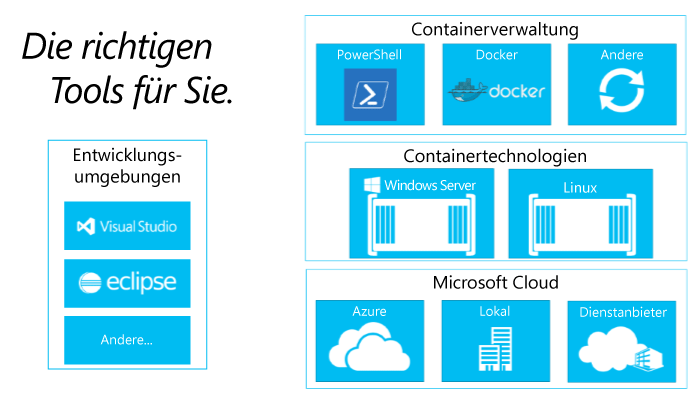

# Informationen zum Erstellen von Container-Ökosystemen

Um zu verstehen, warum das Erstellen eines Container-Ökosystems so wichtig ist, sollten wir zunächst über seine Komponenten sprechen.

## Komponenten eines Container-Ökosystems

Windows-Container sind eine wichtige Komponente eines umfangreichen Container-Ökosystems. Wir arbeiten mit der gesamten Branche zusammen, um Entwicklern Optionen auf allen Ebenen des Lösungsstapels zu bieten.

Das Container-Ökosystem bietet Möglichkeiten zum Verwalten, freigeben und entwickeln von apps, die in Containern ausgeführt werden.

Microsoft möchte bei der Entwicklung dieser Apps der nächsten Generation Entwicklern mehr Optionen und Produktivität bieten. Unser Ziel ist es, die Produktivität der Entwickler zu steigern, was bedeutet, dass Anwendungen auf eine beliebige Microsoft-Cloud ausgerichtet werden können, ohne Code ändern, neu schreiben oder neu konfigurieren zu müssen.

Microsoft hat sich verpflichtet, offen und Ökosystem-freundlich zu sein. Wir unterstützen aktiv die Kombination mehrerer Entwickler-Ökosysteme von Interesse, wie Windows und Linux, um Innovationen voranzutreiben.

In den nächsten Monaten werden wir weitere Informationen zu weiteren Partnern in diesem Entwicklungsnetzwerk bereitstellen.