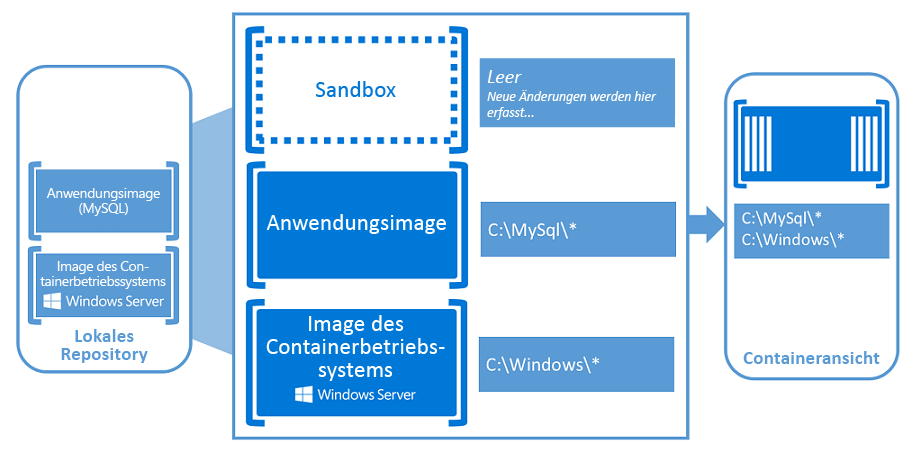

# Informationen zu Windows-Containern

Stellen Sie sich eine Küche vor. In diesem Einzelzimmer finden Sie alles, was Sie zum Zubereiten einer Mahlzeit brauchen: Backofen, Pfannen, Spüle usw. Das ist unser Container.

Stellen Sie sich nun vor, diese Küche in ein Gebäude so einfach wie zu schieben, indem Sie ein Buch in ein Bücherregal schieben. Da alles, was die Küche zu funktionieren hat, bereits vorhanden ist, müssen wir nur noch mit dem Kochen beginnen, um die Stromversorgung und die sanitäre Anlagen zu verbinden.

Warum sollten Sie hier aufhören? Sie können Ihr Gebäude ganz nach Ihren Wünschen anpassen. Füllen Sie es mit vielen Arten von Räumen, füllen Sie es mit identischen Räumen, oder mischen Sie die beiden.

Container fungieren wie dieser Raum, indem Sie eine APP so ausführen, wie wir Sie in unserer Küche zubereiten. Ein Container platziert eine APP und alles, was die APP benötigt, um in einem eigenen isolierten Feld ausgeführt zu werden. Die isolierte App kennt daher keine anderen apps oder Prozesse, die außerhalb ihres Containers vorhanden sind. Da der Container über alles verfügt, was die app ausführen muss, kann der Container an einer beliebigen Stelle verschoben werden, wobei nur die Ressourcen verwendet werden, die der Host bereitstellt, ohne die Ressourcen zu berühren, die für andere Container vorgesehen sind.

Im folgenden Video erfahren Sie mehr darüber, was Windows-Container für Sie tun können, und wie die Partnerschaft von Microsoft mit docker dazu beiträgt, eine reibungslose Umgebung für die Entwicklung von Open-Source-Containern zu schaffen:

<iframe width="800" height="450" src="https://www.youtube.com/embed/Ryx3o0rD5lY" frameborder="0" allow="accelerometer; autoplay; encrypted-media; gyroscope; picture-in-picture" allowfullscreen></iframe>

## Container-Grundlagen

Lassen Sie uns einige Begriffe kennenlernen, die für die Arbeit mit Windows-Containern nützlich sind:

- Container Host: ein physisches oder virtuelles Computersystem, das mit dem Windows-Container Feature konfiguriert wurde. Der Container Host führt mindestens einen Windows-Container aus.
- Sandbox: der Layer, in dem alle Änderungen erfasst werden, die Sie während der Ausführung an dem Container vornehmen (wie Dateisystemänderungen, Registrierungsänderungen oder Softwareinstallationen).
- Basis Bild: die erste Ebene in den Bildebenen eines Containers, die die Betriebssystemumgebung des Containers bereitstellt. Ein Basis Bild kann nicht geändert werden.
- Container Bild: eine schreibgeschützte Vorlage mit Anweisungen zum Erstellen eines Containers. Bilder können auf einer einfachen, unveränderten Betriebssystemumgebung basieren, können aber auch aus der Sandbox eines geänderten Containers erstellt werden. Diese geänderten Bilder überlagern Ihre Änderungen auf der Basis Bild Ebene, und diese Ebenen können kopiert und auf andere Basisbilder erneut angewendet werden, um ein neues Bild mit denselben Änderungen zu erstellen.
- Container-Repository: das lokale Repository, in dem Ihr Container Bild und seine Abhängigkeiten jedes Mal gespeichert werden, wenn Sie ein neues Bild erstellen. Sie können gespeicherte Bilder beliebig oft auf dem Container Host wieder verwenden. Sie können die Container Bilder auch in einer öffentlichen oder privaten Registrierung wie dem docker-Hub speichern, damit Sie für viele verschiedene Container Hosts verwendet werden können.
- Container Orchestrator: ein Prozess, der eine große Anzahl von Containern automatisiert und verwaltet und wie Sie miteinander interagieren. Weitere Informationen finden Sie unter [Informationen zu Windows-Container-Orchestrators](overview-container-orchestrators.md).
- Docker: ein automatisierter Prozess, bei dem Container Bilder gepackt und geliefert werden. Weitere Informationen finden Sie in der [Übersicht](docker-overview.md)über Andock [Fenster, Andock Modul unter Windows oder auf](../manage-docker/configure-docker-daemon.md) der [docker-Website](https://www.docker.com).

Personen, die mit virtuellen Computern vertraut sind, denken vielleicht, dass Container und virtuelle Maschinen ähnlich aussehen. Ein Container führt ein Betriebssystem aus, verfügt über ein Dateisystem und kann über ein Netzwerk ähnlich wie ein physikalisches oder virtuelles Computersystem aufgerufen werden. Was Technologie und Konzepte anbelangt, unterscheiden sich Container jedoch sehr von virtuellen Computern. Weitere Informationen zu diesen Konzepten finden Sie im [Blogbeitrag](https://azure.microsoft.com/blog/containers-docker-windows-and-trends/) von Mark Russinovich, in dem die Unterschiede ausführlicher erläutert werden.

### Windows-Containertypen

Außerdem sollten Sie wissen, dass es zwei unterschiedliche Containertypen gibt, die auch als Runtimes bezeichnet werden.

Windows Server-Container bieten Anwendungsisolierung durch Prozess-und Namespace isolierungstechnologie, weshalb diese Container auch als Prozess isolierte Container bezeichnet werden. Ein Windows Servercontainer teilt sich einen Kernel mit dem Containerhost und allen Containern, die auf dem Host ausgeführt werden. Diese Prozess isolierten Container stellen keine feindliche Sicherheitsgrenze dar und sollten nicht dazu verwendet werden, nicht vertrauenswürdigen Code zu isolieren. Aufgrund des gemeinsam genutzten Kernelspeichers benötigen diese Container die gleiche Kernelversion und -konfiguration.

Hyper-V-Isolierung erweitert die Isolierung, die von Windows Server-Containern bereitgestellt wird, indem jeder Container auf einem hoch optimierten virtuellen Computer ausgeführt wird. In dieser Konfiguration gibt der Container Host seinen Kernel nicht mit anderen Containern auf demselben Host frei. Diese Container wurden für schädliches mandantenfähiges Hosting mit der gleichen Sicherheitsgarantie wie der eines virtuellen Computers entwickelt. Da diese Container den Kernel nicht mit dem Host oder anderen Containern auf dem Host teilen, können Sie Kernel mit unterschiedlichen Versionen und Konfigurationen (in unterstützten Versionen) ausführen. So verwenden beispielsweise alle Windows-Container unter Windows 10 die Hyper-V-Isolierung, um die Version und Konfiguration des Windows Server-Kernels zu nutzen.

Das Ausführen eines Containers unter Windows mit oder ohne Hyper-V-Isolierung ist eine Lauf Zeit Entscheidung. Sie können den Container zunächst mit Hyper-V-Isolierung erstellen und dann später zur Laufzeit als Windows-Server Container ausführen.

## Container Benutzer

### Container für Entwickler

Container helfen Entwicklern, Anwendungen mit höherer Qualität schneller zu erstellen und zu versenden. Entwickler können ein Andockfenster erstellen, das in Sekunden einheitlich für alle Umgebungen bereitgestellt wird. Es gibt ein massives und wachsendes Ökosystem von Anwendungen, die in docker Containern verpackt sind. DockerHub, eine öffentliche Container-Anwendungsregistrierung, die von Docker verwaltet wird, hat mehr als 180.000-Anwendungen in Ihrem öffentlichen Community-Repository veröffentlicht, und diese Zahl wächst weiterhin.

Wenn ein Entwickler eine APP containerizes, werden nur die APP und die Komponenten, die Sie ausführen müssen, in einem Bild kombiniert. Container werden anschließend nach Bedarf anhand dieses Images erstellt. Sie können ein Image auch als Basis für das Erstellen eines weiteren Images nutzen, wodurch das Erstellen von Images noch schneller erfolgt. Mehrere Container können dasselbe Bild verwenden, was bedeutet, dass Container sehr schnell gestartet werden und weniger Ressourcen zur Verfügung stehen. Beispielsweise kann ein Entwickler Container verwenden, um einfache und Portable App-Komponenten (auch als "microservices" bezeichnet) für verteilte apps zu drehen und die einzelnen Dienste schnell einzeln zu skalieren.

Container sind portabel und vielseitig, können in jeder beliebigen Sprache geschrieben werden und sind mit jedem Computer kompatibel, auf dem Windows Server 2016 ausgeführt wird. Entwickler können einen Container lokal auf Ihrem Laptop oder Desktop erstellen und testen und dann das gleiche Container Abbild in der privaten Cloud, öffentlichen Cloud oder dem Dienstanbieter des Unternehmens bereitstellen. Die natürliche Agilität von Containern unterstützt moderne App-Entwicklungsmuster in großflächigen virtualisierten Cloud-Umgebungen.

### Container für IT-Experten

Mithilfe von Containern können Administratoren Infrastrukturen erstellen, die einfacher zu aktualisieren und zu verwalten sind. IT-Experten können Container verwenden, um standardisierte Umgebungen für Ihre Entwicklungs-, QA-und Produktionsteams bereitzustellen. Sie müssen sich nicht mehr um komplexe Installations-und Konfigurationsverfahren sorgen. Durch die Verwendung von Containern können Systemadministratoren die Unterschiede bei den Betriebssysteminstallationen und der zugrunde liegenden Infrastruktur abstrahieren.

## Container 101-Video Präsentation

In der folgenden Video Präsentation erhalten Sie eine ausführlichere Übersicht über das Protokoll und die Implementierung von Windows-Containern.

<iframe src="https://channel9.msdn.com/Blogs/containers/Containers-101-with-Microsoft-and-Docker/player" width="800" height="450" allowFullScreen="true" frameBorder="0" scrolling="no"></iframe>

## Testen von Windows Server-Containern

Möchten Sie die großartigen Möglichkeiten von Containern nutzen? Die folgenden Artikel unterstützen Sie bei den ersten Schritten:

Informationen zum Einrichten eines Containers auf Windows Server finden Sie in der [Windows Server-Schnellstart](../quick-start/quick-start-windows-server.md)-Anleitung.

Informationen zum Einrichten eines Containers unter Windows 10 finden Sie unter [Erste Schritte: Konfigurieren der Umgebung für Container](../quick-start/set-up-environment.md?tabs=Windows-10-Client).