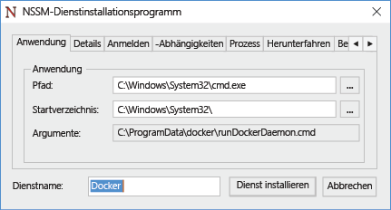
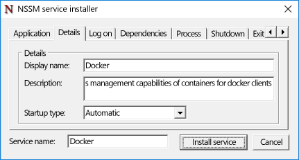
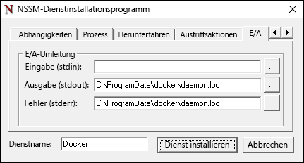

# Docker und Windows

**Dieser Inhalt ist vorläufig und kann geändert werden.** 

Das Docker-Modul ist nicht im Lieferumfang von Windows enthalten und muss einzeln installiert und konfiguriert werden. Die Schritte, die zum Ausführen des Docker-Moduls unter Windows erforderlich sind, unterscheiden sich von den Schritten, die unter Linux benötigt werden. Dieses Dokument führt Sie durch die Schritte, die zum Installieren und Konfigurieren des Docker-Moduls unter Windows Server 2016, Nano Server und Windows Client erforderlich sind. Beachten Sie auch, dass das Docker-Modul und die Befehlszeilenschnittstelle vor Kurzem in zwei Dateien unterteilt wurden. Dieses Dokument enthält Anweisungen zum Installieren beider Dateien.

Weitere Informationen zu Docker und dem Docker-Toolset finden Sie auf [Docker.com](https://www.docker.com/). 

> Das Windows-Containerfeature muss aktiviert werden, bevor Docker zum Erstellen und Verwalten von Windows-Containern verwendet werden kann. Informationen zum Aktivieren dieses Features finden Sie in der [Bereitstellungsanleitung für Containerhosts](./docker_windows.md).

## Windows Server 2016

### Installieren des Docker-Daemons <!--1-->

Laden Sie „dockerd.exe“ von `https://aka.ms/tp5/dockerd` herunter, und speichern Sie die Datei auf dem Containerhost im Verzeichnis „System32“.

```none
wget https://aka.ms/tp5/dockerd -OutFile $env:SystemRoot\system32\dockerd.exe
```

Erstellen Sie ein Verzeichnis namens `c:\programdata\docker`. Erstellen Sie in diesem Verzeichnis eine Datei namens `runDockerDaemon.cmd`.

```none
New-Item -ItemType File -Path C:\ProgramData\Docker\runDockerDaemon.cmd -Force
```

Kopieren Sie den folgenden Text in die Datei `runDockerDaemon.cmd`.

```none
@echo off
set certs=%ProgramData%\docker\certs.d

if exist %ProgramData%\docker (goto :run)
mkdir %ProgramData%\docker

:run
if exist %certs%\server-cert.pem (if exist %ProgramData%\docker\tag.txt (goto :secure))

if not exist %systemroot%\system32\dockerd.exe (goto :legacy)

dockerd -H npipe:// 
goto :eof

:legacy
docker daemon -H npipe:// 
goto :eof

:secure
if not exist %systemroot%\system32\dockerd.exe (goto :legacysecure)
dockerd -H npipe:// -H 0.0.0.0:2376 --tlsverify --tlscacert=%certs%\ca.pem --tlscert=%certs%\server-cert.pem --tlskey=%certs%\server-key.pem
goto :eof

:legacysecure
docker daemon -H npipe:// -H 0.0.0.0:2376 --tlsverify --tlscacert=%certs%\ca.pem --tlscert=%certs%\server-cert.pem --tlskey=%certs%\server-key.pem
```
Laden Sie „nssm.exe“ von [https://nssm.cc/release/nssm-2.24.zip](https://nssm.cc/release/nssm-2.24.zip) herunter.

```none
wget https://nssm.cc/release/nssm-2.24.zip -OutFile $env:ALLUSERSPROFILE\nssm.zip
```

Extrahieren Sie das komprimierte Paket.

```none
Expand-Archive -Path $env:ALLUSERSPROFILE\nssm.zip $env:ALLUSERSPROFILE
```

Kopieren Sie `nssm-2.24\win64\nssm.exe` in das Verzeichnis `c:\windows\system32`.

```none
Copy-Item $env:ALLUSERSPROFILE\nssm-2.24\win64\nssm.exe $env:SystemRoot\system32
```
Führen Sie `nssm install` aus, um den Docker-Dienst zu konfigurieren.

```none
start-process nssm install
```

Geben Sie die folgenden Daten in die entsprechenden Felder im NSSM-Installationsprogramm ein.

Registerkarte „Anwendung“:

**Pfad:** C:\Windows\System32\cmd.exe

**Startverzeichnis:** C:\Windows\System32

**Argumente:** /s /c C:\ProgramData\docker\runDockerDaemon.cmd < nul

**Dienstname:** Docker



Registerkarte „Details“:

**Anzeigename:** Docker

**Beschreibung:** Der Docker-Daemon bietet Funktionen zur Verwaltung von Containern für Docker-Clients.



Registerkarte „E/A“:

**Ausgabe (stdout):** C:\ProgramData\docker\daemon.log

**Fehler (stderr):** C:\ProgramData\docker\daemon.log



Wenn Sie fertig sind, klicken Sie auf die Schaltfläche `Install Service`.

Der Docker-Daemon ist jetzt als Windows-Dienst konfiguriert.

### Firewall <!--1-->

Wenn Sie die Docker-Remoteverwaltung aktivieren möchten, müssen Sie auch TCP-Port 2376 öffnen.

```none
netsh advfirewall firewall add rule name="Docker daemon " dir=in action=allow protocol=TCP localport=2376
```

### Entfernen von Docker <!--1-->

Der folgende Befehl entfernt den Docker-Dienst.

```none
sc.exe delete Docker
```

### Installieren der Docker-Befehlszeilenschnittstelle

Laden Sie „docker.exe“ von `https://aka.ms/tp5/docker` herunter, und platzieren Sie die Datei im Verzeichnis „System32“ des Containerhosts oder eines anderen Systems, auf dem Sie Docker-Befehle ausführen möchten.

```none
wget https://aka.ms/tp5/docker -OutFile $env:SystemRoot\system32\docker.exe
```

## Nano Server

### Installieren von Docker <!--2-->

Laden Sie „dockerd.exe“ aus `https://aka.ms/tp5/dockerd` herunter, und kopieren Sie die Datei in den Ordner `windows\system32` des Nano Server-Containerhosts.

Erstellen Sie ein Verzeichnis namens `c:\programdata\docker`. Erstellen Sie in diesem Verzeichnis eine Datei namens `runDockerDaemon.cmd`.

```none
New-Item -ItemType File -Path C:\ProgramData\Docker\runDockerDaemon.cmd -Force
```

Kopieren Sie den folgenden Text in die Datei `runDockerDaemon.cmd`.

```none
@echo off
set certs=%ProgramData%\docker\certs.d

if exist %ProgramData%\docker (goto :run)
mkdir %ProgramData%\docker

:run
if exist %certs%\server-cert.pem (if exist %ProgramData%\docker\tag.txt (goto :secure))

if not exist %systemroot%\system32\dockerd.exe (goto :legacy)

dockerd -H npipe:// 
goto :eof

:legacy
docker daemon -H npipe:// 
goto :eof

:secure
if not exist %systemroot%\system32\dockerd.exe (goto :legacysecure)
dockerd -H npipe:// -H 0.0.0.0:2376 --tlsverify --tlscacert=%certs%\ca.pem --tlscert=%certs%\server-cert.pem --tlskey=%certs%\server-key.pem
goto :eof

:legacysecure
docker daemon -H npipe:// -H 0.0.0.0:2376 --tlsverify --tlscacert=%certs%\ca.pem --tlscert=%certs%\server-cert.pem --tlskey=%certs%\server-key.pem
```

Sie können das folgende Skript verwenden, um einen geplanten Task zu erstellen, der den Docker-Daemon startet, wenn Windows gestartet wird.

```none
# Creates a scheduled task to start docker.exe at computer start up.

$dockerData = "$($env:ProgramData)\docker"
$dockerDaemonScript = "$dockerData\runDockerDaemon.cmd"
$dockerLog = "$dockerData\daemon.log"
$action = New-ScheduledTaskAction -Execute "cmd.exe" -Argument "/c $dockerDaemonScript > $dockerLog 2>&1" -WorkingDirectory $dockerData
$trigger = New-ScheduledTaskTrigger -AtStartup
$settings = New-ScheduledTaskSettingsSet -Priority 5
Register-ScheduledTask -TaskName Docker -Action $action -Trigger $trigger -Settings $settings -User SYSTEM -RunLevel Highest | Out-Null
Start-ScheduledTask -TaskName Docker 
```

### Firewall <!--2-->

Wenn Sie die Docker-Remoteverwaltung aktivieren möchten, müssen Sie auch TCP-Port 2376 öffnen.

```none
netsh advfirewall firewall add rule name="Docker daemon " dir=in action=allow protocol=TCP localport=2376
```

### Interaktive Nano Server-Sitzung

Nano Server wird über eine PowerShell-Remotesitzung verwaltet. Informationen zur Remoteverwaltung von Nano Server finden Sie unter [Getting Started with Nano Server]( https://technet.microsoft.com/en-us/library/mt126167.aspx#bkmk_ManageRemote) (Erste Schritte mit Nano Server).

Nicht alle Docker-Vorgänge können über eine solche PowerShell-Remotesitzung ausgeführt werden – beispielsweise „docker attach“. Um dieses Problem zu umgehen – und ganz allgemein als bewährte Methode –, verwalten Sie Docker über einen Remoteclient mit einer sicheren TCP-Verbindung.

Stellen Sie zu diesem Zweck sicher, dass der Docker-Daemon zum Lauschen an einem TCP-Port konfiguriert wurde und dass die Docker-Befehlszeilenschnittstelle auf einem Remoteclientcomputer verfügbar ist. Nach der Konfiguration können Docker-Befehle mit dem Parameter „-H“ an den Host ausgegeben werden. Weitere Informationen zum Zugriff auf den Docker-Daemon über ein Remotesystem finden Sie auf Docker.com unter [Daemon socket options](https://docs.docker.com/engine/reference/commandline/daemon/#daemon-socket-option) (Socketoptionen für den Daemon).

Um einen Container remote bereitzustellen und eine interaktive Sitzung zu starten, führen Sie den folgenden Befehl aus.

```none
docker -H tcp://<ipaddress of server>:2376 run -it nanoserver cmd
```

Sie können eine Umgebungsvariable DOCKER_HOST erstellen, sodass die Verwendung des Parameters „-H“ nicht mehr erforderlich ist. Dazu können Sie den folgenden PowerShell-Befehl verwenden:

```none
$env:DOCKER_HOST = "tcp://<ipaddress of server:2376"
```

Wenn diese Variable festgelegt ist, sieht der Befehl folgendermaßen aus.

```none
docker run -it nanoserver cmd
```

### Entfernen von Docker <!--2-->

Um den Docker-Daemon und die Befehlszeilenschnittstelle von Nano Server zu entfernen, löschen Sie `docker.exe` aus dem Verzeichnis „Windows\System32“.

```none
Remove-Item $env:SystemRoot\system32\docker.exe
``` 

Führen Sie den folgenden Befehl aus, um die Registrierung des geplanten Docker-Tasks aufzuheben.

```none
Get-ScheduledTask -TaskName Docker | UnRegister-ScheduledTask
```

### Installieren der Docker-Befehlszeilenschnittstelle

Laden Sie „docker.exe“ von `https://aka.ms/tp5/docker` herunter, und speichern Sie die Datei auf dem Nano Server-Containerhost im Ordner „windows\system32“.

```none
wget https://aka.ms/tp5/docker -OutFile $env:SystemRoot\system32\docker.exe
```

## Konfigurieren des Docker-Starts

Für den Docker-Daemon sind verschiedene Startoptionen verfügbar. In diesem Abschnitt werden diejenigen Optionen beschrieben, die für den Docker-Daemon unter Windows relevant sind. Eine vollständige Erläuterung aller Daemon-Optionen finden Sie auf Docker.com unter [Docker daemon documentation]( https://docs.docker.com/engine/reference/commandline/daemon/) (Dokumentation zum Docker-Daemon).

### Lauschen am TCP-Port

Der Docker-Daemon kann so konfiguriert werden, dass er lokal über eine Named Pipe oder remote über eine TCP-Verbindung auf eingehende Verbindungen lauscht. Standardmäßig lauscht der Daemon nach dem Start nur an der Named Pipe, wodurch Remoteverbindungen verhindert werden.

```none
docker daemon -D
```

Sie können dieses Verhalten mit dem folgenden Startbefehl ändern, sodass der Daemon auf sichere eingehende Verbindungen lauscht. Weitere Informationen zum Sichern der Verbindung finden Sie auf docker.com unter [Security Configuration](https://docs.docker.com/engine/security/https/) (Sicherheitskonfiguration).

```none
docker daemon -D -H npipe:// -H tcp://0.0.0.0:2376 --tlsverify --tlscacert=%certs%\ca.pem --tlscert=%certs%\server-cert.pem --tlskey=%certs%\server-key.pem
``` 

### Named Pipe-Zugriff

Lokal auf dem Containerhost ausgeführte Docker-Befehle werden über eine Named Pipe empfangen. Um diese Befehle auszuführen, ist Administratorzugriff erforderlich. Eine andere Option ist es, eine Gruppe anzugeben, die Zugriff auf die Named Pipe hat. Im folgenden Beispiel erhält eine Windows-Gruppe namens `docker` diesen Zugriff.

```none
dockerd -H npipe:// -G docker
```  


### Standardruntime

Windows-Container verfügen über zwei unterschiedliche Runtimetypen: Windows Server und Hyper-V. Der Docker-Daemon ist zur standardmäßigen Verwendung der Windows Server-Runtime konfiguriert. Dieses Verhalten kann jedoch geändert werden. Um Hyper-V als Standardruntime einzurichten, geben Sie beim Initialisieren des Docker-Daemons „—exec-opt isolation=hyperv“ an.

```none
docker daemon -D —exec-opt isolation=hyperv
```


<!--HONumber=May16_HO5-->


