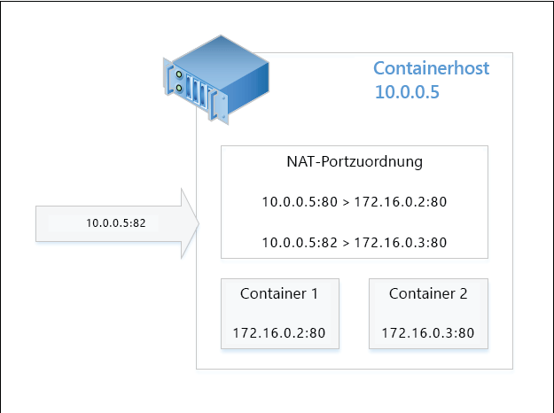

# Containernetzwerk

**Dieser Inhalt ist vorläufig und kann geändert werden.**

Windows-Container funktionieren in Bezug auf Netzwerke ähnlich wie virtuelle Computer. Jeder Container verfügt über einen virtuellen Netzwerkadapter, der mit einem virtuellen Switch verbunden ist, über den eingehender und ausgehender Datenverkehr weitergeleitet wird. Zwei Typen von Netzwerkkonfigurationen sind verfügbar.

- **Netzwerkadressübersetzung**: Jeder Container ist mit einem internen virtuellen Switch verbunden und erhält eine interne IP-Adresse. Eine NAT-Konfiguration übersetzt diese interne Adresse in die externe Adresse des Containerhosts.

- **Transparent**: Jeder Container ist mit einem externen virtuellen Switch verbunden und erhält eine IP-Adresse von einem DHCP-Server.

In diesem Dokument werden die Vorteile und die Konfiguration jedes Modus ausführlich beschrieben.

## NAT-Netzwerkmodus

**Netzwerkadressübersetzung** (Network Address Translation): Diese Konfiguration umfasst einen internen Netzwerkswitch vom Typ NAT sowie WinNat. In dieser Konfiguration verfügt der Containerhost über eine „externe“ IP-Adresse, die in einem Netzwerk erreichbar ist. Allen Containern wird eine „interne“ Adresse zugewiesen, auf die nicht in einem Netzwerk zugegriffen werden kann. Um einen Container in dieser Konfiguration zugänglich zu machen, wird ein externer Port des Hosts einem internen Port des Containers zugeordnet. Diese Zuordnungen werden in einer NAT-Portzuordnungstabelle gespeichert. Der Container ist über die IP-Adresse und den externen Port des Hosts zugänglich, der Datenverkehr an die interne IP-Adresse und den Port des Containers weiterleitet. Der Vorteil von NAT ist, dass der Containerhost auf Hunderte von Containern skaliert werden kann, während er nur eine extern verfügbare IP-Adresse nutzt. Darüber hinaus erlaubt NAT mehreren Containern das Hosten von Anwendungen, die möglicherweise identische Kommunikationsports erfordern.

### Hostkonfiguration

Gehen Sie wie folgt vor, um den Containerhost für die Netzwerkadressübersetzung zu konfigurieren.

Erstellen Sie einen virtuellen Switch vom Typ „NAT“, und konfigurieren Sie ihn mit einem internen Subnetz. Weitere Informationen zum Befehl **New-VMSwitch** finden Sie in der [Referenz zu New-VMSwitch](https://technet.microsoft.com/en-us/library/hh848455.aspx).

```powershell
New-VMSwitch -Name "NAT" -SwitchType NAT -NATSubnetAddress "172.16.0.0/12"
```
Erstellen Sie das Objekt für die Netzwerkadressenübersetzung. Dieses Objekt ist für die NAT-Adressübersetzung zuständig. Weitere Informationen zum Befehl **New-NetNat** finden Sie in der [Referenz zu New-NetNat](https://technet.microsoft.com/en-us/library/dn283361.aspx).

```powershell
New-NetNat -Name NAT -InternalIPInterfaceAddressPrefix "172.16.0.0/12" 
```

### Containerkonfiguration

Wenn Sie einen Windows-Container erstellen, können Sie einen virtuellen Switch für den Container auswählen. Wenn der Container mit einem virtuellen Switch verbunden wird, der NAT verwendet, erhält der Container eine übersetzte Adresse.

In diesem Beispiel wird ein Container erstellt, der mit einem NAT-fähigen virtuellen Switch verbunden ist.

```powershell
New-Container -Name DemoNAT -ContainerImageName WindowsServerCore -SwitchName "NAT"
```

Nach dem Start des Containers können Sie die IP-Adresse innerhalb des Containers anzeigen.

```powershell
[DemoNAT]: PS C:\> ipconfig

Windows IP Configuration
Ethernet adapter vEthernet (Virtual Switch-527ED2FB-D56D-4852-AD7B-E83732A032F5-0):
   Connection-specific DNS Suffix  . : contoso.com
   Link-local IPv6 Address . . . . . : fe80::384e:a23d:3c4b:a227%16
   IPv4 Address. . . . . . . . . . . : 172.16.0.2
   Subnet Mask . . . . . . . . . . . : 255.240.0.0
   Default Gateway . . . . . . . . . : 172.16.0.1
```

Weitere Informationen darüber, wie Sie einen Windows-Container starten und verbinden, finden Sie unter [Verwalten von Containern](./manage_containers.md).

### Portzuordnung

Für den Zugriff auf die Anwendung innerhalb eines NAT-fähigen Containers müssen zwischen dem Container und dem Containerhost Portzuordnungen erstellt werden. Um die Zuordnung zu erstellen, benötigen Sie die IP-Adresse des Containers, den „internen“ Containerport und einen „externen“ Hostport.

In diesem Beispiel wird der Port **80** des Hosts dem Port **80** eines Containers mit der IP-Adresse **172.16.0.2** zugeordnet.

```powershell
Add-NetNatStaticMapping -NatName "Nat" -Protocol TCP -ExternalIPAddress 0.0.0.0 -InternalIPAddress 172.16.0.2 -InternalPort 80 -ExternalPort 80
```

In diesem Beispiel wird der Port **82** des Containerhosts dem Port **80** eines Containers mit der IP-Adresse **172.16.0.3** zugeordnet.

```powershell
Add-NetNatStaticMapping -NatName "Nat" -Protocol TCP -ExternalIPAddress 0.0.0.0 -InternalIPAddress 172.16.0.3 -InternalPort 80 -ExternalPort 82
```
>Für jeden externen Port ist eine entsprechende Firewallregel erforderlich. Diese kann mit `New-NetFirewallRule` erstellt werden. Weitere Informationen finden Sie in der [Referenz zu New-NetFirewallRule](https://technet.microsoft.com/en-us/library/jj554908.aspx).

Nachdem die Portzuordnung erstellt wurde, kann eine Containeranwendung über die IP-Adresse des Containerhosts (physisch oder virtuell) und den verfügbar gemachten externen Port aufgerufen werden. Das folgende Diagramm zeigt beispielsweise eine NAT-Konfiguration mit einer Anforderung für den externen Port **82** des Containerhosts. Aufgrund der Portzuordnung würde diese Anforderung die in Container 2 gehostete Anwendung zurückgeben.



Hier die Anforderung aus Sicht eines Internetbrowsers.


## Transparenter Netzwerkmodus

**Transparentes Netzwerk**: Diese Konfiguration umfasst einen externen Netzwerkswitch. In dieser Konfiguration erhält jeder Container eine IP-Adresse von einem DHCP-Server und ist über diese IP-Adresse zugänglich. Dies hat den Vorteil, dass keine Portzuordnungstabelle verwaltet werden muss.

### Hostkonfiguration

Um das Container-System so zu konfigurieren, dass Container eine IP-Adresse von einem DHCP-Server empfangen können, erstellen Sie einen virtuellen Switch, der mit einem physischen oder virtuellen Netzwerkadapter verbunden ist.

Im folgenden Beispiel wird ein virtueller Switch namens „DHCP“ mithilfe eines Netzwerkadapters namens „Ethernet“ erstellt.

```powershell
New-VMSwitch -Name DHCP -NetAdapterName Ethernet
```

Wenn der Containerhost selbst ein virtueller Computer ist, müssen Sie auf dem Netzwerkadapter, der mit dem Containerswitch verwendet wird, MacAddressSpoofing aktivieren. Im folgenden Beispiel wird dies auf einem virtuellen Computer namens `DemoVm` ausgeführt.

```powershell
Get-VMNetworkAdapter -VMName DemoVM | Set-VMNetworkAdapter -MacAddressSpoofing On
```
Der externe virtuelle Switch kann jetzt mit einem Container verbunden werden, der daraufhin eine IP-Adresse von einem DHCP-Server empfangen kann. In dieser Konfiguration sind im Container gehostete Anwendung über die dem Container zugeordnete IP-Adresse zugänglich.

## Docker-Konfiguration

Beim Starten des Docker-Daemons können Sie eine Netzwerkbrücke auswählen. Wenn Sie Docker unter Windows ausführen, ist dies der externe virtuelle Switch oder der virtuelle NAT-Switch. Im folgenden Beispiel wird der Docker-Daemon unter Angabe eines virtuellen Switches namens `Virtual Switch` gestartet.

```powershell
Docker daemon –D –b “Virtual Switch” -H 0.0.0.0:2375
```

Wenn Sie den Containerhost bereitgestellt haben, und Docker die in der Windows-Container-Schnellstartanleitung angegebenen Skripts verwendet, wird ein interner virtueller Switch vom Typ NAT erstellt. Zudem wird ein Docker-Dienst erstellt und für die Verwendung dieses Switches vorkonfiguriert. Um den vom Docker-Dienst verwendeten virtuellen Switch zu ändern, beenden Sie den Docker-Dienst, ändern die Konfigurationsdatei und starten den Dienst erneut.

Führen Sie den folgenden PowerShell-Befehl aus, um den Dienst zu beenden:

```powershell
Stop-Service docker
```

Die Konfigurationsdatei finden Sie unter „C:\programdata\docker\runDockerDaemon.cmd“. Bearbeiten Sie die folgende Zeile, indem Sie `Virtual Switch` durch den Namen des vom Docker-Dienst zu verwendenden virtuellen Switches ersetzen.

```powershell
docker daemon -D -b “New Switch Name"
```
Starten Sie anschließend den Dienst.

```powershell
Start-Service docker
```

## Verwalten von Netzwerkadaptern

Unabhängig von der Netzwerkkonfiguration („NAT“ oder „Transparent“) stehen mehrere PowerShell-Befehle zum Verwalten von Verbindungen zu Containernetzwerkadaptern und virtuellen Switches zur Verfügung.

Verwalten eines Containernetzwerkadapters

- Add-ContainerNetworkAdapter: Fügt einem Container einen Netzwerkadapter hinzu.
- Set-ContainerNetworkAdapter: Ändert einen Containernetzwerkadapter.
- Remove-ContainerNetworkAdapter: Entfernt einen Containernetzwerkadapter.
- Get-ContainerNetworkAdapter: Gibt Daten über einen Containernetzwerkadapter zurück.

Verwalten Sie die Verbindung zwischen einem Containernetzwerkadapter und einem virtuellen Switch.

- Connect-ContainerNetworkAdapter: Verbindet einen Container mit einem virtuellen Switch.
- Disconnect-ContainerNetworkAdapter: Trennt einen Container von einem virtuellen Switch.

Weitere Einzelheiten zu diesem Befehl finden Sie in der [Referenz zur Container-PowerShell](https://technet.microsoft.com/en-us/library/mt433069.aspx).


<!--HONumber=Jan16_HO1-->
