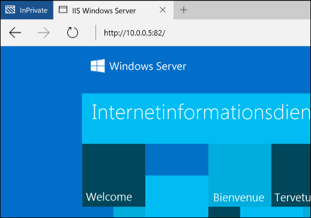

# Containernetzwerk

**Dieser Inhalt ist vorläufig und kann geändert werden.** 

Windows-Container funktionieren in Bezug auf Netzwerke ähnlich wie virtuelle Computer. Jeder Container verfügt über einen virtuellen Netzwerkadapter, der mit einem virtuellen Switch verbunden ist, über den eingehender und ausgehender Datenverkehr weitergeleitet wird. Um eine Trennung der Container zu erzwingen, die sich auf dem gleichen Host befinden, wird für jeden Windows Server- und Hyper-V-Container ein Netzwerkbereich erstellt, in dem der Netzwerkadapter für den Container installiert wird. Windows Server-Container verwenden eine Host-vNIC für die Verbindung mit dem virtuellen Switch. Hyper-V-Container verwenden eine synthetische VM-NIC (nicht für die Utility-VM verfügbar gemacht) für die Verbindung mit dem virtuellen Switch.

Windows-Container unterstützen vier verschiedene Netzwerkmodi.

- **Netzwerkadressübersetzung**: Jeder Container ist mit einem internen virtuellen Switch verbunden und verwendet WinNAT für die Verbindung mit einem privaten IP-Subnetz. WinNAT führt sowohl die Netzwerkadressübersetzung (Network Address Translation, NAT) als auch die Portadressübersetzung (Port Address Translation, PAT) zwischen dem Containerhost und den Containern selbst durch.

- **Transparent**: Jeder Container ist mit einem externen virtuellen Switch verbunden und wird direkt mit dem physischen Netzwerk verbunden. IPs können mithilfe eines externen DHCP-Servers statisch oder dynamisch zugewiesen werden. Die unformatierten Rahmen des Containernetzwerk-Datenverkehrs werden ohne Adressübersetzung direkt im physischen Netzwerk platziert.

- **L2-Brücke**: Jeder Container ist mit einem externen virtuellen Switch verbunden. Der Netzwerkdatenverkehr zwischen zwei Containern, die sich im gleichen IP-Subnetz befinden und mit dem gleichen Containerhost verbunden sind, wird direkt überbrückt. Der Netzwerkdatenverkehr zwischen zwei Containern, die sich in verschiedenen IP-Subnetzen befinden und mit verschiedenen Containerhosts verbunden sind, wird durch den externen virtuellen Switch gesendet. Bei ausgehendem Netzwerkdatenverkehr aus einem Container wird die MAC-Quelladresse in die Adresse des Containerhosts umgeschrieben. Bei eingehendem Netzwerkdatenverkehr an einen Container wird die MAC-Zieladresse in die Adresse des Containers selbst umgeschrieben.

- **L2-Tunnel** - *(dieser Modus sollte nur in einem Microsoft-Cloudstapel verwendet werden)*. Ähnlich wie bei einer L2-Brücke ist jeder Container mit einem externen virtuellen Switch verbunden, und die MAC-Adressen werden beim Ein- und Ausgang umgeschrieben. Es wird jedoch SÄMTLICHER Netzwerkdatenverkehr der Container an den virtuellen Switch des physischen Hosts weitergeleitet, unabhängig von der Layer-2-Konnektivität. Auf diese Weise können Netzwerkrichtlinien im virtuellen Switch des physischen Hosts erzwungen werden, wie auf den höheren Ebenen des Netzwerkstapels (z. B. dem Netzwerkcontroller oder dem Netzwerkressourcenanbieter) programmiert.

In diesem Dokument werden die Vorteile und die Konfiguration jedes Modus ausführlich beschrieben.

## Erstellen eines Netzwerks

### Übersicht

Sowohl PowerShell als auch Docker können verwendet werden, um Containernetzwerke zu erstellen, Container mit einem Netzwerk zu verbinden und Portweiterleitungsregeln einzurichten. Der Schwerpunkt liegt auf den Docker-Netzwerkbefehlen, die auf dem Cloudnetzwerkmodell (Cloud Network Model, CNM) basieren.

Zulässige Treiber für das Erstellen von Netzwerken in Docker sind „transparent“, „nat“ und „l2bridge“. Wie oben bereits erwähnt, sollte der Treiber für L2-Tunnel nur in Bereitstellungsszenarien der öffentlichen Microsoft Azure-Cloud verwendet werden. 

> Docker-Netzwerktreiber bestehen vollständig aus Kleinbuchstaben.

Der Docker-Daemon referenziert die verschiedenen Netzwerkmodi anhand des Namens des Treibers, der zum Erstellen des Netzwerks verwenden wurde. Der NAT-Modus beispielsweise verfügt über einen entsprechenden Docker-Netzwerktreiber namens „nat“. Das Docker-Modul unter Windows sucht standardmäßig nach einem Netzwerk mit einem durch „nat“ gekennzeichneten Treiber. Wenn kein NAT-Netzwerk vorhanden ist, erstellt das Docker-Modul ein solches Netzwerk. Alle erstellten Container werden standardmäßig mit dem NAT-Netzwerk verbunden.

Dieses Verhalten (die standardmäßige Verwendung eines NAT-Netzwerktreibers) kann außer Kraft gesetzt werden. Dafür muss eine spezielle „Brücke“ namens „none“ angegeben werden, die beim Starten des Docker-Daemon-Moduls die Option „-b none“ verwendet.

Führen Sie den folgenden PowerShell-Befehl aus, um den Dienst zu beenden:

```none
Stop-Service docker
```

Sie finden die Konfigurationsdatei hier: `c:\programdata\docker\runDockerDaemon.cmd`. Bearbeiten Sie die folgende Codezeile durch Hinzufügen von `-b "none"`

```none
dockerd <options> -b “none”
```

Starten Sie den Dienst neu.

```none
Start-Service docker
```

Wenn der Docker-Daemon mit „-b 'none'“ ausgeführt wird, muss ein spezifisches Netzwerk erstellt werden, auf das bei Erstellung und Start des Containers verwiesen wird.

Um die Containernetzwerke aufzulisten, die auf dem Host verfügbar sind, verwenden Sie die folgenden Docker- oder PowerShell-Befehle.

```none
docker network ls
```
Dies führt zu einer Ausgabe ähnlich der folgenden:

```none
NETWORK ID          NAME                DRIVER
bd8b691a8286        nat                 nat
7b055c7ed373        none                null
```
Hier der entsprechende Befehl mit PowerShell:


```none
Get-ContainerNetwork |fl
```

Dies führt zu einer Ausgabe ähnlich der folgenden:

```none
Name               : nat
SubnetPrefix       : {172.16.0.0/12}
Gateways           : {172.16.0.1}
Id                 : 67ea1851-326d-408b-a5ef-7dcdb15c4438
Mode               : NAT
NetworkAdapterName :
SourceMac          :
DNSServers         : {10.222.118.22, 10.221.228.12, 10.222.114.67}
DNSSuffix          : corp.microsoft.com
IsDeleted          : False
```

> In PowerShell muss bei den Netzwerkmodi die Groß- und Kleinschreibung nicht beachtet werden.


### NAT-Netzwerk

**Netzwerkadressübersetzung** – dieser Netzwerkmodus eignet sich, um Containern schnell private IP-Adressen zuzuweisen. Der externe Zugriff auf einen Container erfolgt durch Zuordnung zwischen der externen IP-Adresse und dem externen Port (Container) sowie der internen IP-Adresse und dem internen Port des Containers. Sämtlicher Netzwerkdatenverkehr, der an der Kombination externe IP-Adresse / externer Port empfangen wird, wird mit einer WinNAT-Portzuordnungstabelle verglichen und an die IP-Adresse bzw. den Port des richtigen Containers weitergeleitet. Darüber hinaus erlaubt NAT mehreren Containern das Hosten von Anwendungen, die möglicherweise identische (interne) Kommunikationsports erfordern, indem diese eindeutigen externen Ports zugeordnet werden. Windows unterstützt nur das Vorhandensein eines internen NAT-Netzwerkpräfixes pro Host. Weitere Informationen finden Sie im Blogbeitrag [WinNAT capabilities and limitations](https://blogs.technet.microsoft.com/virtualization/2016/05/25/windows-nat-winnat-capabilities-and-limitations/) (Stärken und Schwächen von WinNAT). 

> Ab TP5 wird für alle statischen NAT-Portzuordnungen automatisch eine Firewallregel erstellt. Diese Firewallregel gilt global für den Containerhost und ist nicht auf einen bestimmten Containerendpunkt oder Netzwerkadapter begrenzt.

#### Hostkonfiguration <!--1-->

Um den NAT-Netzwerkmodus zu verwenden, erstellen Sie ein Containernetzwerk mit dem Treiber namens „nat“. 

> Da pro Host nur ein Standardnetzwerk des Typs _nat_ erstellt werden kann, vergewissern Sie sich, dass Sie nur dann ein neues NAT-Netzwerk erstellen, wenn alle anderen NAT-Netzwerke entfernt wurden und der Daemon von Docker mit der Option '-b "none"' ausgeführt wird. Wenn Sie einfach nur steuern möchten, welches interne IP-Netzwerk von NAT verwendet wird, können Sie die Option _--fixed-cidr=<NAT-internes Präfix/Maske>_ dem docker-Befehl in „C:\ProgramData\docker\runDockerDaemon.cmd“ hinzufügen.

```none
docker network create -d nat MyNatNetwork [--subnet=<string[]>] [--gateway=<string[]>]
```

Um ein NAT-Netzwerk mithilfe von PowerShell zu erstellen, verwenden Sie die folgende Syntax. Beachten Sie, dass mithilfe von PowerShell zusätzliche Parameter wie DNSServers und DNSSuffix angegeben werden können. Wenn diese Einstellungen nicht angegeben werden, werden sie aus dem Containerhost geerbt.

```none
New-ContainerNetwork -Name MyNatNetwork -Mode NAT -SubnetPrefix "172.16.0.0/12" [-GatewayAddress <address>] [-DNSServers <address>] [-DNSSuffix <string>]
```

> In Windows Server 2016 Technical Preview 5 und den jüngsten Windows Insider Preview (WIP)-Builds gibt es das bekannte Problem, dass beim Upgrade auf einen neuen Build ein Containernetzwerk und vSwitch dupliziert werden. Führen Sie das folgende Skript aus, um dieses Problem zu umgehen.
```none
PS> $KeyPath = "HKLM:\SYSTEM\CurrentControlSet\Services\vmsmp\parameters\SwitchList"
PS> $keys = get-childitem $KeyPath
PS> foreach($key in $keys)
PS> {
PS>    if ($key.GetValue("FriendlyName") -eq 'nat')
PS>    {
PS>       $newKeyPath = $KeyPath+"\"+$key.PSChildName
PS>       Remove-Item -Path $newKeyPath -Recurse
PS>    }
PS> }
PS> remove-netnat -Confirm:$false
PS> Get-ContainerNetwork | Remove-ContainerNetwork
PS> Get-VmSwitch -Name nat | Remove-VmSwitch (_failure is expected_)
PS> Stop-Service docker
PS> Set-Service docker -StartupType Disabled
Reboot Host
PS> Get-NetNat | Remove-NetNat
PS> Set-Service docker -StartupType automatic
PS> Start-Service docker 
```

### Transparentes Netzwerk

**Transparentes Netzwerk**: Dieser Netzwerkmodus sollte nur in sehr kleinen Bereitstellungen verwendet werden, in denen eine direkte Verbindung zwischen den Containern und dem physischen Netzwerk erforderlich ist. In dieser Konfiguration kann auf alle Netzwerkdienste, die in einem Container ausgeführt werden, direkt aus dem physischen Netzwerk zugegriffen werden. IP-Adressen können statisch zugewiesen werden, vorausgesetzt, sie befinden sich innerhalb des IP-Subnetzpräfixes des physischen Netzwerks und verursachen keine Konflikte mit anderen IPs im physischen Netzwerk. IP-Adressen können auch dynamisch von einem externen DHCP-Server im physischen Netzwerk zugewiesen werden. Wenn für die IP-Zuweisung nicht DHCP verwendet wird, kann auch eine Gateway-IP-Adresse angegeben werden. 

#### Hostkonfiguration <!--2-->

Um den transparenten Netzwerkmodus zu verwenden, erstellen Sie ein Containernetzwerk mit dem Treiber namens „transparent“. 

```none
docker network create -d transparent MyTransparentNetwork
```

In diesem Beispiel wird ein transparentes Netzwerk erstellt und diesem ein Gateway zugewiesen.

```none
docker network create -d transparent --gateway=10.50.34.1 "MyTransparentNet"
```

Wenn der Containerhost virtualisiert ist und Sie DHCP für die IP-Zuweisung verwenden möchten, müssen Sie MACAddressSpoofing im Netzwerkadapter der virtuellen Computer aktivieren.

```none
Get-VMNetworkAdapter -VMName ContainerHostVM | Set-VMNetworkAdapter -MacAddressSpoofing On
```

> Wenn Sie mehr als ein transparentes (oder l2bridge-) Netzwerk erstellen möchten, müssen Sie angeben, mit welchem (virtuellen) Netzwerkadapter der (automatisch erstellte) virtuelle Hyper-V-Switch eine Bindung herstellen soll.
 
### L2-Brückennetzwerk

**L2-Brückennetzwerk**: In dieser Konfiguration fungiert die VFP-vSwitch-Erweiterung (Virtual Filtering Platform) im Containerhost als Brücke und führt die Layer-2-Adressübersetzung (Umschreiben der MAC-Adresse) wie erforderlich aus. Die Layer-3-IP-Adressen und Layer-4-Ports bleiben unverändert. IP-Adressen können statisch zugewiesen werden, um dem IP-Subnetzpräfix des physischen Netzwerks oder – im Fall einer privaten Microsoft-Cloudbereitstellung – einer IP aus dem Subnetzpräfix des virtuellen Netzwerks zu entsprechen.

#### Hostkonfiguration <!--3-->

Um den Netzwerkmodus mit L2-Brücke zu verwenden, erstellen Sie ein Containernetzwerk mit dem Treiber namens „l2bridge“. Beim Erstellen eines L2-Brückennetzwerks müssen auch ein Subnetz und ein Gateway angegeben werden.

```none
docker network create -d l2bridge --subnet=192.168.1.0/24 --gateway=192.168.1.1 MyBridgeNetwork
```

## Entfernen eines Netzwerks

Verwenden Sie `docker network rm`, um ein Containernetzwerk zu löschen.

```none
docker network rm "<network name>"
```
In PowerShell verwenden Sie `Remove-ContainerNetwork`:

Dieser Befehl löscht alle virtuellen Hyper-V-Switches, die vom Containernetzwerk verwendet wurden, sowie alle Objekte für die Netzwerkadressübersetzung, die für NAT-Containernetzwerke erstellt wurden.

## Netzwerkoptionen

Beim Erstellen des Containernetzwerks oder des Containers selbst können verschiedene Docker-Netzwerkoptionen angegeben werden. Zusätzlich zur Option „-d (--driver=<network mode>)“ zur Angabe des Netzwerkmodus werden beim Erstellen eines Containernetzwerks auch die Optionen „-gateway“, „--subnet“ und „-o“ unterstützt.

### Zusätzliche Optionen

Gateway-IP-Adressen können mithilfe von `--gateway` angegeben werden. Dies sollte nur bei Verwendung der statischen IP-Zuweisung (transparente Netzwerke) angegeben werden.

```none
docker network create -d transparent --gateway=10.50.34.1 "MyTransparentNet"
```

Mithilfe von `--subnet` kann ein IP-Subnetzpräfix zum Steuern des Netzwerksegments angegeben werden, aus dem die IP-Adressen zugewiesen werden.

```none
docker network create -d nat --subnet=192.168.0.0/24 "MyCustomNatNetwork"
```
Zusätzliche Anpassungen eines Containernetzwerks können über Docker mithilfe des Parameters „-o (--opt=map[])“ vorgenommen werden. 

Um anzugeben, welcher Netzwerkadapter auf dem Containerhost für ein transparentes, L2-Brücken- oder L2-Tunnelnetzwerk verwendet werden soll, legen Sie die Option *com.docker.network.windowsshim.interface* fest. 
```none
docker network create -d transparent -o com.docker.network.windowsshim.interface="Ethernet 2" "TransparentNetTwo"
```

Der Wert für *com.docker.network.windowsshim.interface* ist der *Name* des Adapters aus: 
```none
Get-NetAdapter
```

> Mithilfe von PowerShell erstellte Containernetzwerke sind in Docker erst verfügbar, wenn der Docker-Daemon neu gestartet wird. Sämtliche Änderungen an einem Containernetzwerk, die über PowerShell vorgenommen werden, erfordern ebenfalls einen Neustart des Docker-Daemons.

### Mehrere Containernetzwerke

Auf einem einzelnen Containerhost können mehrere Containernetzwerke erstellt werden. Dabei gelten folgende Einschränkungen:
* Pro Containerhost kann nur ein NAT-Netzwerk erstellt werden.
* Wenn mehrere Netzwerke vorhanden sind, die einen externen vSwitch für die Verbindung verwenden (z. B. transparent, L2-Brücke, L2 transparent), muss für jedes Netzwerk ein eigener Netzwerkadapter verwendet werden.

### Netzwerkauswahl

Beim Erstellen eines Windows-Containers kann ein Netzwerk angegeben werden, mit dem der Netzwerkadapter des Containers verbunden wird. Wenn kein Netzwerk angegeben wurde, wird das NAT-Standardnetzwerk verwendet.

Um den Container mit einem nicht standardmäßigen NAT-Netzwerk zu verbinden (oder wenn „-b ,none‘“ nicht verwendet wird,) verwenden Sie die Option „--net“ mit dem Ausführungsbefehl von Docker.

```none
docker run -it --net=MyTransparentNet windowsservercore cmd
```

### Statische IP-Adresse

Statische IP-Adressen werden für die Netzwerkadapter der Container festgelegt und nur für die Netzwerkmodi NAT, Transparent (anstehend), [PR](https://github.com/docker/docker/pull/22208) und L2Bridge unterstützt. Darüber hinaus wird die statische IP-Zuweisung für die Standardoption „nat“ von Docker nicht unterstützt.

```none
docker run -it --net=MyTransparentNet --ip=10.80.123.32 windowsservercore cmd
```

Die statische IP-Zuweisung erfolgt direkt im Netzwerkadapter des Containers und darf nur dann durchgeführt werden, wenn sich der Container im Zustand BEENDET befindet. Das Hinzufügen von Containernetzwerkadaptern im laufenden Betrieb (Hot-Add) sowie Änderungen am Netzwerkstapel werden während der Containerausführung nicht unterstützt.

```none
Get-ContainerNetworkAdapter -ContainerName "DemoNAT"

ContainerName Name            Network Id                           Static MacAddress Static IPAddress Maximum Bandwidth
------------- ----            ----------                           ----------------- ---------------- -----------------
DemoNAT       Network Adapter C475D31C-FB42-408E-8493-6DB6C9586915                              0

Set-ContainerNetworkAdapter -ContainerName "DemoNAT" -StaticIPAddress 172.16.0.100
```

Wenn die IP-Adresse automatisch aus dem im Subnetzpräfix des Containernetzwerks angegebenen Adressbereich ausgewählt werden soll, starten Sie den Container, ohne Einstellungen auf den Netzwerkadapter des Containers anzuwenden.

> Die statische IP-Adresszuweisung über PowerShell funktioniert nicht auf Containerendpunkten, die mit einem transparenten Netzwerk verbunden.

Um anzuzeigen, welche Container mit einem bestimmten Netzwerk verbunden und welche IPs diesen Containerendpunkten zugeordnet sind, können Sie folgenden Befehl ausführen.

```none
docker network inspect nat
```

### Erstellen einer MAC-Adresse

Eine MAC-Adresse kann mithilfe der Option `--mac-address` angegeben werden.

```none
docker run -it --mac="92:d0:c6:0a:29:33" --name="MyContainer" windowsservercore cmd
```

### Portzuordnung

Für den Zugriff auf Anwendungen in mit einem NAT-Netzwerk verbundenen Containern müssen zwischen dem Containerhost und dem Netzwerkadapter des Containers Portzuordnungen erstellt werden. Diese Zuordnungen müssen erstellt werden, während sich der Container im Zustand BEENDET befindet.

Dieses Beispiel erstellt eine statische Zuordnung zwischen Port **80** des Containerhosts und Port **80** des Containers.

```none
docker run -it --name=DemoNat -p 80:80 windowsservercore cmd
```

Dieses Beispiel erstellt eine statische Zuordnung zwischen Port **8082** des Containerhosts und Port **80** des Containers.

```none
docker run -it --name=DemoNat -p 8082:80 windowsservercore cmd
```

Dynamische Portzuordnungen werden über Docker ebenfalls unterstützt, sodass Benutzer keinen bestimmten Port des Containerhosts angeben müssen, für den eine Zuordnung erfolgen soll. Auf dem Containerhost wird per Zufallsprinzip ein kurzlebiger Port ausgewählt, der bei Ausführung von „Docker.ps“ überprüft werden kann.

```none
docker run -itd --name=DemoNat -p 80 windowsservercore cmd

docker ps
CONTAINER ID        IMAGE               COMMAND             CREATED             STATUS              PORTS                   NAMES
bbf72109b1fc        windowsservercore   "cmd"               6 seconds ago       Up 2 seconds        *0.0.0.0:14824->80/tcp*   DemoNat
```

In diesem Beispiel wird der TCP-Port 80 des DemoNat-Containers extern vom Containerhost an Port 14824 verfügbar gemacht.

Nachdem die Portzuordnung erstellt wurde, kann über die IP-Adresse des Containerhosts (physisch oder virtuell) und den verfügbar gemachten externen Port auf eine Containeranwendung zugegriffen werden. Das folgende Diagramm zeigt beispielsweise eine NAT-Konfiguration mit einer Anforderung für den externen Port **82** des Containerhosts. Aufgrund der Portzuordnung würde diese Anforderung die in Container 2 gehostete Anwendung zurückgeben.


Hier die Anforderung aus Sicht eines Internetbrowsers.



## Tipps und Einschränkungen

### Firewall

Für den Containerhost müssen bestimmte Firewallregeln erstellt werden, um ICMP (Ping) und DHCP zu ermöglichen. ICMP und DHCP sind für Windows Server-Container erforderlich, um einen Ping zwischen zwei Containern auf dem gleichen Host auszuführen und um dynamisch zugewiesene IP-Adressen über DHCP abzurufen. In TP5 werden diese durch das Skript „Install-ContainerHost.ps1“ erstellt. In Versionen nach TP5 werden diese Regeln automatisch erstellt. Alle Firewallregeln, die für NAT-Portweiterleitungsregeln erforderlich sind, werden automatisch erstellt und nach Beendigung des Containers gelöscht.

### Nicht unterstützte Funktionen

Die folgenden Netzwerkfunktionen werden zurzeit über die Docker-Befehlszeilenschnittstelle nicht unterstützt:
 * Containerverknüpfung (z. B. „--link“)
 * Namensbasierte IP-Auflösung für Container

Die folgenden Netzwerkoptionen werden in Windows Docker zurzeit nicht unterstützt:
 * --add-host
 * --dns
 * --dns-opt
 * --dns-search
 * -h, --hostname
 * --net-alias
 * --aux-address
 * --internal
 * --ip-range


<!--HONumber=Jul16_HO5-->


