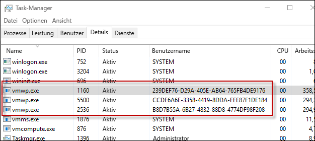

# Hyper-V-Container

**Dieser Inhalt ist vorläufig und kann geändert werden.**

Die Windows-Containertechnologie umfasst zwei Arten von Containern: Windows Server-Container und Hyper-V-Container. Beide Arten von Containern werden auf gleiche Weise erstellt und verwaltet und funktionieren identisch. Der Unterschied besteht im Isolationsgrad, der zwischen dem Container, dem Hostbetriebssystem und allen anderen Containern besteht, die auf diesem Host ausgeführt werden.

**Windows Server-Containern**: Mehrere Container werden auf einem Host isoliert ausgeführt, was mithilfe von Namespace- und Prozessisolationstechnologie ermöglicht wird.

**Hyper-V-Container**: Mehrere Container werden auf einem Host ausgeführt, wobei jedoch jeder Container innerhalb eines dafür vorgesehenen virtuellen Computers ausgeführt wird. Dies ermöglicht eine Isolation auf Kernelebene zwischen einem Hyper-V-Container, dem Containerhost und anderen Containern, die auf dem Containerhost ausgeführt werden.

## Hyper-V-Container – PowerShell

### Erstellen eines Containers

Ein Hyper-V-Container wird genauso wie ein Windows Server-Container erstellt. Der einzige Unterschied ist, dass der „Runtime“-Parameter angibt, dass es sich um einen Hyper-V-Container handelt.

Beispiel für das Erstellen eines Hyper-V-Containers mit PowerShell

```powershell
PS C:\> $con = New-Container -Name HYPVCON -ContainerImageName NanoServer -SwitchName "Virtual Switch" -RuntimeType HyperV
```

### Konvertieren eines Containers

Zusätzlich zum Erstellen eines Containers als Hyper-V-Container zur Buildzeit können Container, die mit PowerShell erstellt wurden, auch von einem Windows Server-Container in einen Hyper-V-Container konvertiert werden.

> Derzeit ist Nano Server das einzige Hostbetriebssystem, dass die Laufzeitkonvertierung von Containern unterstützt.

Erstellen Sie einen neuen Container mit der Standardlaufzeit.

```powershell
PS C:\> New-Container -Name DEMO -ContainerImageName nanoserver -SwitchName NAT
```
Rufen Sie die Laufzeiteigenschaft aus dem Container ab. Wie Sie sehen, ist „RuntimeTyp“ auf „Default“ festgelegt.

```powershell
PS C:\> Get-Container | Select ContainerName, RuntimeType

ContainerName RuntimeType
------------- -----------
DEMO              Default
```

Verwenden Sie den Befehl `Set-Container`, um die Containerlaufzeit zu ändern.

```powershell
PS C:\> Set-Container $con -RuntimeType HyperV
```

Rufen Sie schließlich die Laufzeiteigenschaft nochmals ab, um die Änderung zu prüfen.

```powershell
PS C:\> Get-Container | select ContainerName, RuntimeType

ContainerName RuntimeType
------------- -----------
DEMO               HyperV
```

## Hyper-V-Container – Docker

### Erstellen eines Containers

Das Verwalten von Hyper-V-Containern mit Docker ist nahezu identisch mit dem Verwalten von Windows Server-Containern. Beim Erstellen eines Hyper-V-Containers mit Docker wird der Parameter `–issolation=hyperv` verwendet.

```powershell
docker run -it --isolation=hyperv 646d6317b02f cmd
```

## Besonderheiten

### VM-Arbeitsprozess

Für jeden Hyper-V-Container, der erstellt wird, wird ein entsprechender VM-Arbeitsprozess erstellt.

```powershell
PS C:\> Get-Container | Select Name, RuntimeType, ContainerID | Where {$_.RuntimeType -eq 'Hyperv'}

Name RuntimeType ContainerId
---- ----------- -----------
TST3      HyperV 239def76-d29a-405e-ab64-765fb4de9176
TST       HyperV b8d7b55a-6b27-4832-88d8-4774df98f208
TST2      HyperV ccdf6a6e-3358-4419-8dda-ffe87f1de184
```

Beachten Sie, dass der Container anhand der Container-ID und des Prozessbenutzernamens mit einem Prozess abgeglichen werden kann.



Diese Beziehung kann auch mithilfe des Befehls `Get-ComputeProcess` angezeigt werden.

```powershell
PS C:\> Get-ComputeProcess

Id                                   Name Owner      Type
--                                   ---- -----      ----
239DEF76-D29A-405E-AB64-765FB4DE9176 TST3 VMMS  Container
B8D7B55A-6B27-4832-88D8-4774DF98F208 TST  VMMS  Container
CCDF6A6E-3358-4419-8DDA-FFE87F1DE184 TST2 VMMS  Container
```

Weitere Informationen zum Befehl `Get-ComputeProcess` finden Sie unter [Verwaltungsinteroperabilität](./hcs_powershell.md).

## Demo der Isolation

### Windows Server-Container

Mithilfe der folgenden Übung kann die Isolation eines Hyper-V-Containers veranschaulicht werden. In dieser Übung wird sowohl ein Windows-Server- als auch ein Hyper-V-Container erstellt. Der auf dem Containerhost ausgeführte Prozess wird untersucht. Dabei wird erkennbar, wie der Windows Server-Containerprozess auf dem Containerhost gemeinsam genutzt wird, während dies beim Hyper-V-Containerprozess nicht der Fall ist.

```powershell
PS C:\> get-process | where {$_.ProcessName -eq 'csrss'}

Handles  NPM(K)    PM(K)      WS(K) VM(M)   CPU(s)     Id  SI ProcessName
-------  ------    -----      ----- -----   ------     --  -- -----------
    255      12     1820       4000 ...98     0.53    532   0 csrss
    116      11     1284       3700 ...94     0.25    608   1 csrss
    246      13     1844       5504 ...17     3.45   3484   2 csrss
```

Erstellen Sie einen neuen Windows Server-Container:

```powershell
PS C:\> New-Container -Name WINCONT -ContainerImageName WindowsServerCore -SwitchName "Virtual Switch"
```

Starten Sie den Container:

```powershell
PS C:\> Start-Container $con
```

Richten Sie eine PowerShell-Remotesitzung mit dem Container ein.

```powershell
PS C:\> Enter-PSSession -ContainerId $con.ContainerId –RunAsAdministrator
```

Geben Sie aus der Remotecontainersitzung alle Prozesse mit dem Namen „csrss“ zurück. Notieren Sie die Prozess-ID des laufenden „csrss“-Prozesses (im Beispiel unten 1228).

```powershell
[WINCONT]: PS C:\> get-process | where {$_.ProcessName -eq 'csrss'}

Handles  NPM(K)    PM(K)      WS(K) VM(M)   CPU(s)     Id  SI ProcessName
-------  ------    -----      ----- -----   ------     --  -- -----------
    167       9     1276       3720 ...97     0.20   1228   3 csrss
```

Geben Sie nun die Liste der „csrss“-Prozesse auf dem Containerhost zurück. Beachten Sie, dass der gleiche „csrss“-Prozess auch vom Containerhost zurückgegeben wird.

```powershell
PS C:\> get-process | where {$_.ProcessName -eq 'csrss'}

Handles  NPM(K)    PM(K)      WS(K) VM(M)   CPU(s)     Id  SI ProcessName
-------  ------    -----      ----- -----   ------     --  -- -----------
    252      11     1712       3968 ...98     0.53    532   0 csrss
    113      11     1176       3676 ...93     0.25    608   1 csrss
    175       9     1260       3708 ...97     0.20   1228   3 csrss
    243      13     1736       5512 ...17     3.77   3484   2 csrss
```
### Hyper-V-Container

Geben Sie nun eine Liste der „csrss“-Prozesse auf dem Containerhost zurück.

```powershell
PS C:\> get-process | where {$_.ProcessName -eq 'csrss'}

Handles  NPM(K)    PM(K)      WS(K) VM(M)   CPU(s)     Id  SI ProcessName
-------  ------    -----      ----- -----   ------     --  -- -----------
    261      12     1820       4004 ...98     0.53    532   0 csrss
    116      11     1284       3704 ...94     0.25    608   1 csrss
    246      13     1844       5536 ...17     3.83   3484   2 csrss
```

Erstellen Sie jetzt einen Hyper-V-Container.

```powershell
PS C:\> $con = New-Container -Name HYPVCON -ContainerImageName NanoServer -SwitchName "Virtual Switch" -RuntimeType HyperV
```

Starten Sie den Hyper-V-Container.

```powershell
PS C:\> Start-Container $con
```

Richten Sie eine PowerShell-Remotesitzung mit dem Hyper-V-Container ein.

```powershell
PS C:\> Enter-PSSession -ContainerId $con.ContainerId –RunAsAdministrator
```

Geben Sie nun eine Liste der „csrss“-Prozesse zurück, die im Hyper-V-Container ausgeführt werden. Notieren Sie die Prozess-ID des „csrss“-Prozesses (im Beispiel unten 956).

```powershell
[HYPVCON]: PS C:\> get-process | where {$_.ProcessName -eq 'csrss'}

Handles  NPM(K)    PM(K)      WS(K) VM(M)   CPU(s)     Id  SI ProcessName
-------  ------    -----      ----- -----   ------     --  -- -----------
              4      452       1520 ...63     0.06    956   1 csrss
```

Geben Sie nun eine Liste der „csrss“-Prozesse auf dem Containerhost zurück. Beachten Sie, dass im Gegensatz zum Windows Server-Container, bei dem der „csrss“-Prozess sowohl im Container als auch auf dem Containerhost sichtbar war, der Hyper-V-Containerprozess nur im Container selbst sichtbar ist. Der Grund ist, dass ein Hyper-V-Container in einem dafür vorgesehenen virtuellen Computer gekapselt ist und der Prozess für diesen virtuellen Computer isoliert ist.

```powershell
PS C:\> get-process | where {$_.ProcessName -eq 'csrss'}

Handles  NPM(K)    PM(K)      WS(K) VM(M)   CPU(s)     Id  SI ProcessName
-------  ------    -----      ----- -----   ------     --  -- -----------
    255      12     1716       3972 ...98     0.56    532   0 csrss
    113      11     1176       3676 ...93     0.25    608   1 csrss
    243      13     1732       5512 ...18     4.23   3484   2 csrss
```


