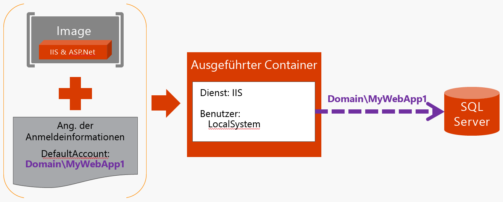

# Active Directory-Dienstkonten für Windows-Container

Benutzer und andere Dienste müssen möglicherweise authentifizierte Verbindungen zu Ihren Anwendungen und Diensten herstellen, damit Sie Ihre Daten sichern und vor nicht berechtigter Verwendung schützen können. Windows Active Directory-Domänen (AD) unterstützen standardmäßig sowohl die Kennwort- als auch die Zertifikatauthentifizierung. Wenn Sie Ihre Anwendung oder Ihren Dienst auf einem in die Domäne eingebunden Windows-Host erstellen und die Anwendung bzw. der Dienst als lokaler Systemdienst oder Netzwerkdienst ausgeführt wird, wird standardmäßig die Identität des Hosts verwendet. Andernfalls können Sie für die Authentifizierung auch ein anderes AD-Konto konfigurieren.

Obwohl Windows-Container nicht in die Domäne eingebunden werden können, können sie dennoch von Active Directory-Domänenidentitäten profitieren – ähnlich wie bei in einen Bereich eingebundenen Geräten. Mit Windows Server 2012 R2-Domänencontrollern haben wir ein neues Domänenkonto eingeführt, das als gruppenverwaltetes Dienstkonto (group Managed Service Account, gMSA) bezeichnet wird und von verschiedenen Diensten verwendet werden kann. Mithilfe von gruppenverwalteten Dienstkonten können die Windows-Container selbst und die Dienste, die sie hosten, so konfiguriert werden, dass ein bestimmtes gMSA als Domänenidentität verwendet wird. Alle als lokaler Systemdienst oder Netzwerkdienst ausgeführten Dienste verwenden dann die Identität des Windows-Containers – genau so, wie diese Dienste heute die in die Domäne eingebundene Identität verwenden. Im Containerimage ist kein Kennwort oder privater Zertifikatschlüssel gespeichert, der versehentlich offengelegt werden könnte. Der Container kann in Entwicklungs-, Tests- und Produktionsumgebungen erneut bereitgestellt werden, ohne dass gespeicherte Kennwörter oder Zertifikate neu erstellt werden müssen. 


# Glossar und Referenzen
- [Active Directory](http://social.technet.microsoft.com/wiki/contents/articles/1026.active-directory-services-overview.aspx) ist ein Dienst zur Ermittlung, Suche und Replikation von Informationen zu Benutzern, Computern, und Dienstkonten unter Windows. 
  - [Active Directory Domain Services](https://technet.microsoft.com/en-us/library/dd448614.aspx) bieten eine oder mehrere Windows Active Directory-Domänen zur Authentifizierung von Computern und Benutzern. 
  - Geräte sind _in die Domäne eingebunden_, wenn sie Mitglied einer Active Directory-Domäne sind. Als „in die Domäne eingebunden“ wird ein Gerätezustand bezeichnet, der nicht nur eine Domänencomputeridentität für das Gerät bereitstellt, sondern auch verschiedene in die Domäne eingebundene Dienste anzeigt.
  - Ein [gruppenverwaltetes Dienstkonto](https://technet.microsoft.com/en-us/library/jj128431(v=ws.11).aspx), häufig mit gMSA abgekürzt, ist ein bestimmter Active Directory-Kontotyp, der eine einfache Sicherung von Diensten mithilfe von Active Directory ermöglicht, ohne ein Kennwort weitergeben zu müssen. Um Verbindungen zwischen Diensten zu authentifizieren, nutzen mehrere Computer oder Container dasselbe gMSA.
- Das PowerShell-Modul _CredentialSpec_: Dieses Modul wird verwendet, um gruppenverwaltete Dienstkonten zu konfigurieren, die mit Containern verwendet werden sollen. Das Skriptmodul und die Beispielschritte stehen unter [windows-server-container-tools](https://github.com/Microsoft/Virtualization-Documentation/tree/live/windows-server-container-tools) im Ordner „ServiceAccounts“ zur Verfügung.

# Funktionsweise

Heute werden gruppenverwaltete Dienstkonten häufig verwendet, um Verbindungen zwischen einem Computer oder Dienst mit einem anderen Computer oder Dienst zu schützen. Folgende allgemeine Schritte sind auszuführen:

1. Erstellen Sie ein gMSA.
2. Konfigurieren Sie den Dienst, der als gMSA ausgeführt werden soll.
3. Richten Sie für den in die Domäne eingebundenen Host, auf dem der Dienst ausgeführt wird, Zugriff auf die gMSA-Geheimnisse in Active Directory ein.
4. Lassen Sie den Zugriff anderer Dienste wie z.B. einer Datenbank oder Dateifreigaben auf ein gMSA zu.

Beim Starten des Diensts erhält der in die Domäne eingebundene Host von Active Directory automatisch die gMSA-Geheimnisse und führt den Dienst mithilfe dieses Kontos aus. Da dieser Dienst als gMSA ausgeführt wird, kann er auf jede Ressource zugreifen, für die dem gMSA Zugriff gewährt wurde.


Gehen Sie für Windows-Container in ähnlicher Weise vor:

1. Erstellen Sie ein gMSA. Standardmäßig ist dies von einem Domänenadministrator oder Kontenoperator durchzuführen. Diese können die Zugriffsrechte zum Erstellen und Verwalten von gMSAs auch an Administratoren übertragen, die die Dienste verwalten, die diese nutzen. Siehe dazu [Erste Schritte mit gMSAs](https://technet.microsoft.com/en-us/library/jj128431(v=ws.11).aspx).
2. Richten Sie für den Host des in die Domäne eingebunden Containers Zugriff auf das gMSA ein.
3. Lassen Sie den Zugriff anderer Dienste wie z.B. einer Datenbank oder Dateifreigaben auf ein gMSA zu.
4. Verwenden Sie das CredentialSpec PowerShell-Modul von [windows-server-container-tools](https://github.com/Microsoft/Virtualization-Documentation/tree/live/windows-server-container-tools), um die Einstellungen zu speichern, die für die Verwendung eines gMSA erforderlich sind.
5. Starten Sie den Container mit einer zusätzlichen Option. `--security-opt "credentialspec=..."`

Wenn der Container gestartet wurde, werden die als lokaler Systemdienst oder Netzwerkdienst ausgeführten installierten Dienste so angezeigt, als würden sie als gMSA ausgeführt. Dies ähnelt der Funktionsweise von Konten auf in die Domäne eingebundenen Hosts, außer dass kein Computerkonto, sondern ein gMSA verwendet wird. 




# Beispielverwendungen


## SQL-Verbindungszeichenfolgen
Wenn ein Dienst als lokaler Systemdienst oder Netzwerkdienst in einem Container ausgeführt wird, kann die integrierte Windows-Authentifizierung genutzt werden, um eine Verbindung mit einer Microsoft SQL Server-Instanz herzustellen.

Beispiel:

```none
Server=sql.contoso.com;Database=MusicStore;Integrated Security=True;MultipleActiveResultSets=True;Connect Timeout=30
```

Erstellen Sie auf der Microsoft SQL Server-Instanz einen Anmeldenamen, und verwenden Sie dazu den Namen der Domäne und des gMSA gefolgt von einem $-Symbol. Sobald der Anmeldename erstellt wurden, kann er einem Benutzer in einer Datenbank hinzugefügt werden und die erforderlichen Zugriffsrechte erhalten.

Beispiel: 

```sql
CREATE LOGIN "DEMO\WebApplication1$"
    FROM WINDOWS
    WITH DEFAULT_DATABASE = "MusicStore"
GO

USE MusicStore
GO
CREATE USER WebApplication1 FOR LOGIN "DEMO\WebApplication1$"
GO

EXEC sp_addrolemember 'db_datareader', 'WebApplication1'
EXEC sp_addrolemember 'db_datawriter', 'WebApplication1'
```


<!--HONumber=Nov16_HO1-->


