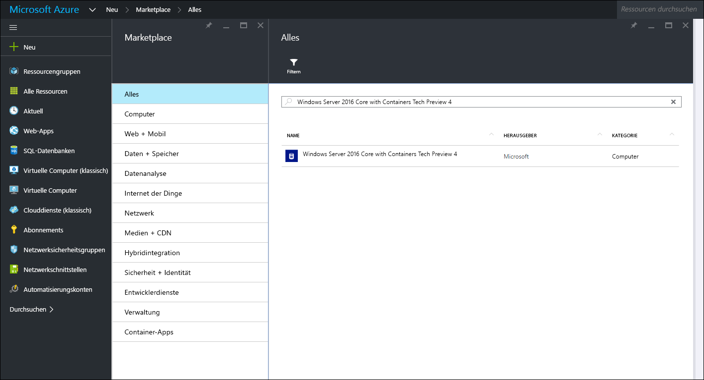
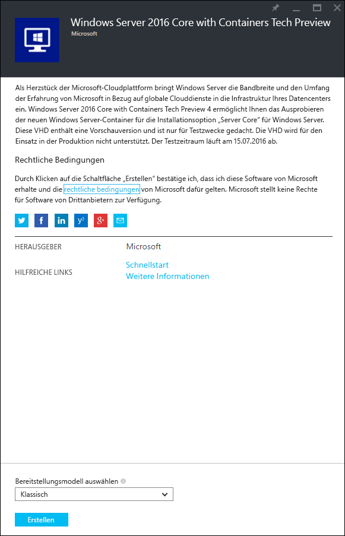
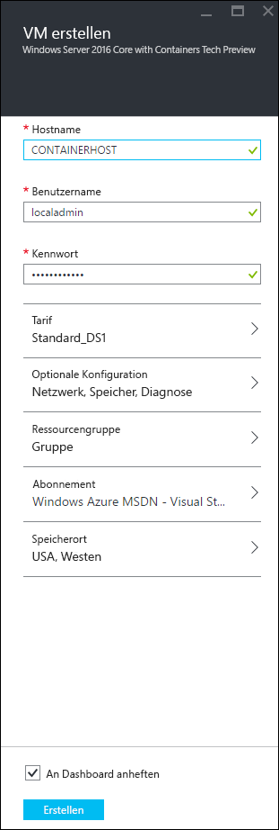
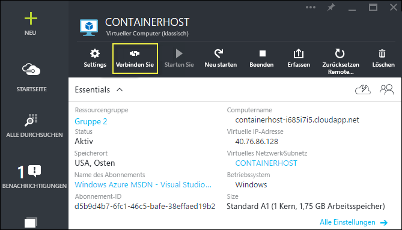

# Azure – Schnellstart

Vor dem Erstellen und Verwalten von Windows Server-Containern in Azure müssen Sie ein Image von Windows Server 2016 Technical Preview bereitstellen, das mit dem Feature „Windows Server-Container“ vorkonfiguriert wurde. In dieser Anleitung begleiten wir Sie durch diesen Prozess.

> Microsoft Azure unterstützt keine Hyper-V-Container. Für Übungen mit Hyper-V-Containern benötigen Sie einen lokalen Containerhost.

## Starten Sie mit dem Verwenden des Azure-Portals

Wenn Sie ein Azure-Konto haben, fahren Sie direkt mit [Erstellen einer Containerhost-VM](#CreateacontainerhostVM) fort.

1. Wechseln Sie zu [azure.com](https://azure.com), und befolgen Sie die Anleitung zum Beziehen einer [kostenlosen Azure-Testversion](https://azure.microsoft.com/en-us/pricing/free-trial/).
2. Melden Sie sich mit Ihrem Microsoft-Konto an.
3. Wenn Ihr Konto einsatzbereit ist, melden Sie sich beim [Azure-Verwaltungsportal](https://portal.azure.com) an.

## Erstellen einer Containerhost-VM

Suchen Sie in Azure Marketplace nach „Container“. Als Ergebnis erhalten Sie „Windows Server 2016 Core with Containers Tech Preview 4“.

Wählen Sie das Image aus, und klicken Sie auf `Erstellen`.

Geben Sie dem virtuellen Computer einen Namen. Wählen Sie einen Benutzernamen und ein Kennwort.

Wählen Sie „Optionale Konfiguration > Endpunkte“ aus, und geben Sie einen HTTP-Endpunkt mit dem privaten und öffentlichen Port 80 ein (siehe unten). Klicken Sie im Anschluss zweimal auf „OK“.

Klicken Sie auf die Schaltfläche `Erstellen`, um den Bereitstellungsprozess für den virtuellen Computer zu starten.

Wenn die Bereitstellung des virtuellen Computers abgeschlossen ist, klicken Sie auf die Schaltfläche „Verbinden“, um eine RDP-Sitzung mit dem Windows Server-Containerhost zu starten.

Melden Sie am virtuellen Computer mit dem Benutzernamen und Kennwort an, das Sie im Assistenten zum Erstellen virtueller Computer angegeben haben. Nach der Anmeldung sehen Sie die Windows-Eingabeaufforderung.

## Video mit exemplarischer Vorgehensweise

<iframe src="https://channel9.msdn.com/Blogs/containers/Quick-Start-Configure-Windows-Server-Containers-in-Microsoft-Azure/player#ccLang=de" width="800" height="450"  allowFullScreen="true" frameBorder="0" scrolling="no"></iframe>

## Nächste Schritte: Nutzen von Containern

Nun da Sie über ein Windows Server 2016-System mit ausgeführtem Feature „Windows Server-Container“ verfügen, können Sie in den folgenden Anleitungen erfahren, wie Sie mit Windows Server-Containern und -Images arbeiten.

[Schnellstart: Windows-Container und Docker](./manage_docker.md)  
[Schnellstart: Windows-Container und PowerShell](./manage_powershell.md)

