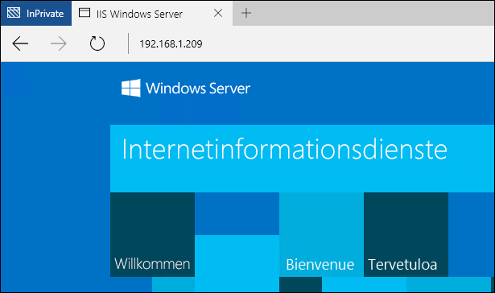

# Schnellstartanleitung: Windows-Container und PowerShell

Mithilfe von Windows-Containern können viele isolierte Anwendungen schnell auf einem einzelnen Computersystem bereitgestellt werden. Diese Schnellstartanleitung veranschaulicht die Bereitstellung und Verwaltung von Windows Server- und Hyper-V-Containern mithilfe von PowerShell. In dieser Übung erstellen Sie von Grund auf eine sehr einfache „Hello World“-Anwendung, die sowohl in einem Windows Server- als auch einem Hyper-V-Container ausgeführt wird. Während dieses Vorgangs erstellen Sie Containerimages, arbeiten mit freigegebenen Ordnern und verwalten den Containerlebenszyklus. Am Ende sind Sie mit der Bereitstellung und Verwaltung von Windows-Containern grundlegend vertraut.

In dieser exemplarischen Vorgehensweise werden sowohl Windows Server- als auch Hyper-V-Container detailliert behandelt. Jeder Containertyp hat eigene Grundanforderungen. In der Dokumentation zu Windows-Containern wird ein Verfahren für die schnelle Bereitstellung eines Containerhosts beschrieben. Dies ist die einfachste Möglichkeit, schnell mit Windows-Containern zu starten. Wenn Sie noch keinen Containerhost haben, lesen Sie die [Schnellstartanleitung zur Bereitstellung von Containerhosts](./container_setup.md).

Die folgenden Elemente werden für jede Übung benötigt.

**Windows Server-Container:**

- Ein Windows-Containerhost unter Windows Server 2016, entweder lokal oder in Azure.

**Hyper-V-Container:**

- Ein Windows-Containerhost mit aktivierter geschachtelter Virtualisierung.
- Das Windows Server 2016-Installationsmedium: [Herunterladen](https://aka.ms/tp4/serveriso).

> Microsoft Azure unterstützt keine Hyper-V-Container. Für die Hyper-V-Übungen benötigen Sie einen lokalen Containerhost.

## Windows Server-Container

Windows Server-Container bieten eine isolierte, portierbare Betriebsumgebung mit Ressourcenkontrolle für das Ausführen von Anwendungen und Hosten von Prozessen. Windows Server-Container bieten zwischen Container und Host sowie zwischen auf dem Host ausgeführten Containern eine Isolation, indem Prozesse und Namespaces voneinander getrennt werden.

### Erstellen eines Containers

In der Version TP4 erfordern Windows Server-Container unter Windows Server 2016 oder Windows Server 2016 Core das Windows Server 2016 Core-Betriebssystemimage.

Geben Sie `powershell` ein, um eine PowerShell-Sitzung zu starten.

```powershell
C:\> powershell
Windows PowerShell
Copyright (C) 2015 Microsoft Corporation. All rights reserved.

PS C:\>
```

Um zu überprüfen, ob das Betriebssystemimage für Windows Server Core installiert wurde, verwenden Sie den Befehl `Get-ContainerImage`. Es werden ggf. mehrere Betriebssystemimages angezeigt.

```powershell
PS C:\> Get-ContainerImage

Name              Publisher    Version      IsOSImage
----              ---------    -------      ---------
NanoServer        CN=Microsoft 10.0.10586.0 True
WindowsServerCore CN=Microsoft 10.0.10586.0 True
```

Mit dem Befehl `New-Container` können Sie einen Windows Server-Container erstellen. Das folgende Beispiel erstellt einen Container namens `TP4Demo` aus dem Betriebssystemimage `WindowsServerCore` und verbindet den Container mit einem VM-Switch mit dem Namen `Virtual Switch`.

```powershell
PS C:\> New-Container -Name TP4Demo -ContainerImageName WindowsServerCore -SwitchName "Virtual Switch"

Name    State Uptime   ParentImageName
----    ----- ------   ---------------
TP4Demo Off   00:00:00 WindowsServerCore
```

Um die vorhandenen Container zu visualisieren, verwenden Sie den Befehl `Get-Container`.

```powershell
PS C:\> Get-Container

Name    State Uptime   ParentImageName
----    ----- ------   ---------------
TP4Demo Off   00:00:00 WindowsServerCore
```

Starten Sie den Container mit dem Befehl `Start-Container`.

```powershell
PS C:\> Start-Container -Name TP4Demo
```

Stellen Sie mit dem Befehl `Enter-PSSession` die Verbindung zum Container her. Nachdem die PowerShell-Sitzung mit dem Container erstellt wurde, ändert sich die PowerShell-Eingabeaufforderung entsprechend dem Containernamen.

```powershell
PS C:\> Enter-PSSession -ContainerName TP4Demo -RunAsAdministrator

[TP4Demo]: PS C:\Windows\system32>
```

### Erstellen des IIS-Images

Sie können den Container jetzt ändern und diese Änderungen erfassen, um ein neues Containerimage zu erstellen. In diesem Beispiel wird IIS installiert.

Verwenden Sie zum Installieren der IIS-Rolle im Container den Befehl `Install-WindowsFeature`.

```powershell
[TP4Demo]: PS C:\> Install-WindowsFeature web-server

Success Restart Needed Exit Code      Feature Result
------- -------------- ---------      --------------
True    No             Success        {Common HTTP Features, Default Document, D...
```

Verlassen Sie nach Abschluss der Installation von IIS den Container durch Eingabe von `exit`. Die PowerShell-Sitzung kehrt zu derjenigen mit dem Containerhost zurück.

```powershell
[TP4Demo]: PS C:\> exit
PS C:\>
```

Beenden Sie den Container abschließend mit dem Befehl `Stop-Container`.

```powershell
PS C:\> Stop-Container -Name TP4Demo
```

Der Status dieses Containers kann jetzt in einem neuen Containerimage erfasst werden. Verwenden Sie hierzu den Befehl `New-ContainerImage`.

Dieses Beispiel erstellt ein neues Containerimage mit dem Namen `WindowsServerCoreIIS`. Der Herausgeber ist `Demo`, und die Version ist `1.0`.

```powershell
PS C:\> New-ContainerImage -ContainerName TP4Demo -Name WindowsServerCoreIIS -Publisher Demo -Version 1.0

Name                 Publisher Version IsOSImage
----                 --------- ------- ---------
WindowsServerCoreIIS CN=Demo   1.0.0.0 False
```

Nachdem der Container nun in dem neuen Image erfasst wurde, wird er nicht mehr benötigt. Sie können ihn mit dem Befehl `Remove-Container` entfernen.

```powershell
PS C:\> Remove-Container -Name TP4Demo -Force
```


### Erstellen des IIS-Containers

Erstellen Sie einen neuen Container, in diesem Fall anhand des Containerimages `WindowsServerCoreIIS`.

```powershell
PS C:\> New-Container -Name IIS -ContainerImageName WindowsServerCoreIIS -SwitchName "Virtual Switch"

Name State Uptime   ParentImageName
---- ----- ------   ---------------
IIS  Off   00:00:00 WindowsServerCoreIIS
```
Starten Sie den Container.

```powershell
PS C:\> Start-Container -Name IIS
```

### Konfigurieren des Netzwerks

Die Standardnetzwerkkonfiguration für die Windows Container-Schnellstartanleitung sieht Container vor, die mit einem virtuellen Switch verbunden sind, der mit Netzwerkadressenübersetzung (NAT) konfiguriert ist. Deshalb muss zum Herstellen einer Verbindung mit einer in einem Container ausgeführten Anwendung ein Port auf dem Containerhost einem Port im Container zugeordnet werden. Ausführliche Informationen zu Containernetzwerk-Funktionen finden Sie unter [Containernetzwerke](../management/container_networking.md).

Für diese Übung wird eine Website in Internetinformationsdienste (IIS) gehostet, die im Container ausgeführt werden. Ordnen Sie für den Zugriff auf die Website an Port 80 den Port 80 der IP-Adresse des Containerhosts dem Port 80 der IP-Adresse des Containers zu.

Führen Sie Folgendes aus, um die IP-Adresse des Containers zurückzugeben.

```powershell
PS C:\> Invoke-Command -ContainerName IIS {ipconfig}

Windows IP Configuration


Ethernet adapter vEthernet (Virtual Switch-7570F6B1-E1CA-41F1-B47D-F3CA73121654-0):

   Connection-specific DNS Suffix  . : DNS
   Link-local IPv6 Address . . . . . : fe80::ed23:c1c6:310a:5c10%16
   IPv4 Address. . . . . . . . . . . : 172.16.0.2
   Subnet Mask . . . . . . . . . . . : 255.255.255.0
   Default Gateway . . . . . . . . . : 172.16.0.1
```

Verwenden Sie zum Erstellen der NAT-Portzuordnung den Befehl `Add-NetNatStaticMapping`. Im folgenden Beispiel wird überprüft, ob eine Portzuordnungsregel vorhanden ist. Ist dies nicht der Fall, wird eine erstellt. `-InternalIPAddress` muss mit der IP-Adresse des Containers übereinstimmen.

```powershell
if (!(Get-NetNatStaticMapping | where {$_.ExternalPort -eq 80})) {
Add-NetNatStaticMapping -NatName "ContainerNat" -Protocol TCP -ExternalIPAddress 0.0.0.0 -InternalIPAddress 172.16.0.2 -InternalPort 80 -ExternalPort 80
}
```

Nachdem die Portzuordnung erstellt wurde, müssen Sie auch eine eingehende Firewallregel für den konfigurierten Port konfigurieren. Führen Sie hierzu für Port 80 das folgende Skript aus. Wenn Sie eine NAT-Regel für einen anderen externen Port als 80 erstellt haben, muss die Firewallregel entsprechend erstellt werden.

```powershell
if (!(Get-NetFirewallRule | where {$_.Name -eq "TCP80"})) {
    New-NetFirewallRule -Name "TCP80" -DisplayName "HTTP on TCP/80" -Protocol tcp -LocalPort 80 -Action Allow -Enabled True
}
```

Wenn Sie in Azure arbeiten und noch keine Netzwerksicherheitsgruppe erstellt haben, holen Sie dies nun nach. Weitere Informationen zu Netzwerksicherheitsgruppen finden Sie im Artikel: [Was ist eine Netzwerksicherheitsgruppe](https://azure.microsoft.com/en-us/documentation/articles/virtual-networks-nsg/)?

### Erstellen einer Anwendung

Nachdem ein Container anhand des IIS-Images erstellt und die Netzwerkverbindung konfiguriert wurde, wechseln Sie in einem Browser zur IP-Adresse des Containerhosts. Der IIS-Begrüßungsbildschirm sollte angezeigt werden.



Nachdem Sie geprüft haben, ob die IIS-Instanzen ausgeführt werden, können Sie eine „Hello World“-Anwendung erstellen und in der IIS-Instanz hosten. Richten Sie dazu eine PowerShell-Sitzung mit dem Container ein.

```powershell
PS C:\> Enter-PSSession -ContainerName IIS -RunAsAdministrator
[IIS]: PS C:\Windows\system32>
```

Führen Sie zum Entfernen des IIS-Begrüßungsbildschirms den folgenden Befehl aus.

```powershell
[IIS]: PS C:\> del C:\inetpub\wwwroot\iisstart.htm
```
Führen Sie den folgenden Befehl aus, um die IIS-Standardwebsite durch eine neue statische Website zu ersetzen.

```powershell
[IIS]: PS C:\> "Hello World From a Windows Server Container" > C:\inetpub\wwwroot\index.html
```

Navigieren Sie erneut zur IP-Adresse des Containerhosts. Jetzt sollte die „Hello World“-Anwendung angezeigt werden. Hinweis: Möglicherweise müssen Sie alle vorhandenen Browserverbindungen schließen oder den Browsercache leeren, um die aktualisierte Anwendung anzuzeigen.


Beenden Sie die Remotesitzung mit dem Container.

```powershell
[IIS]: PS C:\> exit
PS C:\>
```

### Entfernen eines Containers

Ein Container muss beendet werden, bevor er entfernt werden kann.

```powershell
PS C:\> Stop-Container -Name IIS
```

Nachdem der Container beendet wurde, kann er mit dem Befehl `Remove-Container` entfernt werden.

```powershell
PS C:\> Remove-Container -Name IIS -Force
```

Abschließend kann ein Containerimage mithilfe des Befehls `Remove-ContainerImage` entfernt werden.

```powershell
PS C:\> Remove-ContainerImage -Name WindowsServerCoreIIS -Force
```

## Hyper-V-Container

Hyper-V-Container bieten im Vergleich mit Windows Server-Containern eine zusätzliche Ebene der Isolation. Jeder Hyper-V-Container wird in einem hoch optimierten virtuellen Computer erstellt. Ein Windows Server-Container teils sich einen Kernel mit dem Containerhost und allen anderen Windows Server-Containern, die auf diesem Host ausgeführt werden. Dagegen ist ein Hyper-V-Container vollständig von anderen Containern isoliert. Hyper-V-Container werden wie Windows Server-Container erstellt und verwaltet. Weitere Informationen zu Hyper-V-Containern finden Sie unter [Verwalten von Hyper-V-Containern](../management/hyperv_container.md).

> Microsoft Azure unterstützt keine Hyper-V-Container. Für die Übungen mit Hyper-V-Containern benötigen Sie einen lokalen Containerhost.

### Erstellen eines Containers

In der TP4-Version müssen Hyper-V-Container ein Nano Server Core-Betriebssystemimage verwenden. Um zu überprüfen, ob das Betriebssystemimage für Nano Server installiert wurde, verwenden Sie den Befehl `Get-ContainerImage`.

```powershell
PS C:\> Get-ContainerImage

Name              Publisher    Version      IsOSImage
----              ---------    -------      ---------
NanoServer        CN=Microsoft 10.0.10586.0 True
WindowsServerCore CN=Microsoft 10.0.10586.0 True
```

Verwenden Sie zum Erstellen eines Hyper-V-Containers den Befehl `New-Container` mit Angabe einer Laufzeit von Hyper-V.

```powershell
PS C:\> New-Container -Name HYPV -ContainerImageName NanoServer -SwitchName "Virtual Switch" -RuntimeType HyperV

Name State Uptime   ParentImageName
---- ----- ------   ---------------
HYPV Off   00:00:00 NanoServer
```

Starten Sie den erstellten Container **nicht**.

### Erstellen eines freigegebenen Ordners

Freigegebene Ordner machen ein Verzeichnis auf dem Containerhost für den Container verfügbar. Nachdem ein freigegebener Ordner erstellt wurde, stehen alle Dateien im freigegebenen Ordner dem Container zur Verfügung. In diesem Beispiel wird ein freigegebener Ordner zum Kopieren der Nano Server-IIS-Pakete in den Container verwendet. Diese Pakete dienen anschließend zum Installieren von IIS. Weitere Informationen zu freigegebenen Ordnern finden Sie unter [Container und freigegebene Ordner](../management/manage_data.md).

Erstellen Sie auf dem Containerhost ein Verzeichnis mit dem Namen `c:\share\en-us`.

```powershell
S C:\> New-Item -Type Directory c:\share\en-us

    Directory: C:\share

Mode                LastWriteTime         Length Name
----                -------------         ------ ----
d-----       11/18/2015   5:27 PM                en-us
```

Mit dem Befehl `Add-ContainerSharedFolder` können Sie einen neuen freigegebenen Ordner im neuen Container erstellen.

> Damit ein Container erstellt werden kann, muss sein Status „Beendet“ sein.

```powershell
PS C:\> Add-ContainerSharedFolder -ContainerName HYPV -SourcePath c:\share -DestinationPath c:\iisinstall

ContainerName SourcePath DestinationPath AccessMode
------------- ---------- --------------- ----------
HYPV          c:\share   c:\iisinstall   ReadWrite
```

Starten Sie den Container, nachdem der freigegebene Ordner erstellt wurde.

```powershell
PS C:\> Start-Container -Name HYPV
```
Erstellen Sie eine PowerShell-Remotesitzung mit dem Container mithilfe des Befehls `Enter-PSSession`.

```powershell
PS C:\> Enter-PSSession -ContainerName HYPV -RunAsAdministrator
[HYPV]: PS C:\windows\system32\config\systemprofile\Documents>cd /
```
Beachten Sie in der Remotesitzung, dass der freigegebene Ordner `c:\iisinstall\en-us` zwar erstellt wurde, aber leer ist.

```powershell
[HYPV]: PS C:\> ls c:\iisinstall

    Directory: C:\iisinstall

Mode                LastWriteTime         Length Name
----                -------------         ------ ----
d-----       11/18/2015   5:27 PM                en-us
```

### Erstellen des IIS-Images

Da im Container ein Nano Server-Betriebssystemimage ausgeführt wird, sind für die Installation von IIS die IIS-Pakete für Nano Server erforderlich. Diese finden Sie auf dem Windows Server 2016 TP4-Installationsmedium im Verzeichnis `NanoServer\Packages`.

Kopieren Sie `Microsoft-NanoServer-IIS-Package.cab` aus `NanoServer\Packages` nach `c:\share` auf dem Containerhost.

Kopieren Sie `NanoServer\Packages\en-us\Microsoft-NanoServer-IIS-Package.cab` nach `c:\share\en-us` auf dem Containerhost.

Erstellen Sie im Ordner „c:\share“ eine Datei namens „Unattend.xml“, und kopieren Sie diesen Text in die Datei „Unattend.xml“.

```powershell
<?xml version="1.0" encoding="utf-8"?>
<unattend xmlns="urn:schemas-microsoft-com:unattend">
    <servicing>
        <package action="install">
            <assemblyIdentity name="Microsoft-NanoServer-IIS-Package" version="10.0.10586.0" processorArchitecture="amd64" publicKeyToken="31bf3856ad364e35" language="neutral" />
            <source location="c:\iisinstall\Microsoft-NanoServer-IIS-Package.cab" />
        </package>
        <package action="install">
            <assemblyIdentity name="Microsoft-NanoServer-IIS-Package" version="10.0.10586.0" processorArchitecture="amd64" publicKeyToken="31bf3856ad364e35" language="en-US" />
            <source location="c:\iisinstall\en-us\Microsoft-NanoServer-IIS-Package.cab" />
        </package>
    </servicing>
</unattend>
```

Abschließend sollte das Verzeichnis `c:\share` auf dem Containerhost wie folgt konfiguriert sein.

```
c:\share
|-- en-us
|    |-- Microsoft-NanoServer-IIS-Package.cab
|
|-- Microsoft-NanoServer-IIS-Package.cab
|-- unattend.xml
```

Zurück in der Remotesitzung mit dem Container werden Sie feststellen, dass die IIS-Pakete und die „Unattended.xml“-Dateien jetzt im Verzeichnis „c:\iisinstall“ enthalten sind.

```powershell
[HYPV]: PS C:\> ls c:\iisinstall

    Directory: C:\iisinstall

Mode                LastWriteTime         Length Name
----                -------------         ------ ----
d-----       11/18/2015   5:32 PM                en-us
-a----       10/29/2015  11:51 PM        1922047 Microsoft-NanoServer-IIS-Package.cab
-a----       11/18/2015   5:31 PM            789 unattend.xml
```

Führen Sie zum Installieren von IIS den folgenden Befehl aus.

```powershell
[HYPV]: PS C:\> dism /online /apply-unattend:c:\iisinstall\unattend.xml

Deployment Image Servicing and Management tool
Version: 10.0.10586.0

Image Version: 10.0.10586.0


[                           1.0%                           ]

[=====                      10.1%                          ]

[=====                      10.3%                          ]

[===============            26.2%                          ]
```

Wenn die IIS-Installation abgeschlossen ist, starten Sie IIS manuell mit dem folgenden Befehl.

```powershell
[HYPV]: PS C:\> Net start w3svc
The World Wide Web Publishing Service service is starting.
The World Wide Web Publishing Service service was started successfully.
```

Beenden Sie die Containersitzung.

```powershell
[HYPV]: PS C:\> exit
```

Beenden Sie den Container.

```powershell
PS C:\> Stop-Container -Name HYPV
```

Der Status dieses Containers kann jetzt in einem neuen Containerimage erfasst werden.

Dieses Beispiel erstellt ein neues Containerimage mit dem Namen `NanoServerIIS`. Der Herausgeber ist `Demo`, und die Version ist `1.0`.

```powershell
PS C:\> New-ContainerImage -ContainerName HYPV -Name NanoServerIIS -Publisher Demo -Version 1.0

Name          Publisher Version IsOSImage
----          --------- ------- ---------
NanoServerIIS CN=Demo   1.0.0.0 False
```

### Erstellen des IIS-Containers

Erstellen Sie einen neuen Hyper-V-Container anhand des IIS-Images mithilfe des Befehls `New-Container`.

```powershell
PS C:\> New-Container -Name IISApp -ContainerImageName NanoServerIIS -SwitchName "Virtual Switch" -RuntimeType HyperV

Name   State Uptime   ParentImageName
----   ----- ------   ---------------
IISApp Off   00:00:00 NanoServerIIS
```

Starten Sie den Container.

```powershell
PS C:\> Start-Container -Name IISApp
```

### Konfigurieren des Netzwerks

Die Standardnetzwerkkonfiguration für die Windows Container-Schnellstartanleitung sieht Container vor, die mit einem virtuellen Switch verbunden sind, der mit Netzwerkadressenübersetzung (NAT) konfiguriert ist. Deshalb muss zum Herstellen einer Verbindung mit einer in einem Container ausgeführten Anwendung ein Port auf dem Containerhost einem Port im Container zugeordnet werden.

Für diese Übung wird eine Website in Internetinformationsdienste (IIS) gehostet, die im Container ausgeführt werden. Ordnen Sie für den Zugriff auf die Website an Port 80 den Port 80 der IP-Adresse des Containerhosts dem Port 80 der IP-Adresse des Containers zu.

Führen Sie Folgendes aus, um die IP-Adresse des Containers zurückzugeben.

```powershell
PS C:\> Invoke-Command -ContainerName IISApp {ipconfig}

Windows IP Configuration


Ethernet adapter Ethernet:

   Connection-specific DNS Suffix  . : DNS
   Link-local IPv6 Address . . . . . : fe80::c574:5a5e:d5f5:18a0%4
   IPv4 Address. . . . . . . . . . . : 172.16.0.2
   Subnet Mask . . . . . . . . . . . : 255.255.255.0
   Default Gateway . . . . . . . . . : 172.16.0.1
```

Verwenden Sie zum Erstellen der NAT-Portzuordnung den Befehl `Add-NetNatStaticMapping`. In den folgenden Beispielen wird überprüft, ob eine Portzuordnungsregel vorhanden ist. Ist dies nicht der Fall, wird eine erstellt. `-InternalIPAddress` muss mit der IP-Adresse des Containers übereinstimmen.

```powershell
if (!(Get-NetNatStaticMapping | where {$_.ExternalPort -eq 80})) {
Add-NetNatStaticMapping -NatName "ContainerNat" -Protocol TCP -ExternalIPAddress 0.0.0.0 -InternalIPAddress 172.16.0.2 -InternalPort 80 -ExternalPort 80
}
```
Sie müssen auch Port 80 auf dem Containerhost öffnen. Wenn Sie eine NAT-Regel für einen anderen externen Port als 80 erstellt haben, muss die Firewallregel entsprechend erstellt werden.

```powershell
if (!(Get-NetFirewallRule | where {$_.Name -eq "TCP80"})) {
    New-NetFirewallRule -Name "TCP80" -DisplayName "HTTP on TCP/80" -Protocol tcp -LocalPort 80 -Action Allow -Enabled True
}
```

### Erstellen einer Anwendung

Nachdem ein Container anhand des IIS-Images erstellt und die Netzwerkverbindung konfiguriert wurde, wechseln Sie in einem Browser zur IP-Adresse des Containerhosts. Der IIS-Begrüßungsbildschirm sollte angezeigt werden.


Nachdem Sie geprüft haben, ob die IIS-Instanzen ausgeführt werden, können Sie eine „Hello World“-Anwendung erstellen und in der IIS-Instanz hosten. Richten Sie dazu eine PowerShell-Sitzung mit dem Container ein.

```powershell
PS C:\> Enter-PSSession -ContainerName IISApp -RunAsAdministrator
[IISApp]: PS C:\windows\system32\config\systemprofile\Documents>
```

Führen Sie zum Entfernen des IIS-Begrüßungsbildschirms den folgenden Befehl aus.

```powershell
[IIS]: PS C:\> del C:\inetpub\wwwroot\iisstart.htm
```
Führen Sie den folgenden Befehl aus, um die IIS-Standardwebsite durch eine neue statische Website zu ersetzen.

```powershell
[IISApp]: PS C:\> "Hello World From a Hyper-V Container" > C:\inetpub\wwwroot\index.html
```

Navigieren Sie erneut zur IP-Adresse des Containerhosts. Jetzt sollte die „Hello World“-Anwendung angezeigt werden. Hinweis: Möglicherweise müssen Sie alle vorhandenen Browserverbindungen schließen oder den Browsercache leeren, um die aktualisierte Anwendung anzuzeigen.


Beenden Sie die Remotesitzung mit dem Container.

```powershell
exit
```


<!--HONumber=Feb16_HO3-->


