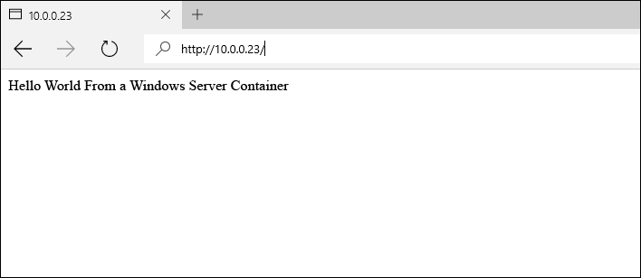

# Containerimages unter Windows Server

**Dieser Inhalt ist vorläufig und kann geändert werden.** 

Im vorhergehenden Windows Server-Schnellstart wurde ein Windows-Container auf der Basis eines bereits vorhandenen Containerimages erstellt. In dieser Übung erfahren Sie im Detail, wie Sie benutzerdefinierte Containerimages manuell unter Verwendung einer Dockerfile-Datei erstellen.

Dieser Schnellstart ist spezifisch für Windows Server-Container unter Windows Server 2016. Weitere Schnellstartdokumentation finden Sie links auf dieser Seite im Inhaltsverzeichnis. 

**Voraussetzungen:**

- Ein Computersystem (physisch oder virtuell), das [Windows Server 2016 Technical Preview 5](https://www.microsoft.com/en-us/evalcenter/evaluate-windows-server-technical-preview) ausführt.
- Konfigurieren Sie dieses System mit dem Windows-Container-Feature und Docker. Eine exemplarische Vorgehensweise zu diesen Schritten finden Sie unter [Windows Containers on Windows Server](./quick_start_windows_server.md) (Windows-Container unter Windows Server).

## 1. Containerimage – manuell

Für optimale Ergebnisse absolvieren Sie diese Übung in einer Windows-Befehlsshell (cmd.exe).

Der erste Schritt beim manuellen Erstellen eines Containerimages ist die Bereitstellung eines Containers. In diesem Beispiel stellen Sie einen IIS-Container auf der Basis des zuvor erstellten IIS-Images bereit. Nachdem der Container bereitgestellt wurde, arbeiten Sie in einer Shellsitzung innerhalb des Containers. Die interaktive Sitzung wird mit dem `-it`-Flag eingeleitet. Detaillierte Informationen zu „Docker Run“-Befehlen finden Sie unter [„Docker run reference“ auf Docker.com]( https://docs.docker.com/engine/reference/run/) („Docker Run“-Referenz). 

```none
docker run -it -p 80:80 microsoft/iis:windowsservercore cmd
```

Als Nächstes wird am Container eine Änderung vorgenommen. Führen Sie zum Entfernen des IIS-Begrüßungsbildschirms den folgenden Befehl aus.

```none
del C:\inetpub\wwwroot\iisstart.htm
```

Und führen Sie den folgenden Befehl aus, um die IIS-Standardwebsite durch eine neue statische Website zu ersetzen.

```none
echo "Hello World From a Windows Server Container" > C:\inetpub\wwwroot\index.html
```

Wechseln Sie auf einem anderen System zur IP-Adresse des Containerhosts. Die „Hello World“-Anwendung sollte jetzt angezeigt werden.

**Hinweis:** Wenn Sie in Azure arbeiten, muss eine Netzwerksicherheits-Gruppenregel vorhanden sein, die Datenverkehr über Port 80 zulässt. Weitere Informationen finden Sie unter [Erstellen einer Regel in einer Netzwerksicherheitsgruppe]( https://azure.microsoft.com/en-us/documentation/articles/virtual-networks-create-nsg-arm-pportal/#create-rules-in-an-existing-nsg).



Wenn Sie zurück im Container sind, beenden Sie die interaktive Containersitzung.

```none
exit
```

Der geänderte Container kann jetzt in einem neuen Containerimage erfasst werden. Dazu benötigen Sie den Containernamen. Dieses können Sie mit dem Befehl `docker ps -a` suchen.

```none
docker ps -a

CONTAINER ID     IMAGE                             COMMAND   CREATED             STATUS   PORTS   NAMES
489b0b447949     microsoft/iis:windowsservercore   "cmd"     About an hour ago   Exited           pedantic_lichterman
```

Um ein neues Containerimage zu erstellen, verwenden Sie den Befehl `docker commit`. „Docker Commit“ hat die Form „docker commit Containername Neuer_Imagename“. Hinweis – Ersetzen Sie den Namen des Containers in diesem Beispiel durch den tatsächlichen Containernamen.

```none
docker commit pedantic_lichterman modified-iis
```

Um zu überprüfen, ob das neue Image erstellt wurde, verwenden Sie den `docker images`-Befehl.  

```none
docker images

REPOSITORY          TAG                 IMAGE ID            CREATED              SIZE
modified-iis        latest              3e4fdb6ed3bc        About a minute ago   10.17 GB
microsoft/iis       windowsservercore   c26f4ceb81db        2 weeks ago          9.48 GB
windowsservercore   10.0.14300.1000     dbfee88ee9fd        8 weeks ago          9.344 GB
windowsservercore   latest              dbfee88ee9fd        8 weeks ago          9.344 GB
```

Dieses Image kann jetzt bereitgestellt werden. Der resultierende Container enthält alle erfassten Änderungen.

## 2. Containerimage – Dockerfile

In der letzten Übung wurde ein Container manuell erstellt, geändert und dann in einem neuen Container-Image erfasst. Docker bietet eine Methode für die Automatisierung dieses Prozesses, die als Dockerfile bezeichnet wird. Diese Übung liefert fast die gleichen Ergebnisse wie die letzte, doch diesmal ist der Prozess automatisiert.

Erstellen Sie auf dem Containerhost das Verzeichnis `c:\build` und in diesem Verzeichnis eine Datei namens `Dockerfile`. Hinweis – Die Datei sollte keine Dateierweiterung haben.

```none
powershell new-item c:\build\Dockerfile -Force
```

Öffnen Sie die Dockerfile-Datei in Editor.

```none
notepad c:\build\Dockerfile
```

Kopieren Sie den folgenden Text in die Dockerfile-Datei, und speichern Sie sie. Diese Befehle weisen Docker an, ein neues Image mit `microsoft/iis` als Basis zu erstellen. Die Dockerfile-Datei führt dann die in der `RUN`-Anweisung angegebenen Befehle aus. In diesem Fall wird die Datei „index.html“ mit neuem Inhalt aktualisiert. 

Weitere Informationen zu Dockerfile-Dateien finden Sie unter [Dockerfiles on Windows](../docker/manage_windows_dockerfile.md) (Dockerfile-Dateien unter Windows).

```none
FROM microsoft/iis:windowsservercore
RUN echo "Hello World - Dockerfile" > c:\inetpub\wwwroot\index.html
```

Der `docker build`-Befehl startet den Imageerstellungsprozess. Der Parameter `-t` weist den Erstellungsprozess an, das neue Image `iis-dockerfile` zu nennen.

```none
docker build -t iis-dockerfile c:\Build
```

Abschließend können Sie mithilfe des Befehls `docker images` prüfen, ob das Image erstellt wurde.

```none
docker images

REPOSITORY          TAG                 IMAGE ID            CREATED             SIZE
iis-dockerfile      latest              8d1ab4e7e48e        2 seconds ago       9.483 GB
microsoft/iis       windowsservercore   c26f4ceb81db        2 weeks ago         9.48 GB
windowsservercore   10.0.14300.1000     dbfee88ee9fd        8 weeks ago         9.344 GB
windowsservercore   latest              dbfee88ee9fd        8 weeks ago         9.344 GB
```

Stellen Sie jetzt mit dem folgenden Befehl einen Container bereit. 

```none
docker run -d -p 80:80 iis-dockerfile ping -t localhost
```

Nachdem der Container erstellt wurde, navigieren Sie zur IP-Adresse des Containerhosts. Die „Hello World“-Anwendung sollte angezeigt werden.


Wenn Sie auf dem Containerhost zurück sind, rufen Sie mit `docker ps` den Namen des Containers ab, und entfernen Sie den Container mit `docker rm`. Hinweis – Ersetzen Sie den Namen des Containers in diesem Beispiel durch den tatsächlichen Containernamen.

Rufen Sie den Containernamen ab.

```none
docker ps

CONTAINER ID   IMAGE            COMMAND               CREATED              STATUS              PORTS                NAMES
c1dc6c1387b9   iis-dockerfile   "ping -t localhost"   About a minute ago   Up About a minute   0.0.0.0:80->80/tcp   cranky_brown
```

Entfernen Sie den Container.

```none
docker rm -f cranky_brown
```

## Nächste Schritte

[Windows-Container unter Windows 10](./quick_start_windows_10.md)


<!--HONumber=Jun16_HO5-->


